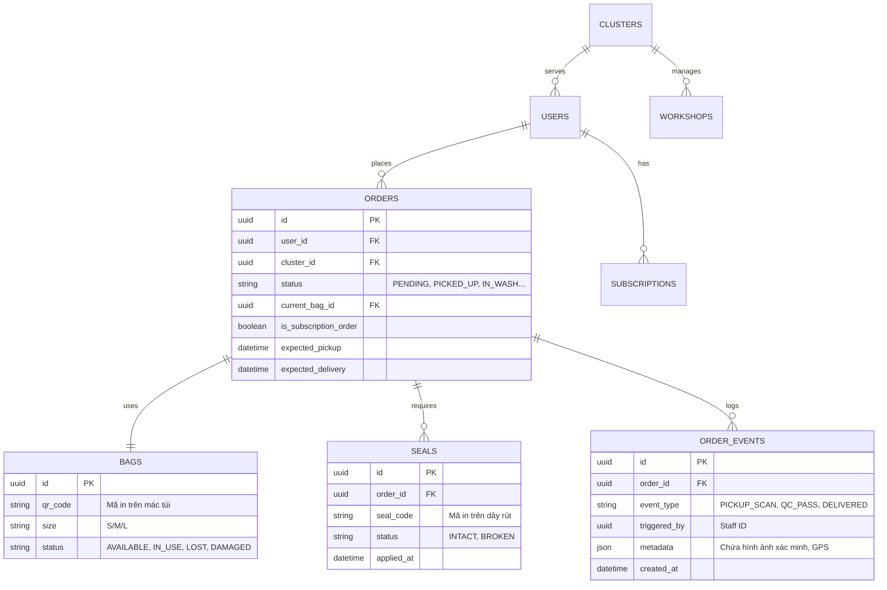
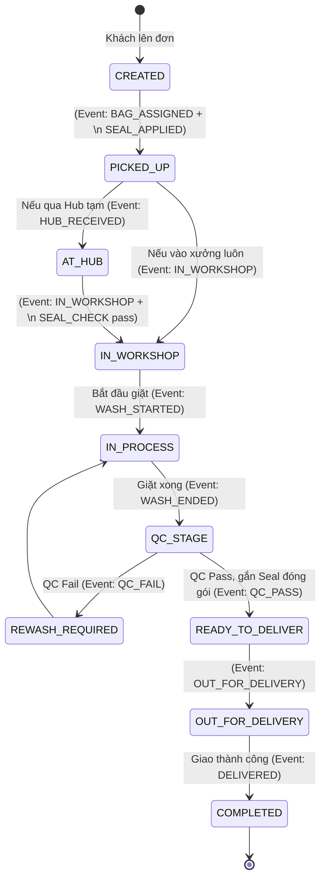

# Định Hướng Chuyển Đổi Mô Hình Kinh Doanh Thành Database Schema (NowWash)

Dựa trên tài liệu chiến lược và luồng vận hành (Operations Workflow), cốt lõi của hệ thống NowWash không nằm ở một giỏ hàng Ecommerce bình thường, mà nằm ở một mô hình **Event-Sourcing / State Machine**. Một "Đơn hàng" (Order) không chỉ đơn giản là "Chờ lấy -> Đang giao -> Xong", mà nó gắn chặt với 2 thực thể định danh vật lý: **Túi (Bag)** và **Niêm phong (Seal)**.

## 1. Các Thực Thể Lõi (Core Entities)
Hệ thống xoay quanh 5 thực thể chính:

1.  **Users (Khách hàng):** Quản lý thông tin cư dân, địa chỉ Block/Tòa nhà.
2.  **Clusters (Cụm vận hành):** Một Cluster đại diện cho một nhóm các tòa nhà và được phụ trách bởi 1 Workshop (Xưởng) hoặc 1 Hub.
3.  **Plans (Gói dịch vụ):** Các gói Subscription (ví dụ: Gói 8 túi/tháng, Túi lẻ Size S/M/L).
4.  **Physical Equipments (Trang thiết bị vật lý):**
    *   `Bags`: Mỗi túi có một QR code (Bag ID) riêng, có Size. Túi này có thể luân chuyển qua nhiều khách (tương tự như lồng giặt).
    *   `Seals`: Dây rút niêm phong có mã code riêng dùng 1 lần (Seal ID).
5.  **Orders (Đơn hàng):** Phiên giao dịch đại diện cho 1 lần giặt.

---

## 2. Sơ đồ Thực Thể Mối Quan Hệ (Entity-Relationship Diagram)

---

## 3. Máy Trạng Thái Đơn Hàng (Order State Machine)

Trái tim của hệ thống là `ORDER_EVENTS`. Nhân viên không trực tiếp sửa "status" của Order trong bảng điều khiển. Staff mở app, quét QR, hệ thống sẽ chèn 1 dòng vào `ORDER_EVENTS`, từ đó Order sẽ tự động chuyển trạng thái.

## 4. Đặc tả kĩ thuật (Dự kiến)
Để hệ thống vận hành trơn tru và quét mã vạch (Barcode/QR) dưới dạng thời gian thực trên PWA, hệ thống nên được sử dụng:
*   **Database:** PostgreSQL (vì cấu trúc quan hệ giữa Order/Bag/Seal cực kì khắt khe).
*   **Backend:** Go (Golang) hoặc Node.js (NestJS) xây dựng theo mô hình Event-Driven.
*   **Frontend Cư Dân:** Zalo Mini App (Tiện dụng, khách quen Zalo không cần tải app).
*   **Frontend Staff Scanner:** Next.js PWA hoặc React Native (Cần dùng Camera để lấy Barcode nhanh nhất).
