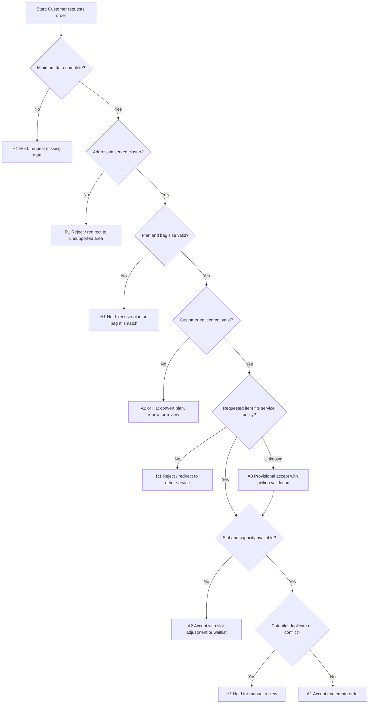

# SF-00 Deep Dive: Order Eligibility & Creation Gate
*Dự án: NowWash*

Tài liệu này đào sâu riêng cho `SF-00` trong `Service Flow`. Mục tiêu là khóa chặt logic `đơn nào được phép vào vận hành`, `đơn nào phải hold`, và `đơn nào phải từ chối hoặc đổi điều kiện` trước khi dispatch.

Tài liệu gốc liên quan:
- `docs/05_Operations/service_flow_master.md`
- `docs/05_Operations/business_rules_exceptions.md`
- `docs/05_Operations/laundry_operations_sop_detailed.md`
- `docs/06_Product_Tech/database_schema.md`
- `apps/web/src/lib/data.ts`

## 1. Mục tiêu của SF-00

`SF-00` phải trả lời được 2 câu hỏi khác nhau:

1. `Can create order now?`
   - Hệ thống có nên cho phép tạo đơn và đưa vào hàng đợi vận hành hay không.

2. `Can promise fulfillment with current data?`
   - Với dữ liệu hiện có ở lúc khách đặt, NowWash có thể cam kết thực hiện đúng slot và đúng loại dịch vụ hay mới chỉ ở mức `provisional accept`.

Điểm quan trọng:
- Với mô hình `bag-based laundry`, không phải mọi điều kiện đều xác minh được tại thời điểm tạo đơn.
- Một số rule chỉ xác minh dứt điểm ở `pickup` hoặc `workshop intake`.
- Vì vậy `SF-00` phải phân biệt rõ giữa `accepted`, `accepted with conditions`, `held for review`, và `rejected`.

## 2. Giả định vận hành dùng cho bản draft này

Các giả định dưới đây được rút từ tài liệu chiến lược và mock data hiện có. Đây là `đề xuất mặc định` để chốt logic, nếu cần mình sẽ tiếp tục khóa thành policy chính thức:

- NowWash vận hành theo `cluster`, mỗi cluster phục vụ một nhóm tòa nhà/bán kính hạn chế.
- `Subscription` là sản phẩm lõi và mặc định có `slot cố định T3/T6`.
- `One-off / PAYG` dùng slot còn trống trong inventory của cluster.
- Plan gắn với `bag size` mặc định:
  - `Cá Nhân` -> `S`
  - `Đôi` -> `M`
  - `Gia Đình` -> `L`
- Rule dung lượng thực tế vẫn là `miệng túi phải đóng được và seal được`.
- Các mốc kg trong UI chỉ là `guideline truyền thông`, không thay thế quy tắc `fits-and-seals`.
- Một số case phải `provisional accept` ở SF-00 rồi mới xác minh tiếp ở `SF-02 Pickup` và `SF-04 Workshop Intake`.

## 3. Kết quả quyết định chuẩn của SF-00

| Outcome Code | Tên kết quả | Ý nghĩa vận hành | Hành động hệ thống khuyến nghị |
| --- | --- | --- | --- |
| `A1` | Auto Accept | Đơn đủ điều kiện, tạo và dispatch bình thường | Tạo order `CREATED` |
| `A2` | Accept With Adjustment | Đơn hợp lệ nhưng phải đổi slot/điều kiện | Đề xuất slot mới rồi tạo `CREATED` |
| `A3` | Provisional Accept | Cho tạo đơn nhưng phải xác minh thêm ở pickup/workshop | Tạo `CREATED` + gắn tag review/instruction |
| `H1` | Hold For Manual Review | Chưa đủ dữ liệu hoặc có xung đột cần người quyết | Chưa dispatch; đưa vào queue review |
| `R1` | Reject Before Confirm | Không đủ điều kiện ngay từ đầu | Không tạo đơn hoặc không cho checkout |
| `R2` | Cancel After Creation | Đã tạo đơn nhưng phát hiện sai lệch vật lý sau đó | Hủy đơn + hoàn/đổi gói theo policy |

## 4. Dữ liệu đầu vào tối thiểu

Không nên cho đơn vượt qua `SF-00` nếu thiếu một trong các trường sau:

| Nhóm dữ liệu | Trường tối thiểu | Bắt buộc | Ghi chú |
| --- | --- | --- | --- |
| Customer | Tên, số điện thoại, customer ID | Có | Đủ để CS liên hệ và gắn lịch sử |
| Address | Tòa, block, căn, hướng dẫn giao nhận | Có | Phải đủ để map cluster và shipper tìm đúng điểm |
| Service | Loại order (`subscription` / `one-off`) | Có | Quyết định entitlement và slot logic |
| Bag / Plan | Bag size hoặc plan | Có | Plan và bag size phải khớp |
| Time | Requested pickup slot, requested delivery expectation | Có | Dùng cho capacity gate |
| Access | Ghi chú lễ tân, locker, chốt bảo vệ, contactless option | Nên có | Bắt buộc nếu tòa có hạn chế tiếp cận |
| Risk declaration | Khách xác nhận không có hàng blacklist/oversized ngoài policy | Có | Tickbox rule, không thay cho kiểm tra thực địa |

## 5. Chuỗi quyết định SF-00

## 6. Gate-by-Gate Decision Table

### Gate 1. Data Completeness

| Điều kiện pass | Nếu fail | Outcome | Owner |
| --- | --- | --- | --- |
| Có đủ customer, phone, building, apartment, service type, bag/plan, slot | Thiếu trường cốt lõi hoặc địa chỉ không đủ rõ | `H1` | System -> CS/Ops review |

`Rule to run`
- Không cho dispatch nếu địa chỉ chỉ có tên tòa mà thiếu căn hoặc thiếu hướng dẫn tiếp cận trong các tòa có nhiều block.
- Không cho qua nếu thiếu số điện thoại liên hệ.
- Nếu thiếu dữ liệu nhưng vẫn muốn giữ lead, cho phép lưu nháp chứ không cho vào vận hành.

### Gate 2. Service Area & Cluster Eligibility

| Điều kiện pass | Nếu fail | Outcome | Owner |
| --- | --- | --- | --- |
| Địa chỉ thuộc tòa nhà/vùng đang được cluster phục vụ | Ngoài vùng, chưa map cluster, hoặc cluster tạm ngưng nhận đơn | `R1` hoặc `H1` | System / Ops scheduler |

`Rule to run`
- Chỉ nhận đơn trong danh sách building đã map vào cluster.
- Nếu building nằm trong cluster nhưng tuyến hôm đó bị khóa capacity tạm thời, dùng `A2` thay vì reject thẳng.
- Nếu building chưa onboard chính thức nhưng nằm cạnh cluster, không auto-accept; đưa `H1` để ops quyết định có nhận pilot hay không.

### Gate 3. Product / Plan Fit

| Điều kiện pass | Nếu fail | Outcome | Owner |
| --- | --- | --- | --- |
| Plan hợp lệ và khớp bag size, hoặc one-off chọn đúng bag size | Plan hết hiệu lực, bag size không khớp plan, hoặc customer không có entitlement phù hợp | `A2`, `H1`, hoặc `R1` | System / CS |

`Rule to run`
- Subscription order chỉ pass nếu thuê bao còn hiệu lực.
- Khách subscription hết quota bag tháng hiện tại:
  - Nếu còn rollover hợp lệ -> `A1`
  - Nếu không còn rollover nhưng cho phép mua lẻ -> `A2` chuyển PAYG
  - Nếu không cho mua lẻ tự động -> `H1`
- Không cho đổi bag size khác plan nếu chưa có rule upsell/downsell rõ ràng.
- Một đơn được tạo theo `one-off` nếu khách không có hoặc không muốn dùng entitlement subscription.

### Gate 4. Item / Service Policy Fit

| Điều kiện pass | Nếu fail | Outcome | Owner |
| --- | --- | --- | --- |
| Hàng nằm trong phạm vi giặt túi dân sinh thông thường | Khách khai báo hàng oversized/blacklist/sai gói | `R1` hoặc `A2` redirect | System / CS |

`Rule to run`
- Nếu khách khai báo:
  - `ga bọc đệm`, `thảm`, `sofa fabric`, `đồ cực cồng kềnh` -> không cho vào flow bag thường.
  - `đồ dính máu/chất thải sinh học`, `hóa chất công nghiệp`, `đồ lót rời rạc`, `đồ dễ hỏng cao cấp` -> không auto-accept.
- Nếu khách không khai hoặc hệ thống chưa biết rõ loại đồ:
  - Không reject ngay.
  - Cho `A3 Provisional Accept`.
  - Gắn instruction để shipper xác minh tại pickup.

### Gate 5. Slot & Capacity Fit

| Điều kiện pass | Nếu fail | Outcome | Owner |
| --- | --- | --- | --- |
| Có capacity pickup, workshop, và delivery cho slot đó | Slot đầy, xưởng backlog, delivery window không còn khả năng đáp ứng | `A2` hoặc `H1` | System / Ops scheduler |

`Rule to run`
- Slot chỉ được mở nếu cả 3 lớp capacity cùng còn:
  - pickup capacity
  - workshop capacity
  - delivery capacity
- Subscription:
  - Mặc định bám slot cố định của plan.
  - Nếu slot cố định bị vỡ công suất diện rộng, phải tạo `A2` với slot thay thế có xác nhận.
- One-off:
  - Chỉ hiển thị slot còn inventory.
- Không nên accept slot pickup mà delivery side không còn khả năng trả đúng cam kết.

### Gate 6. Duplicate & Conflict Guard

| Điều kiện pass | Nếu fail | Outcome | Owner |
| --- | --- | --- | --- |
| Không có order trùng hoặc xung đột hoạt động | Trùng slot, trùng intent, hoặc đơn active hiện hữu gây nghi ngờ | `H1` hoặc `R1` | System / CS |

`Rule to run`
- `Exact duplicate` nên block nếu cùng:
  - customer
  - address
  - service type
  - slot pickup
  - được tạo trong một khoảng thời gian ngắn
- `Potential duplicate` nên hold nếu:
  - khách đã có order `CREATED` chưa pickup trong cùng slot
  - khách đã có order active và đang cố tạo thêm đơn nhưng không có cờ `multi-bag`
- Không coi là duplicate nếu:
  - khách chủ động tạo thêm bag và hệ thống/support đã xác nhận `multi-bag`
  - subscription household có nhiều bag entitlement và có ghi chú rõ

`Khuyến nghị mặc định`
- Dùng `15 phút` cho exact duplicate window.
- Dùng cờ `multi_bag_confirmed` để phân biệt đơn thật với click lặp.

### Gate 7. Access & Delivery Constraints Known Upfront

| Điều kiện pass | Nếu fail | Outcome | Owner |
| --- | --- | --- | --- |
| Có cách pickup/delivery hợp lệ cho building đó | Tòa cấm lên căn hộ, yêu cầu locker, hoặc giờ cấm giao nhưng khách chưa chọn phương án thay thế | `A2` hoặc `H1` | CS / Ops |

`Rule to run`
- Nếu building bắt buộc nhận qua lễ tân/locker, phải capture rule đó ngay từ lúc tạo đơn.
- Nếu khách không chấp nhận phương án access hợp lệ, không nên auto-accept.
- Các building có `special access policy` phải đổ ra instruction mặc định cho shipper và dispatcher.

### Gate 8. Commit Output

| Nếu pass toàn bộ | Nếu pass có điều kiện | Nếu không pass |
| --- | --- | --- |
| `A1` -> tạo `CREATED`, gán cluster, slot, plan, instruction chuẩn | `A2/A3/H1` -> tạo theo mode tương ứng, không dispatch mù | `R1` -> từ chối tạo đơn hoặc redirect sang sản phẩm khác |

`Output tối thiểu khi commit`
- `order_id`
- `customer_id`
- `cluster_id`
- `order_type`
- `plan_id` hoặc `PAYG`
- `bag_size`
- `requested_pickup`
- `assigned_pickup`
- `expected_delivery`
- `eligibility_outcome`
- `eligibility_tags`
- `ops_instructions`

## 7. Decision Matrix Theo Use Case

| Use case | Kết quả đề xuất | Lý do |
| --- | --- | --- |
| Subscriber active, đúng tòa trong cluster, đúng slot cố định, còn bag allowance | `A1` | Đủ điều kiện hoàn toàn |
| Subscriber active nhưng slot cố định hôm đó bị đầy | `A2` | Hợp lệ nhưng phải đổi slot |
| Subscriber hết bag nhưng còn rollover hợp lệ | `A1` | Entitlement vẫn đủ |
| Subscriber hết bag và hết rollover, nhưng cho mua lẻ | `A2` | Chuyển PAYG thay vì từ chối |
| Khách one-off trong cluster, slot còn chỗ | `A1` | Đơn lẻ hợp lệ |
| Khách one-off trong cluster nhưng mọi slot ngày đó đầy | `A2` | Dời slot |
| Building chưa map cluster nhưng ở sát ranh | `H1` | Cần ops quyết định pilot hay reject |
| Khách khai báo thảm/ga dày ngay từ đầu | `R1` hoặc `A2` redirect | Sai phạm vi bag service |
| Khách không khai gì đặc biệt, nhưng item thực tế có thể vượt chuẩn | `A3` | Chỉ provisional accept, xác minh ở pickup |
| Đơn tạo 2 lần liên tiếp cùng khách/cùng slot | `H1` hoặc `R1` | Nguy cơ duplicate |
| Khách đã có đơn active cùng slot nhưng muốn tạo thêm túi | `H1` nếu chưa xác nhận | Tránh tạo nhầm bag trùng |
| Tòa chỉ cho giao lễ tân/locker | `A1` hoặc `A2` | Hợp lệ nếu capture trước phương án access |
| Thiếu số điện thoại hoặc thiếu căn hộ | `H1` | Chưa đủ điều kiện điều phối |

## 8. Business Rules Nên Khóa Cứng Trong Hệ Thống

Đây là các rule mình khuyến nghị phải thành `system-enforced rules`, không để người nhớ tay:

1. `Không serviceable address -> không hiện checkout khả dụng`
2. `Plan-bag mismatch -> không cho tạo đơn trực tiếp`
3. `Slot đầy -> chỉ cho chọn slot khác, không cho overbook thủ công trừ admin`
4. `Duplicate suspect -> không tự dispatch`
5. `Known blacklist/oversized -> không đi vào bag flow`
6. `Special-access building -> auto-attach ops instruction`
7. `Subscription entitlement exhausted -> ép chọn renew hoặc PAYG`

## 9. Những Case Chỉ Có Thể Xác Minh Sau Khi Đã Tạo Đơn

Đây là phần rất quan trọng để tránh kỳ vọng sai:

| Case | Vì sao chưa xác minh được ở SF-00 | Điểm xác minh tiếp theo | Nếu fail sau đó |
| --- | --- | --- | --- |
| Túi có thực sự đóng và seal được không | Chỉ thấy mô tả, chưa thấy đồ thật | `SF-02 Pickup` | `R2` hoặc upsell thêm túi |
| Có vật blacklist trộn trong túi không | Khách có thể không khai hoặc không biết rule | `SF-02` / `SF-05` | `R2` + trả lại / đổi dịch vụ |
| Đồ quá cỡ thực tế so với mô tả | Chưa có kiểm tra vật lý | `SF-02` / `SF-05` | `R2` hoặc redirect |
| Building access có đúng như customer khai không | Tùy ca trực bảo vệ/lễ tân | `SF-02` / `SF-09` | `A2`, re-attempt, hoặc CS can thiệp |

Kết luận vận hành:
- `SF-00` không nên cố giả vờ biết chắc mọi thứ.
- `SF-00` phải biết `cái gì xác minh được ngay`, `cái gì chỉ provisional`, và `case nào không được phép đi tiếp`.

## 10. Evidence & Audit Requirements Cho SF-00

Tối thiểu phải lưu các dữ liệu sau để phục vụ audit và dispute về sau:

- Dữ liệu order request gốc.
- Address snapshot tại thời điểm tạo đơn.
- Cluster được map.
- Slot khách yêu cầu và slot hệ thống assign.
- Plan/bag size tại thời điểm confirm.
- Kết quả eligibility (`A1/A2/A3/H1/R1/R2`).
- Rule hit / reason code nếu bị hold, đổi slot, hoặc reject.
- Tickbox khách xác nhận service rules.

`Reason code` nên chuẩn hóa, ví dụ:
- `ADDR_INCOMPLETE`
- `OUT_OF_CLUSTER`
- `PLAN_BAG_MISMATCH`
- `SUB_QUOTA_EXHAUSTED`
- `KNOWN_OVERSIZED`
- `KNOWN_BLACKLIST`
- `SLOT_FULL`
- `DUPLICATE_SUSPECT`
- `SPECIAL_ACCESS_REVIEW`

## 11. Ranh Giới Với Các Flow Khác

`SF-00` chỉ quyết định việc `đưa đơn vào service chain`.

Không xử lý sâu tại đây:
- Cách nói chuyện với khách khi phải đổi slot -> thuộc `Customer Care Flow`
- Tranh chấp khách không đồng ý reject -> thuộc `Complaint / Incident Flow`
- KPI full-slot, fill-rate, reject-rate -> thuộc `Reporting Flow`

Nhưng `SF-00` phải tạo đủ `reason code` và `instruction` để các flow sau có dữ liệu dùng ngay.

## 12. Các Quyết Định Nên Chốt Với Bạn Ở Vòng Review Này

Đây là 6 quyết định còn lại để biến `SF-00` thành policy thực thi:

1. `Duplicate window`
   - Mặc định đề xuất: block exact duplicate trong `15 phút`.

2. `Subscription exhausted behavior`
   - Hết bag thì auto-convert sang `PAYG` hay buộc gia hạn trước?

3. `Pilot building policy`
   - Building sát cluster nhưng chưa onboard thì `H1 review` hay `R1 reject`?

4. `Overbooking authority`
   - Ai được quyền ép overbook slot khi VIP hoặc case recovery?

5. `Special-access default`
   - Tòa cấm lên căn thì mặc định để lễ tân/locker hay bắt buộc khách xác nhận từng lần?

6. `Late-discovery cancel handling`
   - Khi `A3 provisional accept` nhưng fail tại pickup/workshop thì xử lý mặc định là gì: upsell, đổi dịch vụ, hay hủy hoàn?

## 13. Kết luận

Nếu chốt theo tài liệu này, `SF-00` sẽ không còn là bước “tạo đơn cho xong”, mà trở thành `eligibility gate` đúng nghĩa:

- Chặn sớm case chắc chắn sai.
- Giữ lại case cần người review.
- Cho chạy nhanh case tốt.
- Không hứa quá mức với case chỉ mới xác minh được một phần.
