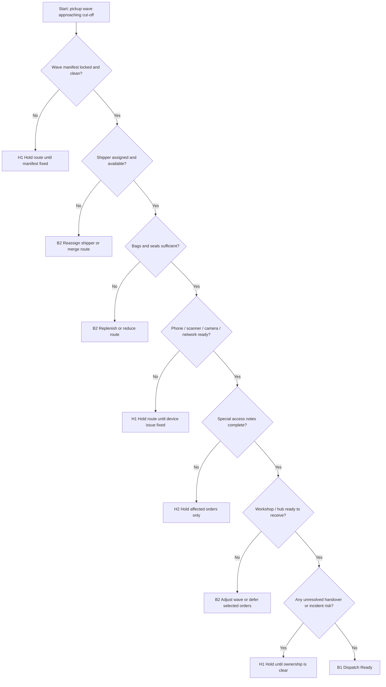

# SF-01 Deep Dive: Pre-Pickup Readiness
*Dự án: NowWash*

Tài liệu này đào sâu riêng cho `SF-01` trong `Service Flow`. Mục tiêu là khóa chặt logic `ca nào`, `tuyến nào`, và `đơn nào` đủ điều kiện rời trạng thái chuẩn bị để đi vào `SF-02 Pickup`.

Tài liệu gốc liên quan:
- `docs/05_Operations/service_flow_master.md`
- `docs/05_Operations/laundry_operations_sop_detailed.md`
- `docs/05_Operations/service_flow_sf00_order_eligibility.md`
- `docs/05_Operations/service_flow_protocol_offline_fallback.md`
- `docs/09_Strategy_Management/00. Tài liệu chung.md`
- `apps/web/src/app/dashboard/inventory/page.tsx`

## 1. Mục tiêu của SF-01

`SF-01` phải trả lời 3 câu hỏi trước khi shipper rời điểm tập kết:

1. `Có đúng đơn để đi không?`
   - Route manifest đã sạch, đúng slot, đúng owner, đúng chỉ dẫn chưa?

2. `Có đủ người và công cụ để đi không?`
   - Shipper, bag, seal, điện thoại, scanner, pin, mạng, và backup đã sẵn sàng chưa?

3. `Có nên cho tuyến xuất phát ngay không?`
   - Nếu có lỗi, route được `fix nhanh`, `reassign`, `hold`, hay phải `drop khỏi wave`?

Điểm quan trọng:
- `SF-01` không chỉ là check túi và pin điện thoại.
- Đây là `go / no-go gate` của cả wave pickup.
- Nếu làm lỏng bước này, mọi lỗi ở `pickup`, `transit`, và `custody` sẽ tăng mạnh.

## 2. Phạm vi

`In scope`
- Chuẩn bị đơn cho wave pickup.
- Giao route cho shipper.
- Kiểm tra vật tư bag/seal.
- Kiểm tra thiết bị scanner/camera/network.
- Kiểm tra readiness của workshop/hub liên quan đến wave đó.
- Handover giữa ca hoặc khi reassign tuyến.

`Out of scope`
- Rule tạo đơn và eligibility từ đầu vào của khách.
- Kỹ thuật pickup tại cửa khách.
- Xử lý khiếu nại phát sinh sau pickup.

## 3. Kết quả quyết định chuẩn của SF-01

| Outcome Code | Tên kết quả | Ý nghĩa vận hành | Hành động khuyến nghị |
| --- | --- | --- | --- |
| `B1` | Dispatch Ready | Tuyến/ca đủ điều kiện xuất phát | Release route |
| `B2` | Ready With Adjustment | Đi được nhưng phải đổi người, đổi route, hoặc cấp bù vật tư | Adjust rồi release |
| `H1` | Hold Route | Chưa được xuất phát cho tới khi fix xong blocker | Giữ route ở staging |
| `H2` | Hold Order | Không chặn cả route nhưng phải rút 1 hoặc vài đơn khỏi wave | Remove order khỏi tuyến hiện tại |
| `R1` | Remove From Wave | Đơn/tuyến không thể chạy trong slot hiện tại | Reschedule / reassign / cancel theo policy |

## 4. Nguyên tắc điều hành của SF-01

- `Không release tuyến nếu route manifest chưa sạch`.
- `Không release shipper nếu thiếu tối thiểu bag/seal cho các đơn đã assign`.
- `Không dựa vào trí nhớ`: mọi readiness phải đi qua checklist hoặc log.
- `Không tự ý đổi tuyến hoặc đổi account scanner`.
- `Mọi reassign giữa ca phải có handover record`.
- `Pickup readiness` và `workshop receiving readiness` phải được check cùng một wave, không check tách rời.

## 5. Dữ liệu đầu vào tối thiểu

| Nhóm dữ liệu | Trường tối thiểu | Bắt buộc | Ghi chú |
| --- | --- | --- | --- |
| Wave | Wave ID, slot, cluster, cut-off time | Có | Khung điều phối cho cả tuyến |
| Route | Route ID, shipper assigned, danh sách stop | Có | Phải biết ai chịu trách nhiệm tuyến |
| Order manifest | Order ID, customer, building, apartment, bag size, special notes | Có | Dữ liệu từ `SF-00` đã sạch |
| Inventory issue | Số bag theo size, seal stock, reserve stock | Có | Phải so với demand của wave |
| Device status | Phone, battery, scanner login, camera, network | Có | Không đủ thì không release |
| Access notes | Reception/locker/building policy/contactless instruction | Có nếu applicable | Bắt buộc với tòa có rule riêng |
| Workshop readiness | Intake owner, intake window, camera sorting, machine readiness | Có | Để tránh pickup xong mà xưởng không nhận được |

## 6. Hai lớp readiness bắt buộc

### Lớp A. Route Dispatch Readiness

Tập trung vào: `đúng đơn`, `đúng người`, `đúng vật tư`, `đúng thiết bị`.

### Lớp B. Receiving Readiness

Tập trung vào: `hub/xưởng có sẵn sàng nhận wave đó không`.

Kết luận:
- Chỉ cần lớp A pass mà lớp B fail thì vẫn không nên release toàn bộ wave.
- Tối thiểu phải có một cơ chế `hold/reduce wave` để không tạo backlog mù.

## 7. Chuỗi quyết định SF-01

## 8. Gate-by-Gate Decision Table

### Gate 1. Wave Manifest Integrity

| Điều kiện pass | Nếu fail | Outcome | Owner |
| --- | --- | --- | --- |
| Mỗi route có danh sách order sạch, không trùng, đúng slot, đúng cluster | Manifest còn order trùng, sai slot, sai cluster, thiếu note quan trọng | `H1` hoặc `H2` | Dispatcher / ops scheduler |

`Rule to run`
- Không release route nếu còn order chưa gán owner.
- Không release route nếu còn order có `eligibility outcome = H1` hoặc `A3` mà chưa gắn instruction rõ.
- Không đưa vào wave pickup những order:
  - đã bị reschedule nhưng route chưa refresh
  - đã cancel nhưng vẫn nằm trong route
  - thuộc cluster khác

`Minimum manifest fields`
- `order_id`
- `slot`
- `building + apartment`
- `customer name + masked phone`
- `bag_size`
- `service type`
- `special access note`
- `eligibility tags`
- `payment note` nếu có COD hoặc xác nhận thanh toán

### Gate 2. Shipper Availability & Ownership

| Điều kiện pass | Nếu fail | Outcome | Owner |
| --- | --- | --- | --- |
| Có shipper cụ thể nhận tuyến, có mặt, đúng ca, đúng account | Shipper vắng, đến trễ, đổi người chưa handover, hoặc tuyến vượt tải cá nhân | `B2` hoặc `H1` | Dispatcher / shift lead |

`Rule to run`
- Mỗi route chỉ có một `owner chính` tại thời điểm release.
- Không dùng chung account scanner giữa 2 shipper trên cùng wave.
- Nếu phải đổi shipper:
  - phải log `reassign`
  - route mới phải được shipper mới xác nhận lại trước khi release

`Khuyến nghị mặc định`
- Nếu shipper chưa check-in trước cut-off `15 phút`, route tự chuyển sang trạng thái `at risk`.
- Nếu một shipper vượt ngưỡng stop hoặc ETA không còn khả thi, dispatcher phải `split` hoặc `merge` route trước khi xuất phát.

### Gate 3. Bag Readiness

| Điều kiện pass | Nếu fail | Outcome | Owner |
| --- | --- | --- | --- |
| Có đủ bag đúng size cho số pickup dự kiến và buffer tối thiểu | Thiếu bag theo size, bag bẩn, bag QR unreadable, bag status không khả dụng | `B2`, `H2`, hoặc `H1` | Shift lead / inventory owner |

`Rule to run`
- Không cấp bag có status khác `AVAILABLE`.
- Không cấp bag chưa vệ sinh hoặc QR không đọc được.
- Bag cấp cho route phải khớp size của order, trừ khi có policy upsell/downsell đã xác nhận.

`Khuyến nghị buffer mặc định`
- Mỗi route phải có:
  - bag đúng size cho toàn bộ order đã assign
  - `+1` spare bag cho mỗi size đang có trong route
- Nếu route có > 10 stop, cân nhắc `+2` spare seal-compatible bags tổng.

`Case xử lý nhanh`
- `BAG_NOT_AVAILABLE` -> đổi bag khác cùng size
- `QR_UNREADABLE` -> in/dán lại hoặc rút bag khỏi vòng sử dụng
- `BAG_DIRTY` -> loại khỏi route và chuyển cleaning queue

### Gate 4. Seal Readiness

| Điều kiện pass | Nếu fail | Outcome | Owner |
| --- | --- | --- | --- |
| Có đủ seal dùng một lần cho route và buffer tối thiểu | Thiếu seal, seal lỗi mã, seal hỏng vật lý, seal không assignable | `B2` hoặc `H1` | Shift lead / inventory owner |

`Rule to run`
- Không cho shipper rời điểm tập kết nếu số seal khả dụng < số pickup dự kiến.
- Seal bị cong, gãy, mờ QR hoặc nghi lỗi in phải loại khỏi route.
- Seal là vật tư `single-use`; không tái cấp seal đã từng ở trạng thái `LOCKED` hoặc `BROKEN`.

`Khuyến nghị buffer mặc định`
- Mỗi route cần:
  - số seal = số pickup dự kiến
  - `+2` seal dự phòng tối thiểu

### Gate 5. Device & App Readiness

| Điều kiện pass | Nếu fail | Outcome | Owner |
| --- | --- | --- | --- |
| Điện thoại, app scanner, camera, pin, mạng đều hoạt động | Hết pin, camera hỏng, app lỗi, sai account, mất mạng kéo dài | `H1`, `B2`, hoặc `H2` | Shipper / shift lead / tech support |

`Rule to run`
- Không release nếu:
  - pin < ngưỡng tối thiểu
  - camera không chụp được ảnh đạt chuẩn
  - app scanner chưa đăng nhập đúng account
- Không đổi account giữa ca nếu chưa có handover.

`Khuyến nghị mặc định`
- Battery tại lúc release nên `>= 60%`.
- Power bank hoặc phương án sạc dự phòng nên là bắt buộc với tuyến > 90 phút.
- Trước khi rời điểm tập kết phải test:
  - mở app
  - scan thử một QR test
  - chụp thử một ảnh
  - xác nhận upload/sync nếu có mạng

`Fallback`
- Nếu app lỗi nhưng còn thời gian fix nhanh: đổi thiết bị hoặc relogin.
- Nếu phải chạy `offline fallback`, bắt buộc theo `docs/05_Operations/service_flow_protocol_offline_fallback.md`.
- Mặc định:
  - `shift lead` được duyệt case `1 route / 1 attempt`
  - `ops lead` duyệt case đa route hoặc case dự kiến đi qua handover đầu tiên khi chưa sync xong

### Gate 6. Access Notes & Special Building Constraints

| Điều kiện pass | Nếu fail | Outcome | Owner |
| --- | --- | --- | --- |
| Tất cả order có đủ access note áp dụng cho building đó | Thiếu note lễ tân/locker, thiếu contact note, thiếu giờ được vào tòa | `H2` hoặc `H1` | Dispatcher / CS |

`Rule to run`
- Order có building policy đặc biệt mà thiếu note phải bị giữ lại khỏi route cho đến khi bổ sung.
- Không bắt shipper “đến nơi rồi hỏi sau” với các tòa đã biết là có hạn chế tiếp cận.
- Nếu nhiều order trong cùng building cùng thiếu note, có thể `hold cả cluster stop` chứ không chỉ 1 order.

### Gate 7. Workshop / Hub Receiving Readiness

| Điều kiện pass | Nếu fail | Outcome | Owner |
| --- | --- | --- | --- |
| Hub/xưởng đã sẵn intake owner, khu nhận hàng, và năng lực nhận wave đó | Camera sorting chưa hoạt động, intake owner chưa có mặt, backlog vượt ngưỡng, khu nhận còn đồ tồn | `B2`, `H1`, hoặc `R1` | Workshop lead / ops lead |

`Rule to run`
- Không nên cho pickup wave lớn rời điểm tập kết nếu xưởng chưa xác nhận nhận được wave đó.
- Nếu workshop readiness fail toàn cục, dispatcher phải:
  - giảm wave
  - dời một phần slot
  - hoặc đóng pickup tạm thời cho cluster

`Checklist tối thiểu từ workshop`
- Camera sorting đang ghi.
- Khu sorting sạch, không còn đồ tồn chưa xử lý.
- Máy giặt tối thiểu đủ để nhận wave kế tiếp.
- Có người nhận intake rõ ràng.

### Gate 8. Handover & Incident Continuity

| Điều kiện pass | Nếu fail | Outcome | Owner |
| --- | --- | --- | --- |
| Không còn route mồ côi, không còn order “không ai giữ”, incident từ ca trước đã assign owner | Đổi ca chưa bàn giao, reassign nửa chừng, route split không rõ người nhận | `H1` | Shift lead / dispatcher |

`Rule to run`
- Mọi handover phải có:
  - route ID
  - shipper cũ / shipper mới
  - timestamp
  - số order bàn giao
  - bag/seal đã cấp
  - issue còn mở
- Không để order vừa reassign vừa thiếu access note vừa thiếu bag.

### Gate 9. Commit to Dispatch

| Nếu pass toàn bộ | Nếu pass có điều chỉnh | Nếu không pass |
| --- | --- | --- |
| `B1` -> route được release | `B2` -> adjust xong rồi release | `H1/H2/R1` -> không cho route hoặc order rời staging |

`Output tối thiểu khi release`
- `wave_id`
- `route_id`
- `shipper_id`
- `released_at`
- `orders_released`
- `bags_issued`
- `seals_issued`
- `device_check_passed`
- `workshop_ready_confirmed`
- `dispatch_notes`

## 9. Checklist Chuẩn Theo Vai Trò

### 9.1 Dispatcher Checklist

- Route manifest sạch, không trùng, không cancel sót.
- Mỗi route có shipper owner rõ.
- ETA của route còn khả thi trong slot.
- Access note và instruction đặc biệt đã đính kèm.
- Reassign hoặc split route đã được xác nhận.

### 9.2 Shipper Checklist

- Có đúng danh sách order được giao.
- Có đủ bag đúng size và seal dự phòng.
- Điện thoại đúng account, pin đủ, camera hoạt động.
- Đã scan thử QR test.
- Đã hiểu building note đặc biệt trong route.

### 9.3 Workshop / Hub Checklist

- Có người nhận wave.
- Camera sorting hoạt động.
- Khu intake sạch và không tồn hàng blocking.
- Có công suất tối thiểu để nhận lượng pickup sắp về.

## 10. Exception Matrix Cho SF-01

| Bucket | Tín hiệu | Xử lý tức thời | Outcome mặc định |
| --- | --- | --- | --- |
| `Manifest error` | Sai slot, sai cluster, duplicate | Fix manifest trước khi đi | `H1` / `H2` |
| `Staffing gap` | Shipper vắng, check-in trễ | Reassign hoặc merge route | `B2` / `H1` |
| `Bag shortfall` | Thiếu bag đúng size | Cấp bù hoặc rút order khỏi wave | `B2` / `H2` |
| `Seal shortfall` | Seal không đủ hoặc lỗi QR | Cấp bù hoặc hold route | `B2` / `H1` |
| `Device failure` | App/camera/pin lỗi | Đổi thiết bị hoặc hold | `H1` |
| `Access note missing` | Thiếu lễ tân/locker note | Hold order affected | `H2` |
| `Workshop not ready` | Intake blocked, camera off, backlog | Reduce wave / reschedule | `B2` / `R1` |
| `Handover unclear` | Không rõ ai đang giữ route | Stop release | `H1` |

## 11. System-Enforced Rules Nên Có

Đây là các rule mình khuyến nghị phải khóa bằng hệ thống hoặc workflow tool:

1. `Không release route nếu chưa có shipper owner`
2. `Không release route nếu còn order status bất thường trong manifest`
3. `Không release route nếu bag/seal issued < demand tối thiểu`
4. `Không release route nếu device check fail`
5. `Không release route nếu route có order special-access nhưng note trống`
6. `Không release wave lớn nếu workshop readiness chưa xác nhận`
7. `Mọi reassign route phải tạo handover log`

## 12. Các Mốc Số Liệu Nên Theo Dõi Từ SF-01

Các chỉ số này rất quan trọng vì nó cho biết lỗi vận hành bắt đầu từ trước pickup hay tại pickup:

- `% route release đúng giờ`
- `% route bị hold ở SF-01`
- `% order bị rút khỏi wave`
- `% route thiếu bag đúng size`
- `% route thiếu seal`
- `% shipper release với device fail`
- `% route reassign trong vòng 30 phút trước cut-off`
- `% wave pickup bị giảm vì workshop chưa sẵn`

## 13. Những Quyết Định Nên Chốt Với Bạn Ở Vòng Review Này

Đây là các policy còn nên khóa tiếp:

1. `Battery minimum`
   - Đề xuất mặc định: `>= 60%` lúc release.

2. `Bag buffer by route`
   - Đề xuất mặc định: `+1` spare bag cho mỗi size có mặt trên route.

3. `Seal buffer by route`
   - Đề xuất mặc định: `+2` seal dự phòng tối thiểu mỗi route.

4. `Late shipper tolerance`
   - Đề xuất mặc định: shipper chưa check-in trước cut-off `15 phút` thì route vào `at risk`.

5. `Workshop readiness veto`
   - Workshop lead có quyền chặn cả wave hay chỉ có thể đề nghị ops lead chặn?

## 14. Ranh Giới Với Các Flow Khác

`SF-01` chỉ quyết định việc `có cho route/order rời staging để đi pickup hay không`.

Không xử lý sâu tại đây:
- Cách nói chuyện với khách khi phải đổi hẹn -> thuộc `Customer Care Flow`
- Cách xử lý khi shipper tới nơi mà khách không có mặt -> thuộc `SF-02 Pickup`
- Cách xử lý mất đồ hoặc seal broken sau pickup -> thuộc `SF-03+` và `Complaint / Incident Flow`

Nhưng `SF-01` phải để lại đủ `release log`, `handover log`, và `reason code` để các flow sau truy được trách nhiệm.

## 15. Kết luận

Nếu chốt theo tài liệu này, `SF-01` sẽ trở thành một `dispatch control gate` thực thụ:

- Chặn lỗi trước khi shipper đi.
- Giảm pickup fail do thiếu chuẩn bị.
- Giảm custody issue vì route được cấp phát rõ.
- Giảm backlog xưởng do pickup chạy mù vượt khả năng nhận.
