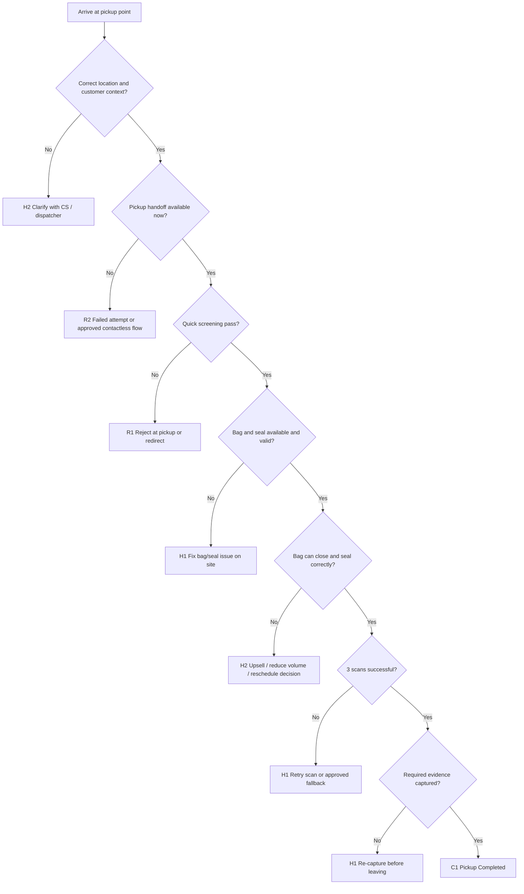

# SF-02 Deep Dive: Pickup & Seal at Customer Site
*Dự án: NowWash*

Tài liệu này đào sâu riêng cho `SF-02` trong `Service Flow`. Mục tiêu là khóa chặt logic `pickup hợp lệ`, `niêm phong hợp lệ`, và `bằng chứng tối thiểu` để một đơn được phép rời khỏi địa điểm khách hàng và đi tiếp vào chain of custody.

Tài liệu gốc liên quan:
- `docs/05_Operations/service_flow_master.md`
- `docs/05_Operations/laundry_operations_sop_detailed.md`
- `docs/05_Operations/business_rules_exceptions.md`
- `docs/05_Operations/service_flow_sf00_order_eligibility.md`
- `docs/05_Operations/service_flow_sf01_pre_pickup_readiness.md`
- `docs/05_Operations/service_flow_protocol_offline_fallback.md`
- `docs/09_Strategy_Management/00. Tài liệu chung.md`

## 1. Mục tiêu của SF-02

`SF-02` phải trả lời 4 câu hỏi tại điểm pickup:

1. `Đúng đơn, đúng khách, đúng điểm nhận chưa?`
2. `Đồ này có hợp lệ để đưa vào bag service flow không?`
3. `Bag + seal + scans + photos đã đủ để khóa chain of custody chưa?`
4. `Nếu có lệch chuẩn thì tiếp tục, hold, reject, hay failed attempt?`

Điểm quan trọng:
- `SF-02` là điểm đầu tiên khóa bằng chứng vật lý và số.
- Một pickup chỉ được coi là hoàn tất khi có `đồ đã vào túi`, `seal đã khóa`, `3 scan`, và `evidence tối thiểu`.
- Nếu thiếu một trong các lớp đó thì chưa được coi là `PICKED_UP`.

## 2. Phạm vi

`In scope`
- Xác thực order tại nơi nhận.
- Xác thực khách/người bàn giao/điểm giao nhận.
- Quick screening `OVF`, `OSZ`, `BLK`.
- Assign bag, apply seal, capture evidence.
- Contactless pickup hoặc pickup qua lễ tân/locker nếu được phép.
- Fallback khi QR, bag, seal, app, camera, network gặp lỗi tại hiện trường.

`Out of scope`
- Điều phối route trước khi tới điểm pickup.
- Vận chuyển từ pickup về hub/xưởng.
- Tranh chấp mất đồ sau khi đồ đã rời điểm pickup.

## 3. Kết quả quyết định chuẩn của SF-02

| Outcome Code | Tên kết quả | Ý nghĩa vận hành | Hành động khuyến nghị |
| --- | --- | --- | --- |
| `C1` | Pickup Completed | Pickup hợp lệ, đủ evidence, đủ seal, đủ scan | Tạo `BAG_ASSIGNED + SEAL_APPLIED + PICKUP_SCAN` |
| `C2` | Pickup Completed With Approved Variation | Pickup thành công nhưng có ngoại lệ được policy cho phép | Tạo pickup event + gắn tag ngoại lệ |
| `H1` | Hold On Site | Chưa được rời điểm nhận vì còn blocker có thể xử lý ngay | Tạm dừng và xử lý tại chỗ |
| `H2` | Hold For CS / Ops Decision | Cần người khác quyết trước khi pickup tiếp tục | Escalate và chờ quyết định |
| `R1` | Reject At Pickup | Không được nhận đồ theo policy | Không tạo pickup event |
| `R2` | Failed Pickup Attempt | Không nhận được đồ trong attempt này | Mark failed attempt / reschedule theo policy |

## 4. Nguyên tắc điều hành của SF-02

- `Không scan + không ảnh + không seal = chưa pickup`.
- `Không nhận một phần bằng chứng`: nếu app cho bấm pickup mà thiếu dữ liệu thì quy trình đang sai.
- `Không ép fit`: túi không đóng được thì không được niêm phong bằng mọi giá.
- `Không nhận hàng ngoài policy chỉ vì khách năn nỉ hoặc gần KPI`.
- `Không để đồ rời khỏi điểm pickup khi ownership chưa rõ`.
- `Contactless pickup` chỉ hợp lệ nếu building policy và customer authorization cho phép.

## 5. Dữ liệu đầu vào tối thiểu

| Nhóm dữ liệu | Trường tối thiểu | Bắt buộc | Ghi chú |
| --- | --- | --- | --- |
| Order | Order ID / Order QR | Có | Điểm neo của mọi bằng chứng |
| Customer context | Tên khách, phone mask, apartment, building note | Có | Dùng để đối chiếu tại chỗ |
| Bag | Bag ID / Bag QR, đúng size | Có | Không pickup nếu không có bag hợp lệ |
| Seal | Seal ID / Seal QR, single-use | Có | Không pickup nếu không có seal hợp lệ |
| Photos | Ảnh cận seal và ảnh toàn cảnh điểm pickup | Có | Evidence tối thiểu |
| Access context | Người bàn giao / reception / locker note | Có nếu applicable | Bắt buộc với pickup không trực tiếp |
| Exception note | `OVF`, `OSZ`, `BLK`, `NSH`, `QR_UNREADABLE`, `SEAL_BROKEN`... | Có nếu phát sinh | Để hậu kiểm |

## 6. Chuỗi quyết định SF-02

## 7. Gate-by-Gate Decision Table

### Gate 1. Arrival & Location Match

| Điều kiện pass | Nếu fail | Outcome | Owner |
| --- | --- | --- | --- |
| Shipper đang ở đúng building / apartment / pickup point theo route | Sai tòa, sai block, sai tầng, thiếu access context, hoặc không tìm được điểm nhận | `H2` hoặc `R2` | Shipper / dispatcher / CS |

`Rule to run`
- Không bắt đầu sequence scan nếu chưa chắc đang ở đúng điểm pickup.
- Nếu building có nhiều block/tháp, shipper phải match đúng `building + apartment`.
- Nếu customer yêu cầu pickup tại reception/locker thay vì căn hộ, point đó phải khớp instruction từ `SF-00` hoặc `SF-01`.

### Gate 2. Handoff Availability

| Điều kiện pass | Nếu fail | Outcome | Owner |
| --- | --- | --- | --- |
| Có khách, người được ủy quyền, hoặc điểm contactless hợp lệ để bàn giao đồ | Khách vắng, không liên hệ được, reception từ chối giữ, locker không khả dụng | `R2`, `C2`, hoặc `H2` | Shipper / CS |

`Rule to run`
- `Direct handoff` là mặc định.
- `Contactless pickup` chỉ được coi là hợp lệ nếu có ít nhất một trong các điều kiện:
  - customer đã pre-authorize trong note
  - building policy mặc định là reception / locker
  - CS xác nhận trực tiếp trong attempt đó
- Nếu không có pre-authorization và customer không reachable, không tự ý nhận đồ từ bên thứ ba.

`Khuyến nghị mặc định`
- Thử gọi / nhắn trong ngưỡng vận hành tiêu chuẩn trước khi mark failed attempt.
- Nếu tòa không cho lên căn nhưng có lễ tân/bảo vệ/locker được phép, route có thể chuyển sang `C2` nếu evidence đủ.

### Gate 3. Identity & Order Match

| Điều kiện pass | Nếu fail | Outcome | Owner |
| --- | --- | --- | --- |
| Order, tên khách, building, apartment, và bag size chỉ định khớp | Khách đưa nhầm order, nhầm căn, hoặc muốn nhập sang order khác | `H2` hoặc `R2` | Shipper / CS |

`Rule to run`
- Không scan một order rồi nhận đồ của một customer khác.
- Nếu cùng household có nhiều order active, shipper phải xác nhận đúng order trước khi nhận đồ.
- Không gộp 2 order vào 1 bag tại điểm pickup.

### Gate 4. Quick Screening: Eligibility at Door

| Điều kiện pass | Nếu fail | Outcome | Owner |
| --- | --- | --- | --- |
| Không có dấu hiệu rõ ràng của `OSZ` hoặc `BLK`; volume sơ bộ có khả năng fit vào bag | Phát hiện hàng cấm, quá khổ, hoặc sai gói rõ ràng | `R1` hoặc `H2` | Shipper / CS |

`Rule to run`
- Shipper phải nhìn nhanh lô đồ trước khi bagging để phát hiện:
  - `OSZ`: ga bọc đệm cao su, thảm, vải dày cồng kềnh, vật vượt công suất lồng
  - `BLK`: đồ lót rời rạc, chất thải sinh học, hóa chất công nghiệp, đồ premium dễ hỏng cần luồng khác
- Nếu rule đã rõ từ mắt thường, không cần pick lên rồi mới từ chối.
- Nếu chưa chắc nhưng có nghi ngờ:
  - không reject ngay nếu policy cho phép xác minh tiếp
  - nhưng phải gắn exception note hoặc escalated confirmation

### Gate 5. Bag Assignment Validity

| Điều kiện pass | Nếu fail | Outcome | Owner |
| --- | --- | --- | --- |
| Bag đúng size, sạch, QR đọc được, trạng thái dùng được | Bag thiếu, bag sai size, bag bẩn, bag QR lỗi | `H1`, `H2`, hoặc `R2` | Shipper / shift lead |

`Rule to run`
- Chỉ dùng bag có status hợp lệ từ `SF-01`.
- Không đổi bag size ngoài policy mà không xác nhận.
- Nếu bag hiện trường lỗi:
  - ưu tiên thay bag khác cùng size
  - nếu cần đổi size theo upsell/downsell, phải có reason code rõ

`Quick error mapping`
- `BAG_NOT_AVAILABLE` -> đổi bag hoặc escalate điều chỉnh
- `QR_UNREADABLE` trên bag -> đổi bag hoặc in/dán lại theo protocol

### Gate 6. Seal Assignment Validity

| Điều kiện pass | Nếu fail | Outcome | Owner |
| --- | --- | --- | --- |
| Seal còn nguyên, QR đọc được, chưa từng dùng | Seal gãy, mờ mã, lỗi in, hoặc seal bị dùng trước | `H1` hoặc `R2` | Shipper / shift lead |

`Rule to run`
- Mọi seal phải là `single-use`.
- Seal lỗi trong lúc thao tác không được chắp vá.
- Nếu seal bị gãy khi đang niêm phong:
  - loại seal cũ
  - lấy seal mới
  - làm lại đầy đủ bước evidence cần thiết

`Quick error mapping`
- `SEAL_BROKEN` khi chưa rời điểm pickup -> thay seal mới và capture lại evidence
- `QR_UNREADABLE` trên seal -> thay seal khác

### Gate 7. Fit & Closure Check

| Điều kiện pass | Nếu fail | Outcome | Owner |
| --- | --- | --- | --- |
| Đồ vào túi xong, kéo khóa kín, seal có thể khóa đúng cách | Túi tràn (`OVF`), zipper không kín, không thể niêm phong an toàn | `H2`, `R1`, hoặc `C2` | Shipper / CS |

`Rule to run`
- Rule tối thượng là `miệng túi phải khép lại được hoàn toàn và seal được`.
- Không ép kéo khóa trên túi tràn.
- Không niêm phong trên zipper đang hở hoặc căng quá mức.

`Decision mặc định cho OVF`
- Nếu khách chấp nhận bỏ bớt đồ ra -> tiếp tục
- Nếu khách chấp nhận thêm bag theo policy -> `C2` với bag bổ sung / upsell
- Nếu không đạt được phương án hợp lệ -> `R1` hoặc `R2` tùy policy kinh doanh

### Gate 8. Mandatory Scan Set

| Điều kiện pass | Nếu fail | Outcome | Owner |
| --- | --- | --- | --- |
| Scan đủ `Order QR`, `Bag QR`, `Seal QR` | Thiếu scan, scan nhầm, scan lỗi liên tục, mapping không khớp | `H1`, `H2`, hoặc `R2` | Shipper / shift lead / tech support |

`Rule to run`
- Bộ scan tối thiểu là:
  - `Order QR`
  - `Bag QR`
  - `Seal QR`
- Không hoàn tất pickup nếu còn thiếu bất kỳ scan nào.
- Không được sửa tay mapping order-bag-seal nếu chưa có protocol fallback được duyệt.

`Fallback`
- Nếu một mã bị mờ nhưng vẫn xác minh được vật lý:
  - dùng protocol `QR_UNREADABLE` đã duyệt
  - tạo note và capture ảnh chứng minh
- Nếu app scan lỗi hàng loạt:
  - chỉ được chạy tiếp nếu `offline fallback` đã được cấp quyền từ `SF-01`
  - nếu không, giữ `H1` hoặc chuyển `R2`

### Gate 9. Evidence Minimum Set

| Điều kiện pass | Nếu fail | Outcome | Owner |
| --- | --- | --- | --- |
| Có đủ bộ bằng chứng tối thiểu cho kiểu handoff đó | Thiếu ảnh, ảnh mờ, không nhận diện được điểm pickup, không thấy seal rõ | `H1` | Shipper |

`Evidence minimum set mặc định cho direct pickup`
- `Photo 1`: ảnh cận seal đã móc chặt vào khóa kéo
- `Photo 2`: ảnh toàn cảnh túi tại điểm pickup, có dấu hiệu nhận diện location
- `Timestamp`
- `Shipper account`
- `Order-Bag-Seal linkage` từ scan set

`Evidence minimum set cho reception / locker pickup`
- `Photo 1`: cận seal đã khóa
- `Photo 2`: túi tại reception / locker / quầy bảo vệ
- `Photo 3`: thông tin nhận diện lễ tân / bảo vệ / mã locker nếu policy yêu cầu
- `Access note / authorization source`

`Rule to run`
- Ảnh phải đủ sáng, đủ nét, không bị crop mất seal hoặc mất location cue.
- Nếu ảnh đầu không đạt, chụp lại trước khi rời điểm pickup.
- Không dùng một ảnh cũ cho nhiều đơn.

### Gate 10. Commit Pickup Event

| Nếu pass toàn bộ | Nếu pass có approved variation | Nếu không pass |
| --- | --- | --- |
| `C1` -> tạo `BAG_ASSIGNED + SEAL_APPLIED + PICKUP_SCAN` | `C2` -> tạo pickup event + tag variation | `H1/H2/R1/R2` -> không được tạo pickup completion |

`Output tối thiểu khi commit`
- `order_id`
- `bag_id`
- `seal_id`
- `pickup_attempt_id`
- `pickup_type` (`direct`, `reception`, `locker`, `authorized-third-party`)
- `pickup_outcome`
- `exception_tags`
- `photos_attached`
- `triggered_by`
- `pickup_timestamp`

## 8. Bộ Bằng Chứng Chuẩn Cần Khóa Cứng

Đây là phần mình đề xuất xem như `minimum legal-operational proof` của pickup:

1. `Order QR scan`
2. `Bag QR scan`
3. `Seal QR scan`
4. `Seal close-up photo`
5. `Location photo`
6. `Timestamp`
7. `Shipper account / staff ID`

`Conditional evidence`
- `Reception/locker proof`
- `Customer authorization source`
- `Exception reason code`
- `CS approval note` nếu có đổi phương án pickup

Nếu thiếu 1 trong 7 lớp core ở trên, pickup chưa nên được coi là hoàn tất.

## 9. Pickup Types Cần Phân Biệt Rõ

| Pickup type | Khi nào dùng | Evidence bổ sung | Outcome thường gặp |
| --- | --- | --- | --- |
| `Direct` | Khách hoặc người được ủy quyền bàn giao trực tiếp | Bộ evidence chuẩn | `C1` |
| `Reception` | Tòa/khách yêu cầu qua lễ tân/bảo vệ | Ảnh điểm nhận + identity cue | `C2` |
| `Locker` | Tòa có locker / cabin hợp lệ | Ảnh locker + mã locker | `C2` |
| `Authorized third-party` | Người thân / helper / lễ tân được ủy quyền | Note nguồn ủy quyền | `C2` |
| `Failed attempt` | Không có handoff hợp lệ | Lý do attempt fail | `R2` |

## 10. Exception Matrix Cho SF-02

| Bucket | Tín hiệu | Xử lý tức thời | Outcome mặc định |
| --- | --- | --- | --- |
| `OVF` | Túi không khép kín, không seal được | Giảm đồ / thêm bag / dừng | `H2` / `C2` / `R1` |
| `OSZ` | Đồ quá khổ, quá dày, vượt công suất | Từ chối / redirect dịch vụ | `R1` |
| `BLK` | Hàng cấm hoặc sai chuẩn vệ sinh | Từ chối / redirect | `R1` |
| `NSH` | Khách không có mặt | Contactless nếu hợp lệ, nếu không failed attempt | `C2` / `R2` |
| `BAG_NOT_AVAILABLE` | Bag lỗi hoặc thiếu | Đổi bag / hold on site | `H1` |
| `SEAL_BROKEN` | Seal lỗi lúc niêm phong | Thay seal và capture lại | `H1` |
| `QR_UNREADABLE` | Mã bag/seal/order không đọc được | Retry / fallback đã duyệt | `H1` / `H2` |
| `APP_OR_NETWORK_FAIL` | Không thể ghi nhận event / upload | Fallback đã duyệt hoặc dừng attempt | `H1` / `R2` |
| `ORDER_MISMATCH` | Khách, địa chỉ, order không khớp | Gọi CS / dispatcher | `H2` |

## 11. Offline / Tech Fallback Protocol Ở Điểm Pickup

Protocol chuẩn cho bài toán app/scanner/network lỗi được khóa tại:

- `docs/05_Operations/service_flow_protocol_offline_fallback.md`

Áp dụng tối thiểu tại `SF-02` như sau:

`Chỉ được dùng nếu`
- `SF-01` đã cho phép offline fallback, hoặc
- shift lead / ops lead xác nhận ngay trong attempt đó.

`Bộ dữ liệu fallback tối thiểu`
- Ảnh bag
- Ảnh seal đã khóa
- Ảnh location
- Ghi tay / note app local:
  - order code
  - bag code
  - seal code
  - thời gian
  - tên account shipper

`Rule to run`
- Không rời location nếu chưa chụp đủ bộ fallback.
- Phải sync / nhập lại hệ thống ngay khi có kết nối.
- `Bắt buộc sync xong trước first non-customer handover` như hub hoặc workshop, trừ khi `ops lead` duyệt waiver riêng theo protocol.
- `Hard max`: hoàn tất sync trong vòng `30 phút` kể từ lúc kết nối khôi phục và luôn trước khi hết ca.
- Nếu không thể tái lập chính xác `order-bag-seal linkage`, case phải vào `H2 incident review`.

## 12. Các Rule Nên Khóa Cứng Trong Hệ Thống

1. `Không cho bấm pickup complete nếu thiếu 3 scan`
2. `Không cho bấm pickup complete nếu thiếu bộ ảnh tối thiểu`
3. `Seal broken at pickup -> bắt buộc thay seal mới, không override`
4. `Order-bag-seal mismatch -> không commit event`
5. `Contactless pickup -> bắt buộc chọn pickup type và evidence tương ứng`
6. `Reject / failed attempt -> bắt buộc chọn reason code`
7. `A3 provisional orders từ SF-00 -> bắt buộc hiển thị instruction tại màn pickup`

## 13. Các Mốc Số Liệu Nên Theo Dõi Từ SF-02

- `% pickup complete đủ 3 scan`
- `% pickup complete đủ bộ ảnh chuẩn`
- `% pickup phải dùng approved variation`
- `% pickup failed vì no-show`
- `% pickup reject vì `OSZ` / `BLK``
- `% pickup dùng offline fallback`
- `% seal reissue tại cửa khách`
- `% order mismatch tại pickup`

## 14. Những Quyết Định Nên Chốt Với Bạn Ở Vòng Review Này

Đây là các policy còn nên khóa tiếp:

1. `No-show wait time`
   - Chờ khách tối đa bao lâu trước khi mark failed attempt?

2. `Reception / locker default`
   - Có coi đây là mặc định hợp lệ cho pickup nếu building policy cho phép, hay phải cần customer authorization từng lần?

3. `Upsell at door`
   - Khi `OVF`, shipper có quyền tự upsell bag phụ trong ngưỡng nào?

4. `Third-party handoff`
   - Ai được coi là người bàn giao hợp lệ: người thân, helper, lễ tân, bảo vệ?

5. `Reject vs failed attempt`
   - Trường hợp khách không đồng ý policy `OSZ/BLK/OVF` thì hệ thống nên đánh là `R1 Reject` hay `R2 Failed attempt`?

## 15. Ranh Giới Với Các Flow Khác

`SF-02` chỉ quyết định việc `đồ đã được nhận và niêm phong hợp lệ tại điểm pickup hay chưa`.

Không xử lý sâu tại đây:
- Handover về hub/xưởng -> thuộc `SF-03`
- Seal broken sau khi rời khách -> thuộc `SF-03` và incident flow
- Tranh cãi bồi thường -> thuộc `Complaint / Incident Flow`

Nhưng `SF-02` phải tạo đủ bằng chứng để các flow sau có căn cứ.

## 16. Kết luận

Nếu chốt theo tài liệu này, `SF-02` sẽ trở thành `custody lock gate` thực thụ:

- Chặn nhận sai đồ từ đầu.
- Buộc pickup phải có bằng chứng chuẩn.
- Giảm khiếu nại mất đồ nhờ order-bag-seal linkage rõ.
- Giảm pickup “ảo” được bấm cho xong khi thực tế chưa đủ điều kiện.
