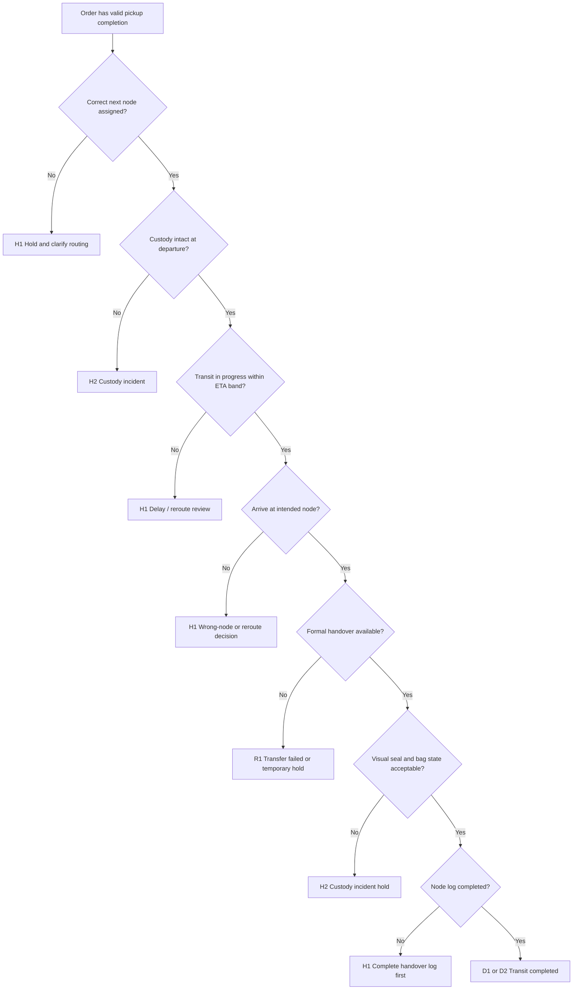

# SF-03 Deep Dive: Transit to Hub / Workshop
*Dự án: NowWash*

Tài liệu này đào sâu riêng cho `SF-03` trong `Service Flow`. Mục tiêu là khóa chặt logic `chain of custody` từ lúc một order đã pickup xong tại khách cho đến khi order được bàn giao hợp lệ vào `hub` hoặc đến cửa `workshop intake`.

Tài liệu gốc liên quan:
- `docs/05_Operations/service_flow_master.md`
- `docs/05_Operations/laundry_operations_sop_detailed.md`
- `docs/05_Operations/business_rules_exceptions.md`
- `docs/05_Operations/service_flow_sf02_pickup_and_seal.md`
- `docs/09_Strategy_Management/00. Tài liệu chung.md`
- `docs/06_Product_Tech/database_schema.md`

## 1. Mục tiêu của SF-03

`SF-03` phải trả lời 4 câu hỏi:

1. `Order có còn nguyên custody sau khi rời khách không?`
2. `Order đang đi theo đúng tuyến và đúng điểm nhận kế tiếp không?`
3. `Mọi handover giữa người với người hoặc người với hub có được log rõ không?`
4. `Nếu seal, ETA, hoặc điểm bàn giao có vấn đề thì incident được kích hoạt ở đâu?`

Điểm quan trọng:
- `SF-03` không tạo thêm giá trị xử lý dịch vụ; nó chỉ bảo vệ `sự thật vận hành`.
- Đây là stage giữ cho bằng chứng từ `SF-02` còn nguyên cho tới `SF-04`.
- Mọi “chữa cháy” bằng cách đổi bag, thay seal, hoặc bàn giao mơ hồ ở giữa đường đều làm hỏng chuỗi custody.

## 2. Phạm vi

`In scope`
- Rời điểm pickup.
- Vận chuyển trực tiếp đến workshop.
- Vận chuyển qua hub tạm.
- Handover cho hub staff.
- Handover tới điểm chờ intake workshop.
- Quản lý ETA, route deviation, và custody incident trên đường.

`Out of scope`
- Kỹ thuật pickup và niêm phong tại cửa khách.
- Seal integrity check chính thức khi nhập xưởng.
- Mở túi, sorting, hoặc bất kỳ xử lý vật lý nào bên trong order.

## 3. Kết quả quyết định chuẩn của SF-03

| Outcome Code | Tên kết quả | Ý nghĩa vận hành | Hành động khuyến nghị |
| --- | --- | --- | --- |
| `D1` | Transit Completed | Order đến đúng điểm nhận kế tiếp với custody còn nguyên | Tiếp tục sang `SF-04` hoặc trạng thái `AT_HUB` |
| `D2` | Transit Completed With Approved Reroute | Order đến nơi khác với điều chỉnh đã phê duyệt | Log reroute + tiếp tục flow |
| `H1` | Transit Hold | Order bị giữ tạm để làm rõ route / receiving / ETA | Hold tại điểm kiểm soát hợp lệ |
| `H2` | Custody Incident Hold | Có dấu hiệu gãy chain of custody | Khóa order và kích hoạt incident |
| `R1` | Transfer Failed | Không thể giao order vào node kế tiếp trong attempt này | Quay lại hub, reschedule, hoặc escalation |

## 4. Nguyên tắc điều hành của SF-03

- `Không mở túi trên đường`.
- `Không đổi bag trên đường`.
- `Không đổi seal trên đường`.
- `Không reseal để che sự cố`.
- `Mỗi lần order đổi người giữ phải có handover log`.
- `Nếu seal nghi rách hoặc có dấu mở, order lập tức chuyển sang custody incident`.
- `Transit chỉ có quyền di chuyển và bàn giao, không có quyền hợp thức hóa lỗi`.

## 5. Định nghĩa node và ownership

| Node | Vai trò | Ownership mặc định |
| --- | --- | --- |
| `Pickup release point` | Order vừa hoàn tất pickup, rời địa điểm khách | Shipper pickup |
| `On-route transit` | Order đang trên đường tới hub hoặc workshop | Shipper hiện giữ tuyến |
| `Hub receiving point` | Điểm tập kết tạm | Hub staff sau handover |
| `Workshop gate` | Cửa nhận hàng trước intake chính thức | Shipper hoặc hub runner cho tới khi workshop lead nhận |

`Nguyên tắc`
- Tại mọi thời điểm chỉ có `1 owner chính`.
- Nếu không xác định được owner chính, order phải vào `H2`.

## 6. Hai đường transit chuẩn

### Đường A. Direct-to-Workshop

`Pickup` -> `On-route transit` -> `Workshop gate` -> `SF-04`

### Đường B. Via-Hub

`Pickup` -> `On-route transit` -> `Hub receiving` -> `Hub staging` -> `Hub outbound transit` -> `Workshop gate` -> `SF-04`

Kết luận:
- Dù đi đường A hay B, quy tắc custody giống nhau.
- Khác biệt chủ yếu nằm ở `số lần handover` và `evidence tại node`.

## 7. Chuỗi quyết định SF-03

## 8. Gate-by-Gate Decision Table

### Gate 1. Departure Eligibility

| Điều kiện pass | Nếu fail | Outcome | Owner |
| --- | --- | --- | --- |
| Order đã có pickup completion hợp lệ từ `SF-02` và đã được gán next node | Thiếu pickup proof, thiếu next node, hoặc order đang ở hold state | `H1` hoặc `H2` | Shipper / dispatcher |

`Rule to run`
- Không cho order rời điểm pickup nếu `SF-02` chưa commit hợp lệ.
- Next node phải rõ là:
  - `workshop direct`
  - `hub`
  - `hub rồi workshop`
- Nếu route thay đổi sau pickup, dispatcher phải push reroute chính thức; shipper không tự đoán node mới.

### Gate 2. Custody at Departure

| Điều kiện pass | Nếu fail | Outcome | Owner |
| --- | --- | --- | --- |
| Bag nguyên vẹn, seal khóa, không có dấu mở rõ ràng, order còn trong quyền giữ của shipper đúng account | Seal lệch, bag rách nặng, order bị lẫn khỏi tuyến, ownership mơ hồ | `H2` | Shipper / dispatcher / ops |

`Rule to run`
- Trước khi rời pickup cluster hoặc trước khi merge nhiều order cùng tuyến, shipper phải đảm bảo mọi order vẫn tách riêng và có thể truy từng bag.
- Không được để bag loose không rõ order code trong xe/giỏ.
- Nếu vừa pickup xong đã thấy seal có dấu hỏng, không được tự thay seal; chuyển incident.

### Gate 3. Route Adherence & ETA Control

| Điều kiện pass | Nếu fail | Outcome | Owner |
| --- | --- | --- | --- |
| Order di chuyển trên route hợp lệ, ETA còn trong ngưỡng chấp nhận | Chậm tuyến, vòng sai đường, dừng ngoài kế hoạch, hoặc ETA vỡ đáng kể | `H1`, `D2`, hoặc `R1` | Shipper / dispatcher |

`Rule to run`
- Dispatcher phải theo dõi ETA ở mức route/wave.
- Không coi mọi delay là incident custody; chỉ escalate custody nếu delay đi kèm mất dấu ownership hoặc seal risk.
- Nếu cần reroute:
  - phải có node mới rõ ràng
  - phải có owner mới rõ ràng
  - phải có log thời điểm đổi

`Khuyến nghị mặc định`
- Có một `ETA grace band` chuẩn để phân biệt delay bình thường và delay cần can thiệp.
- Reroute chỉ nên dùng nếu vẫn giữ được custody rõ và receiving node còn khả năng nhận.

### Gate 4. In-Transit Handling Standards

| Điều kiện pass | Nếu fail | Outcome | Owner |
| --- | --- | --- | --- |
| Bag được xếp riêng, không bị đè ép bất thường, không lẫn với order khác | Chèn ép gây nguy cơ rách seal, để chung không nhận diện, hoặc chuyển tay không log | `H1` hoặc `H2` | Shipper / shift lead |

`Rule to run`
- Mỗi bag phải vẫn là một `transport unit` riêng.
- Không buộc, gộp, hoặc bọc chung 2 order theo cách làm mất nhận diện.
- Không để bag tại vị trí không có kiểm soát như gửi tạm vô danh, quán cà phê, hoặc khu công cộng.

### Gate 5. Hub Arrival & Handover

| Điều kiện pass | Nếu fail | Outcome | Owner |
| --- | --- | --- | --- |
| Có hub staff nhận hàng, scan/order match đúng, và xác nhận visual intact | Hub chưa có người nhận, hub từ chối nhận, sai hub, hoặc visual seal fail | `D1`, `D2`, `H1`, `H2`, hoặc `R1` | Shipper / hub staff / dispatcher |

`Rule to run`
- Nếu đi qua hub tạm, phải dùng `HUB_HANDOVER_SCAN` hoặc cơ chế tương đương.
- Handover hub tối thiểu phải có:
  - `Order QR scan`
  - xác nhận `seal nguyên? yes/no`
  - ảnh nếu `no`
  - timestamp nhận
  - owner nhận
- Hub staff chỉ làm `visual custody check`, không thay thế `SF-04` seal integrity check của workshop.

`Nếu visual seal fail tại hub`
- Không nhận vào flow bình thường.
- Chuyển `H2 custody incident`.
- Không reseal tại hub để đi tiếp.

### Gate 6. Hub Staging Controls

| Điều kiện pass | Nếu fail | Outcome | Owner |
| --- | --- | --- | --- |
| Order nằm tại khu staging có kiểm soát, phân tách rõ, chờ outbound đúng node kế tiếp | Bag bị đặt lẫn, mất owner, tồn quá lâu không reason, hoặc không rõ wave outbound | `H1` hoặc `H2` | Hub staff / ops lead |

`Rule to run`
- Hub staging phải giữ:
  - khu vực xác định
  - order identification rõ
  - owner / ca chịu trách nhiệm
- Không để hub thành kho mù không có `ageing control`.
- Order tồn hub quá ngưỡng phải có reason code.

### Gate 7. Outbound from Hub to Workshop

| Điều kiện pass | Nếu fail | Outcome | Owner |
| --- | --- | --- | --- |
| Order được assign đúng runner/tuyến, next node là workshop cụ thể, và custody vẫn nguyên | Sai workshop, runner chưa nhận tuyến, missing order in staging, seal risk phát sinh | `H1`, `H2`, hoặc `R1` | Hub staff / dispatcher |

`Rule to run`
- Outbound từ hub cũng phải có handover log như pickup route.
- Nếu chuyển từ hub sang workshop khác với plan ban đầu, phải log là `approved reroute`.
- Không điều order sang workshop mới chỉ vì “gần hơn” nếu chưa xác nhận receiving capacity.

### Gate 8. Arrival at Workshop Gate

| Điều kiện pass | Nếu fail | Outcome | Owner |
| --- | --- | --- | --- |
| Order đến đúng workshop gate, có người nhận bước tiếp theo, custody vẫn nguyên | Sai workshop, workshop chưa sẵn, order bị treo không owner, hoặc visual seal fail | `D1`, `D2`, `H1`, `H2`, hoặc `R1` | Shipper / hub runner / workshop lead |

`Rule to run`
- `SF-03` kết thúc khi order đã đến workshop gate với owner kế tiếp rõ.
- `SF-04` chỉ bắt đầu khi workshop lead nhận và làm intake.
- Nếu workshop chưa sẵn nhận:
  - order không được bỏ vô danh trước cửa
  - phải giữ owner hiện tại hoặc đưa về khu hold được chỉ định

### Gate 9. Commit Transit Completion

| Nếu pass direct path | Nếu pass via-hub path | Nếu fail |
| --- | --- | --- |
| `D1` -> tới workshop gate, chờ `SF-04` | `D1` -> `AT_HUB` hoặc tới workshop gate sau hub | `H1/H2/R1` -> không coi là transfer hoàn tất |

`Output tối thiểu`
- `order_id`
- `from_node`
- `to_node`
- `current_owner`
- `handover_owner`
- `handover_timestamp`
- `seal_visual_status`
- `route_id`
- `eta_status`
- `reroute_flag`
- `incident_tags`

## 9. Bộ Log / Evidence Tối Thiểu Của Transit

`Core transit evidence`
- Pickup completion reference từ `SF-02`
- Route / node assignment
- Handover log ở mọi node trung gian
- `seal visual status` tại node nhận
- Timestamp đến node
- Người giao / người nhận

`Conditional evidence`
- Ảnh bag/seal nếu visual check fail
- Camera hub / nhà xe / hành lang nếu có incident
- Reroute approval note
- Delay reason code

Kết luận:
- `SF-03` không cần nhiều ảnh như pickup, nhưng bắt buộc phải có `ownership log`.
- Nếu thiếu ownership log ở một handover, custody đã yếu đi đáng kể.

## 10. Handover Types Cần Phân Biệt

| Handover type | Khi nào dùng | Dữ liệu bắt buộc | Outcome thường gặp |
| --- | --- | --- | --- |
| `Shipper -> Workshop gate` | Đi thẳng xưởng | order scan, timestamp, người nhận | `D1` |
| `Shipper -> Hub` | Qua hub tạm | order scan, seal visual yes/no, người nhận | `D1` |
| `Hub -> Workshop` | Xuất từ hub sang xưởng | route + owner + timestamp | `D1` / `D2` |
| `Shipper -> Shipper` | Reassign giữa đường đã duyệt | handover log đầy đủ | `D2` |

## 11. Exception Matrix Cho SF-03

| Bucket | Tín hiệu | Xử lý tức thời | Outcome mặc định |
| --- | --- | --- | --- |
| `SBR` | Seal rách, đứt, hoặc có dấu mở trên đường | Khóa order, không đi tiếp flow thường | `H2` |
| `WRONG_NODE` | Đến sai hub/xưởng | Hold và xin reroute | `H1` / `D2` |
| `NO_RECEIVER` | Đến node nhưng không có người nhận | Hold tạm có owner hoặc quay lại hub | `H1` / `R1` |
| `ETA_BREACH` | Trễ vượt ngưỡng | Dispatcher review, re-plan | `H1` / `D2` |
| `ORDER_NOT_FOUND` | Thiếu bag tại điểm handover | Kích hoạt custody incident | `H2` |
| `UNLOGGED_HANDOVER` | Chuyển tay nhưng không log | Incident review | `H2` |
| `HUB_BACKLOG` | Hub tồn quá tải, không nhận thêm | Reduce wave / reroute có duyệt | `H1` / `R1` |
| `WORKSHOP_NOT_READY` | Xưởng chưa nhận được | Hold có owner hoặc quay hub | `H1` / `R1` |

## 12. Các Rule Nên Khóa Cứng Trong Hệ Thống

1. `Không cho reseal trong transit`
2. `Seal visual fail ở hub/workshop gate -> khóa order khỏi flow thường`
3. `Mọi handover phải có from_owner và to_owner`
4. `Reroute phải có approval flag`
5. `Không cho mark HUB_RECEIVED nếu chưa có người nhận`
6. `Không cho order vào workshop nếu đang ở custody incident hold`
7. `Order aging tại hub vượt ngưỡng -> bắt buộc reason code`

## 13. Các Mốc Số Liệu Nên Theo Dõi Từ SF-03

- `% order transit direct-to-workshop`
- `% order qua hub`
- `% handover có log đầy đủ`
- `% seal visual fail trên đường`
- `% sai node`
- `% reroute được phê duyệt`
- `% transfer failed do no receiver`
- `thời gian tồn hub trung bình`
- `% order vào workshop với custody intact`

## 14. Những Quyết Định Nên Chốt Với Bạn Ở Vòng Review Này

Đây là các policy còn nên khóa tiếp:

1. `ETA grace band`
   - Trễ bao nhiêu phút thì từ `normal delay` chuyển sang `dispatch intervention`?

2. `Hub ageing threshold`
   - Một order được ở hub tối đa bao lâu trước khi buộc escalate?

3. `Reroute authority`
   - Ai được quyền đổi workshop: dispatcher, ops lead, hay workshop lead?

4. `Handover photo requirement`
   - Hub handover bình thường có cần ảnh không, hay chỉ cần khi visual fail / exception?

5. `No receiver at workshop gate`
   - Giữ owner hiện tại bao lâu trước khi trả về hub hoặc chuyển hold?

6. `Shipper-to-shipper transfer`
   - Có cho phép thường xuyên hay chỉ trong emergency / approved reroute?

## 15. Ranh Giới Với Các Flow Khác

`SF-03` chỉ quyết định việc `order có được vận chuyển và bàn giao nguyên custody sang node kế tiếp hay không`.

Không xử lý sâu tại đây:
- Seal integrity check chính thức và intake -> thuộc `SF-04`
- Bồi thường hoặc dispute do seal broken -> thuộc `Incident / Complaint Flow`
- Quản trị tồn kho hub/facility sâu -> thuộc `Assets / Facilities Flow`

Nhưng `SF-03` phải để lại đủ `ownership trail` để mọi flow sau truy trách nhiệm được.

## 16. Kết luận

Nếu chốt theo tài liệu này, `SF-03` sẽ trở thành `custody transport gate` thực thụ:

- Không cho transit tự ý “vá” lỗi.
- Bảo vệ chain of custody từ pickup đến receiving node.
- Giảm tranh chấp mất đồ bằng ownership trail rõ ràng.
- Tách rõ delay vận hành bình thường với custody incident thật sự.
