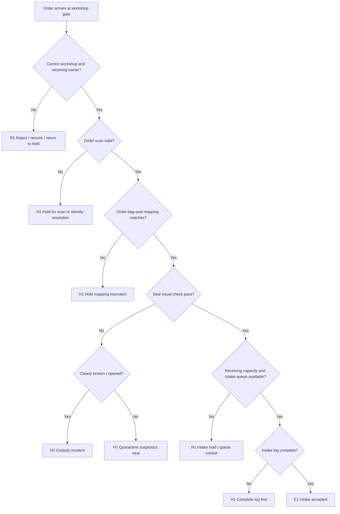

# SF-04 Deep Dive: Workshop Intake & Seal Integrity Check
*Dự án: NowWash*

Tài liệu này đào sâu riêng cho `SF-04` trong `Service Flow`. Mục tiêu là khóa chặt logic `order nào được phép vào xưởng`, `order nào phải quarantine`, và `order nào phải chuyển thành custody incident` trước khi túi bị mở ra tại bàn sorting.

Tài liệu gốc liên quan:
- `docs/05_Operations/service_flow_master.md`
- `docs/05_Operations/laundry_operations_sop_detailed.md`
- `docs/05_Operations/business_rules_exceptions.md`
- `docs/05_Operations/service_flow_sf03_transit_to_hub_workshop.md`
- `docs/05_Operations/service_flow_workshop_hold_matrix.md`
- `docs/09_Strategy_Management/00. Tài liệu chung.md`
- `docs/06_Product_Tech/database_schema.md`

## 1. Mục tiêu của SF-04

`SF-04` phải trả lời 4 câu hỏi:

1. `Đây có đúng order mà xưởng đang chờ nhận không?`
2. `Bag, seal, và mapping order-bag-seal có còn khớp không?`
3. `Seal integrity có đạt chuẩn để order được vào xưởng không?`
4. `Nếu fail thì đi vào nhánh nào: quarantine, reroute, hay incident?`

Điểm quan trọng:
- `SF-04` là `gate cuối cùng` trước khi xưởng được quyền mở túi.
- Nếu gate này lỏng, mọi tranh chấp mất đồ hoặc nghi mở seal sẽ trôi thẳng vào dây chuyền và mất bằng chứng.
- `SF-04` không giải quyết tranh chấp; nó chỉ chặn order khỏi flow thường và giữ nguyên hiện trạng cho điều tra.

## 2. Phạm vi

`In scope`
- Nhận order tại cửa xưởng.
- Scan order vào `IN_WORKSHOP`.
- Xác nhận mapping `order -> bag -> seal`.
- Kiểm tra seal bằng mắt thường và thao tác nhẹ theo SOP.
- Quarantine / hold / incident routing.
- Intake log trước khi order vào sorting.

`Out of scope`
- Mở seal.
- Sorting, kiểm túi áo quần, chụp `ORG`.
- Chạy máy giặt hoặc QC.

## 3. Kết quả quyết định chuẩn của SF-04

| Outcome Code | Tên kết quả | Ý nghĩa vận hành | Hành động khuyến nghị |
| --- | --- | --- | --- |
| `E1` | Intake Accepted | Order được phép vào xưởng bình thường | Tạo `IN_WORKSHOP + SEAL_CHECK pass` |
| `E2` | Intake Accepted With Approved Exception | Order được nhận vào xưởng với ngoại lệ đã duyệt | Log exception + tiếp tục |
| `H1` | Intake Hold / Quarantine | Chưa được vào sorting, cần xác minh thêm nhưng chưa kết luận incident | Đưa vào khu quarantine có owner |
| `H2` | Custody Incident | Có dấu hiệu gãy chain of custody hoặc mất tính toàn vẹn | Khóa order, không cho vào flow thường |
| `R1` | Intake Rejected / Redirected | Xưởng này không được hoặc không thể nhận order | Trả node trước / reroute / hold theo policy |

## 4. Nguyên tắc điều hành của SF-04

- `Không cắt seal trước khi intake pass`.
- `Không intake nếu mapping order-bag-seal không khớp`.
- `Không intake nếu seal có dấu mở, đứt, hoặc nghi bị can thiệp`.
- `Không “cho chạy tạm” order lỗi để khỏi nghẽn dây chuyền`.
- `Quarantine phải là khu vực có owner, không phải góc để đồ tạm`.
- `Workshop lead là người có quyền gatekeeping chính`.

## 5. Các trạng thái vật lý cần phân biệt

| Trạng thái vật lý | Ý nghĩa | Kết quả mặc định |
| --- | --- | --- |
| `Seal intact` | Seal nguyên, khóa và head còn ổn, không có dấu mở rõ | `E1` |
| `Seal suspicious` | Seal lệch, trầy, lỏng, khó kết luận | `H1` |
| `Seal broken` | Seal đứt, rách, hoặc có dấu mở rõ | `H2` |
| `Bag mismatch` | Bag đang cầm không khớp bag đã assign | `H1` hoặc `H2` |
| `Order mismatch` | Mã order / node / tuyến không khớp | `H1` hoặc `R1` |

## 6. Chuỗi quyết định SF-04

## 7. Gate-by-Gate Decision Table

### Gate 1. Correct Workshop & Receiving Ownership

| Điều kiện pass | Nếu fail | Outcome | Owner |
| --- | --- | --- | --- |
| Order tới đúng workshop được assign, có workshop lead hoặc receiving owner nhận | Sai workshop, workshop chưa mở intake, hoặc không có owner nhận | `R1` hoặc `H1` | Shipper / hub runner / workshop lead |

`Rule to run`
- Không nhận “giữ tạm” order vào xưởng nếu không có owner.
- Không cho order vào khu xử lý chung nếu workshop này không phải receiving node đúng.
- Nếu workshop chưa ready nhưng đúng node, order vào `H1` tại khu hold có owner thay vì coi như đã nhập xưởng.

### Gate 2. Order Identity Validation

| Điều kiện pass | Nếu fail | Outcome | Owner |
| --- | --- | --- | --- |
| Scan order thành công, order đang ở trạng thái được phép intake | Order scan lỗi, order đã cancel, order đang incident hold, hoặc order không thuộc wave này | `H1`, `H2`, hoặc `R1` | Workshop lead / dispatcher |

`Rule to run`
- Chỉ scan những order có transit chain hợp lệ từ `SF-03`.
- Không intake order đang ở `custody incident`.
- Nếu order code không đọc được nhưng bag/seal vật lý vẫn còn:
  - đưa vào `H1`
  - không mở túi
  - gọi xác minh mapping

### Gate 3. Order-Bag-Seal Mapping Integrity

| Điều kiện pass | Nếu fail | Outcome | Owner |
| --- | --- | --- | --- |
| Bag ID và Seal ID hiển thị trên hệ thống khớp đúng bag/seal thực tế | Bag khác mã, seal khác mã, thiếu mapping, hoặc mapping bị override mơ hồ | `H1` hoặc `H2` | Workshop lead / ops / product-tech |

`Rule to run`
- Intake chỉ pass khi hệ thống hiển thị đúng:
  - `order_id`
  - `bag_id`
  - `seal_id`
- Không sửa tay mapping ngay tại xưởng để “cho chạy”.
- Nếu mapping mismatch nhưng custody còn có thể truy:
  - `H1 quarantine`
- Nếu mapping mismatch đi kèm dấu custody fail:
  - `H2 incident`

### Gate 4. Seal Visual Integrity Check

| Điều kiện pass | Nếu fail | Outcome | Owner |
| --- | --- | --- | --- |
| Seal nhìn nguyên vẹn, head-lock ổn, không có dấu mở, không có dấu thay thế | Seal đứt, rách, lỏng bất thường, head-lock nghi bị cạy, hoặc dấu can thiệp rõ | `E1`, `H1`, hoặc `H2` | Workshop lead |

`Rule to run`
- Kiểm tra bằng mắt thường trước.
- Dùng thao tác nhẹ theo SOP để xác nhận cụm khóa vẫn chắc.
- Không kéo quá mạnh làm phát sinh tranh cãi “xưởng làm đứt seal”.

`Decision logic`
- `Rõ ràng nguyên` -> pass
- `Nghi ngờ nhưng chưa chắc` -> `H1 quarantine`
- `Rõ ràng fail / mở / đứt` -> `H2 custody incident`

### Gate 5. Bag Physical Condition Check

| Điều kiện pass | Nếu fail | Outcome | Owner |
| --- | --- | --- | --- |
| Bag đủ nguyên trạng để tiếp tục vào sorting, không rách nặng, không bục khóa, không có dấu thao tác trái phép | Bag rách nặng, khóa hỏng, dấu can thiệp quanh zipper, hoặc condition không tương thích với seal pass | `H1` hoặc `H2` | Workshop lead |

`Rule to run`
- Bag condition không thay thế cho seal check, nhưng là lớp corroboration.
- Nếu bag hỏng nghiêm trọng mà seal vẫn “nguyên”, case phải vào `H1` để xem có mâu thuẫn vật lý không.

### Gate 6. Receiving Capacity & Queue Control

| Điều kiện pass | Nếu fail | Outcome | Owner |
| --- | --- | --- | --- |
| Xưởng có chỗ nhận, intake queue đang mở, order có thể vào khu chờ sorting hợp lệ | Intake queue quá tải, khu sorting chưa clear, camera chưa ready, hoặc xưởng bị hold kỹ thuật | `H1` hoặc `R1` | Workshop lead / ops lead |

`Rule to run`
- Không để “đã intake” nhưng thực tế nằm bừa ngoài khu chờ.
- Nếu capacity fail, order có thể bị `H1` tại khu receiving hold nhưng chưa sang `SF-05`.
- Không để capacity pressure ép xưởng intake order có seal nghi ngờ.

### Gate 7. Quarantine Handling

| Điều kiện pass | Nếu fail | Outcome | Owner |
| --- | --- | --- | --- |
| Order suspicious nhưng đã được chuyển đúng vào quarantine có owner, tag, timestamp | Order bị đặt lẫn, không tag, không owner, hoặc không rõ next action | `H1` hoặc `H2` | Workshop lead / ops |

`Rule to run`
- Mọi order `H1` tại xưởng phải có:
  - quarantine location
  - owner
  - reason code
  - timestamp
  - next reviewer
- `Set / release / SLA` cho mọi quarantine hoặc hold tại xưởng tuân theo `docs/05_Operations/service_flow_workshop_hold_matrix.md`.
- Quarantine không đồng nghĩa với “để đó”.
- Nếu sau một thời gian xác minh mà custody fail rõ hơn, escalate sang `H2`.

### Gate 8. Incident Trigger for SBR / Custody Break

| Điều kiện pass | Nếu fail | Outcome | Owner |
| --- | --- | --- | --- |
| Không có dấu custody break | Seal broken hoặc dấu mở rõ | `H2` | Workshop lead / CS / ops |

`Rule to run`
- Với mọi case `SBR`:
  - từ chối intake bình thường
  - tạo incident log
  - lưu ảnh seal nếu có thể
  - thông báo CS / ops
- Không tự reseal để đưa vào xưởng.
- Không mở túi để “xem thử có thiếu gì không” trước khi incident path được kích hoạt.

### Gate 9. Commit Intake Acceptance

| Nếu pass bình thường | Nếu pass có exception được duyệt | Nếu không pass |
| --- | --- | --- |
| `E1` -> tạo `IN_WORKSHOP + SEAL_CHECK pass` | `E2` -> intake có note ngoại lệ | `H1/H2/R1` -> không được coi là intake thành công |

`Output tối thiểu`
- `order_id`
- `bag_id`
- `seal_id`
- `received_at`
- `received_by`
- `seal_check_result`
- `bag_condition_result`
- `mapping_check_result`
- `intake_outcome`
- `quarantine_flag`
- `incident_tags`

## 8. Bộ Log / Evidence Tối Thiểu Của Intake

`Core intake evidence`
- Order scan result
- Mapping result `order-bag-seal`
- Seal check result `pass/suspicious/fail`
- Timestamp intake
- Receiving owner

`Conditional evidence`
- Ảnh seal khi suspicious/fail
- Ảnh bag khi condition bất thường
- Incident note / reason code
- Quarantine location log

Kết luận:
- Intake không cần video như sorting, nhưng phải có `decision evidence`.
- Nếu sau này có complaint mà intake không chứng minh được vì sao xưởng nhận hay không nhận, xưởng sẽ yếu thế.

## 9. Intake Outcomes Theo Use Case

| Use case | Kết quả đề xuất | Lý do |
| --- | --- | --- |
| Order đúng xưởng, scan được, mapping đúng, seal nguyên | `E1` | Flow chuẩn |
| Order đúng xưởng, seal hơi nghi nhưng chưa kết luận | `H1` | Quarantine để tránh mở nhầm |
| Seal đứt rõ, dấu mở rõ | `H2` | Custody incident rõ ràng |
| Sai workshop nhưng custody vẫn nguyên | `R1` hoặc `H1` | Không intake, chờ reroute |
| Order scan lỗi nhưng bag/seal vật lý khớp và còn truy được | `H1` | Chưa đủ để intake |
| Mapping mismatch nhưng chưa có seal fail | `H1` | Cần xác minh |
| Mapping mismatch + seal suspicious | `H2` | Custody risk cao |
| Xưởng backlog nhưng order hợp lệ | `H1` | Hold capacity, không phải custody incident |

## 10. Exception Matrix Cho SF-04

| Bucket | Tín hiệu | Xử lý tức thời | Outcome mặc định |
| --- | --- | --- | --- |
| `SBR` | Seal broken / dấu mở rõ | Incident path, không intake | `H2` |
| `SEAL_SUSPECT` | Seal lỏng, lệch, khó kết luận | Quarantine | `H1` |
| `MAPPING_MISMATCH` | Order-bag-seal không khớp | Hold xác minh | `H1` / `H2` |
| `WRONG_WORKSHOP` | Sai node nhận | Reject / reroute | `R1` |
| `SCAN_FAIL` | Không scan được order | Hold identity resolution | `H1` |
| `INTAKE_BACKLOG` | Xưởng chưa nhận nổi | Hold capacity | `H1` |
| `NO_RECEIVER` | Không có workshop lead nhận | Hold tại gate | `H1` |
| `BAG_CONDITION_CONFLICT` | Bag hỏng nhưng seal pass không thuyết phục | Quarantine / incident review | `H1` / `H2` |

## 11. Các Rule Nên Khóa Cứng Trong Hệ Thống

1. `Không cho mark IN_WORKSHOP nếu seal_check chưa có kết quả`
2. `Seal_check fail -> không cho order vào flow thường`
3. `Mapping mismatch -> không cho override tay tại intake`
4. `Order đang custody incident hold -> không cho re-intake`
5. `Quarantine order -> bắt buộc reason code + owner + location`
6. `Wrong workshop -> không cho intake complete`
7. `Không cho cắt seal trước khi intake pass`

## 12. Các Mốc Số Liệu Nên Theo Dõi Từ SF-04

- `% intake pass ngay lần đầu`
- `% intake vào quarantine`
- `% SBR tại cửa xưởng`
- `% mapping mismatch`
- `% scan fail tại intake`
- `thời gian hold trung bình ở quarantine`
- `% order vào sorting với seal_check pass`
- `% incident được kích hoạt từ intake gate`

## 13. Những Quyết Định Nên Chốt Với Bạn Ở Vòng Review Này

Đây là các policy còn nên khóa tiếp:

1. `Suspicious seal threshold`
   - Dấu hiệu nào đủ để xếp `H1 suspicious` thay vì pass luôn?

2. `Mapping override authority`
   - Có ai được quyền sửa mapping sau kiểm chứng, hay mọi sửa mapping phải qua ops/product-tech?

3. `Photo on fail`
   - Seal suspicious/fail có bắt buộc chụp ảnh trong mọi case không?

4. `Wrong workshop handling`
   - Sai workshop thì mặc định trả về hub, hay có thể giữ tại gate chờ reroute?

## 14. Ranh Giới Với Các Flow Khác

`SF-04` chỉ quyết định việc `order có được nhận vào xưởng hợp lệ hay không`.

Không xử lý sâu tại đây:
- Mở seal và đối soát camera -> thuộc `SF-05`
- Điều tra bồi thường nếu SBR dẫn tới dispute -> thuộc `Incident / Complaint Flow`
- Quản trị công suất xưởng sâu -> thuộc `Assets / Facilities` và `Reporting`

Nhưng `SF-04` phải tạo đủ `gate evidence` để về sau giải thích được vì sao xưởng nhận hay không nhận.

## 15. Kết luận

Nếu chốt theo tài liệu này, `SF-04` sẽ trở thành `intake integrity gate` đúng nghĩa:

- Không cho order lỗi custody lọt vào xưởng.
- Tách rõ `pass`, `quarantine`, và `incident`.
- Giữ nguyên bằng chứng trước khi bất kỳ ai được quyền cắt seal.
- Tạo nền vững cho `SF-05 Open, Sort, and Pre-Wash Verification`.
