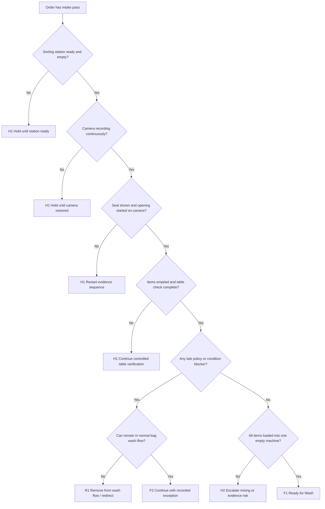

# SF-05 Deep Dive: Open, Sort, and Pre-Wash Verification
*Dự án: NowWash*

Tài liệu này đào sâu riêng cho `SF-05` trong `Service Flow`. Mục tiêu là khóa chặt logic `khi nào xưởng được phép mở túi`, `cách đối soát trên bàn sorting`, và `điều kiện nào để toàn bộ đồ của một order được đưa hợp lệ vào đúng 1 mẻ giặt`.

Tài liệu gốc liên quan:
- `docs/05_Operations/service_flow_master.md`
- `docs/05_Operations/laundry_operations_sop_detailed.md`
- `docs/05_Operations/standard_operating_procedures.md`
- `docs/05_Operations/service_flow_sf04_workshop_intake_and_seal_check.md`
- `docs/05_Operations/service_flow_workshop_hold_matrix.md`
- `docs/05_Operations/business_rules_exceptions.md`
- `docs/06_Product_Tech/database_schema.md`

## 1. Mục tiêu của SF-05

`SF-05` phải trả lời 5 câu hỏi:

1. `Order này có được quyền mở túi tại bàn sorting không?`
2. `Camera evidence có đủ liên tục để bảo vệ sự thật khi mở túi không?`
3. `Tình trạng gốc và vật lạ trong đồ có được ghi nhận đúng không?`
4. `Có dấu hiệu nào buộc phải dừng trước khi giặt không?`
5. `Toàn bộ đồ của order đã vào đúng 1 lồng máy trống chưa?`

Điểm quan trọng:
- `SF-05` là `evidence station` quan trọng nhất bên trong xưởng.
- Đây là chỗ NowWash có thể chứng minh `order nào vào bàn có gì`, `có thiếu từ đầu hay không`, và `xưởng có để sót món nào trên bàn hay không`.
- Nếu camera hoặc table discipline lỏng, complaint `MIS` sau này gần như không thể xử lý tự tin.

## 2. Phạm vi

`In scope`
- Chuẩn bị sorting station.
- Xác nhận camera/top-down continuity.
- Đưa seal lên camera và cắt seal.
- Đổ đồ ra bàn, kiểm vật lạ, ghi nhận `ORG`.
- Phân loại sơ bộ để chuẩn bị giặt.
- Đưa toàn bộ đồ của 1 order vào đúng 1 máy trống.
- Chặn late `BLK`, late `OSZ`, và các case không được vào giặt thường.

`Out of scope`
- Intake gate trước khi được mở túi.
- Thực thi chu trình giặt/sấy.
- QC sau giặt.

## 3. Kết quả quyết định chuẩn của SF-05

| Outcome Code | Tên kết quả | Ý nghĩa vận hành | Hành động khuyến nghị |
| --- | --- | --- | --- |
| `F1` | Ready for Wash | Order đã được mở, đối soát, và nạp hợp lệ vào đúng 1 máy | Cho phép `WASH_STARTED` ở `SF-06` |
| `F2` | Ready With Recorded Exception | Order đi tiếp nhưng có `ORG` hoặc note vật lạ đã được ghi nhận | Đi tiếp với evidence bổ sung |
| `H1` | Sorting Hold | Tạm dừng tại bàn sorting để làm rõ issue nhưng chưa là incident nặng | Hold tại station có owner |
| `H2` | Sorting Incident / Escalation | Có lỗi evidence hoặc custody đủ lớn để không được giặt tiếp | Khóa order khỏi flow thường |
| `R1` | Removed From Wash Flow | Order không được đi vào luồng giặt thường | Return / redirect / special handling |

## 4. Nguyên tắc điều hành của SF-05

- `Không mở túi nếu camera không hoạt động`.
- `Một station chỉ xử lý một order active tại một thời điểm`.
- `Không có order overlap trên cùng bàn`.
- `Không bỏ sót item trên bàn sau khi nạp máy`.
- `Không trộn item giữa hai order ở bất kỳ thời điểm nào`.
- `Không bắt đầu giặt nếu còn unresolved issue tại station`.
- `BLK late discovery` là lỗi policy, không phải lý do để giặt tạm rồi xử lý sau.

## 5. Tiền điều kiện để bước vào SF-05

Chỉ được vào `SF-05` nếu:

- Order đã `SF-04 intake pass`.
- Station được assign rõ.
- Camera top-down đang ghi.
- Bàn sạch, sáng, không còn item tồn.
- Có ít nhất một máy trống sẵn sàng cho order đó.

Nếu thiếu một trong các điều kiện trên, order phải quay về `H1` trước khi mở túi.

## 6. Chuỗi quyết định SF-05

## 7. Gate-by-Gate Decision Table

### Gate 1. Sorting Station Readiness

| Điều kiện pass | Nếu fail | Outcome | Owner |
| --- | --- | --- | --- |
| Bàn sorting sạch, rộng, sáng, và không có item từ order khác | Còn đồ tồn, bề mặt bẩn, station đang dở order khác, hoặc ánh sáng/camera framing không đạt | `H1` | Sorter / workshop lead |

`Rule to run`
- Không đưa order mới lên bàn khi bàn còn bất kỳ item lạ nào.
- Một station chỉ có `1 active order`.
- Nếu chuyển ca hoặc đổi người tại station, phải reset station về trạng thái sạch trước khi mở order tiếp theo.

### Gate 2. Camera Continuity

| Điều kiện pass | Nếu fail | Outcome | Owner |
| --- | --- | --- | --- |
| Camera top-down đang ghi và khung hình thấy rõ seal, mặt bàn, và vùng thao tác chính | Camera off, thiếu lưu hình, lệch khung, tối, mất đoạn ghi | `H1` hoặc `H2` | Sorter / workshop lead / tech support |

`Rule to run`
- Camera phải được xác nhận đang ghi trước khi cắt seal.
- Nếu camera dừng giữa chừng:
  - dừng thao tác
  - không tiếp tục mở hoặc chuyển đồ
  - đánh giá có cần restart evidence sequence hay chuyển hold

`Khuyến nghị mặc định`
- Giữ một `camera health check` đầu ca và giữa ca.
- Có checklist cho `timestamp`, `góc quay`, và `độ sáng`.

### Gate 3. Seal Display and Opening Evidence

| Điều kiện pass | Nếu fail | Outcome | Owner |
| --- | --- | --- | --- |
| Seal được đưa rõ trước camera, được cắt có kiểm soát, và seal fragment được loại đúng chỗ | Seal không thấy rõ, thao tác ngoài khung hình, hoặc mất continuity lúc mở | `H1` hoặc `H2` | Sorter / washer |

`Rule to run`
- Trước khi cắt, phải đưa seal lên camera đủ lâu để nhận diện.
- Cắt seal trong khung hình.
- Seal đã cắt phải được bỏ vào khay hoặc vị trí xử lý seal hủy, không để lẫn trên bàn.
- Không mở zip trước khi bước hiển thị seal hoàn tất.

### Gate 4. Full Emptying and Table Verification

| Điều kiện pass | Nếu fail | Outcome | Owner |
| --- | --- | --- | --- |
| Toàn bộ đồ đã được đổ ra bàn và có thể nhìn thấy hết phạm vi item của order | Mở túi không hết, còn đồ trong bag, hoặc một phần item nằm ngoài vùng kiểm soát | `H1` hoặc `H2` | Sorter / washer |

`Rule to run`
- Phải đổ toàn bộ đồ ra bàn.
- Sau khi đổ, kiểm tra lại bag rỗng trước khi bỏ bag khỏi vùng thao tác.
- Không cho một phần đồ nằm trong bag và một phần trên bàn quá lâu không kiểm soát.

### Gate 5. Pocket Check and Foreign Object Handling

| Điều kiện pass | Nếu fail | Outcome | Owner |
| --- | --- | --- | --- |
| Túi quần/áo được kiểm, vật lạ được lấy ra và log đúng | Bỏ qua pocket check, vật lạ không được log, hoặc vật lạ rơi lẫn sang order khác | `H1` hoặc `H2` | Sorter / washer / workshop lead |

`Rule to run`
- Phải kiểm túi áo/quần để lấy:
  - tiền
  - chìa khóa
  - tai nghe
  - vật nhỏ có thể gây hỏng máy hoặc gây tranh chấp
- Vật lạ phải được đưa vào quy trình `found item log`, không đặt rời trên mép bàn.
- Không tự ý bỏ hoặc giữ vật lạ mà không log.

### Gate 6. Original Condition (`ORG`) Recording

| Điều kiện pass | Nếu fail | Outcome | Owner |
| --- | --- | --- | --- |
| Vết bẩn, rách, hư hỏng có sẵn được chụp và ghi nhận khi phát hiện | Có dấu condition gốc nhưng không log, hoặc log quá muộn sau khi đã giặt | `F2` hoặc `H1` | Sorter / washer |

`Rule to run`
- `ORG` chỉ có giá trị nếu được ghi nhận trước khi giặt.
- Nếu phát hiện:
  - vết bẩn cũ
  - rách
  - bong nút
  - phai sẵn
  - hư hỏng rõ
  thì phải chụp và note ngay.
- Không dùng `ORG` sau này như một lời giải thích hồi tố nếu không có evidence từ stage này.

### Gate 7. Late Discovery of `BLK`, `OSZ`, or Wrong Service Fit

| Điều kiện pass | Nếu fail | Outcome | Owner |
| --- | --- | --- | --- |
| Sau khi mở túi, item vẫn phù hợp bag wash flow | Phát hiện hàng blacklist muộn, item sai gói, hoặc không thể vào đúng 1 máy theo rule | `R1`, `H1`, hoặc `H2` | Workshop lead / CS |

`Rule to run`
- Nếu phát hiện `BLK` muộn:
  - không giặt
  - không đưa vào máy
  - chuyển khỏi normal wash flow
- Nếu phát hiện `OSZ` muộn:
  - không ép chia sang nhiều máy nếu chưa có ngoại lệ được duyệt
- Nếu order không còn fit với `1 order = 1 drum`, phải escalate thay vì tự bẻ rule.

`Lưu ý`
- Việc “đóng lại bằng seal mới” để ship trả khách chỉ được xem là `return handling` đã có quyết định, không phải cách chữa custody problem.

### Gate 8. Machine Readiness and Single-Drum Rule

| Điều kiện pass | Nếu fail | Outcome | Owner |
| --- | --- | --- | --- |
| Có đúng 1 máy trống, toàn bộ order có thể vào máy đó, không còn item sót trên bàn | Không có máy trống, order không fit, còn item sót, hoặc có nguy cơ lẫn đồ | `H1`, `H2`, hoặc `R1` | Sorter / washer / workshop lead |

`Rule to run`
- `1 order = 1 drum` là rule không được phá trong flow chuẩn.
- Không được:
  - tách 1 order ra 2 máy
  - để lại 1 item trên bàn “lát tính”
  - đẩy 1 item sang order khác
- Nếu máy đã được chọn nhưng phát hiện không đủ tải an toàn:
  - dừng
  - escalate theo policy
  - không cố nhồi

### Gate 9. Table Clear Verification

| Điều kiện pass | Nếu fail | Outcome | Owner |
| --- | --- | --- | --- |
| Sau khi nạp máy, bàn sorting và vùng xung quanh không còn item của order | Còn item sót, item rơi ngoài khung, hoặc không chắc bàn đã clear | `H1` hoặc `H2` | Sorter / workshop lead |

`Rule to run`
- Phải có thao tác kiểm `table clear` trước khi cho qua `SF-06`.
- Nếu còn item sót:
  - dừng
  - kiểm lại toàn bộ machine loading
  - không cho start wash vội

### Gate 10. Commit Ready for Wash

| Nếu pass bình thường | Nếu pass có recorded exception | Nếu không pass |
| --- | --- | --- |
| `F1` -> order sẵn sàng vào `SF-06` | `F2` -> order sẵn sàng nhưng có `ORG` hoặc note vật lạ | `H1/H2/R1` -> không được sang `WASH_STARTED` |

`Output tối thiểu`
- `order_id`
- `sorting_station_id`
- `opened_at`
- `opened_by`
- `camera_session_ref`
- `org_flag`
- `found_item_flag`
- `service_fit_result`
- `single_drum_check_result`
- `ready_for_wash_outcome`

## 8. Bộ Evidence Tối Thiểu Của Sorting

`Core evidence`
- Camera top-down continuity
- Seal shown on camera before cut
- Full table-emptying sequence
- Table clear verification before wash start

`Conditional evidence`
- Ảnh `ORG`
- Found item log
- Late `BLK/OSZ` note
- Escalation note nếu station hold

Kết luận:
- `SF-05` không chỉ là thao tác nội bộ; nó là chứng cứ.
- Nếu camera continuity không đủ, giá trị pháp lý và vận hành của stage này giảm mạnh.

## 9. Use Case Matrix

| Use case | Kết quả đề xuất | Lý do |
| --- | --- | --- |
| Camera ok, seal hiển thị rõ, đồ đổ hết, không issue, nạp đúng 1 máy | `F1` | Flow chuẩn |
| Có `ORG` rõ và đã chụp/log trước khi giặt | `F2` | Đi tiếp nhưng giữ evidence |
| Có tiền/chìa khóa trong túi và đã log | `F2` | Exception có kiểm soát |
| Camera mất giữa lúc mở túi | `H1` hoặc `H2` | Evidence continuity bị gãy |
| Phát hiện `BLK` muộn tại xưởng | `R1` | Không được vào wash flow |
| Phát hiện order không fit 1 máy | `H1` / `R1` | Không được bẻ rule tùy tiện |
| Bàn còn sót item sau khi nạp máy | `H1` | Chưa được sang `SF-06` |
| Có dấu lẫn item giữa hai order | `H2` | Risk nghiêm trọng về mixing |

## 10. Exception Matrix Cho SF-05

| Bucket | Tín hiệu | Xử lý tức thời | Outcome mặc định |
| --- | --- | --- | --- |
| `CAMERA_BREAK` | Camera tắt, mất đoạn, lệch khung | Dừng station | `H1` / `H2` |
| `FOUND_ITEM` | Tiền, chìa khóa, vật nhỏ | Log theo found item procedure | `F2` / `H1` |
| `ORG` | Vết bẩn/hư hỏng có sẵn | Chụp và note trước wash | `F2` |
| `LATE_BLK` | Hàng blacklist phát hiện muộn | Loại khỏi wash flow | `R1` |
| `LATE_OSZ` | Quá tải / sai fit khi đã mở túi | Escalate, không nhồi nhiều máy | `H1` / `R1` |
| `TABLE_NOT_CLEAR` | Còn item trên bàn sau load | Stop before wash | `H1` |
| `MIXING_RISK` | Item lẫn order khác, overlap station | Incident-level review | `H2` |
| `NO_MACHINE` | Không có máy trống phù hợp | Hold capacity | `H1` |

## 11. Các Rule Nên Khóa Cứng Trong Hệ Thống

1. `Không cho sang WASH_STARTED nếu sorting station chưa complete`
2. `Không cho tiếp tục nếu camera continuity fail mà chưa có resolution`
3. `ORG chỉ có giá trị nếu được ghi trước wash start`
4. `Found item -> bắt buộc tạo log`
5. `Late BLK -> không cho vào wash flow`
6. `Single-drum rule fail -> không cho wash start`
7. `Table clear fail -> không cho wash start`

## 12. Các Mốc Số Liệu Nên Theo Dõi Từ SF-05

- `% station có camera continuity đầy đủ`
- `% order có ORG`
- `% order có found item`
- `% late BLK`
- `% late OSZ / single-drum fail`
- `% table clear fail`
- `% station hold do camera`
- `% mixing-risk incident`

## 13. Những Quyết Định Nên Chốt Với Bạn Ở Vòng Review Này

Đây là các policy còn nên khóa tiếp:

1. `Camera continuity tolerance`
   - Mất bao lâu / mất đoạn thế nào thì phải coi là fail hoàn toàn?

2. `Found item policy`
   - Tiền mặt, trang sức nhỏ, chìa khóa sẽ được niêm phong và giao lại theo luồng nào?

3. `Late BLK return handling`
   - Khi phát hiện `BLK` muộn, có reseal return ngay trong xưởng hay phải qua một return station riêng?

4. `Single-drum exceptions`
   - Có tồn tại ngoại lệ được duyệt trước cho đồ cồng kềnh nội bộ hay không?

5. `Camera off emergency`
   - Nếu camera station hỏng giữa cao điểm, có cho chuyển order sang station khác đã intake rồi hay buộc re-hold từng order?

6. `ORG severity threshold`
   - Mức nào chỉ cần note, mức nào bắt buộc CS biết trước khi giặt?

## 14. Ranh Giới Với Các Flow Khác

`SF-05` chỉ quyết định việc `order có được mở và chuẩn bị hợp lệ để vào đúng 1 mẻ giặt hay không`.

Không xử lý sâu tại đây:
- Thực thi giặt/sấy -> thuộc `SF-06`
- Đánh giá pass/fail chất lượng sau wash -> thuộc `SF-07`
- Khiếu nại mất đồ sau giao -> dùng evidence từ stage này nhưng xử lý ở `Complaint / Incident Flow`

Nhưng `SF-05` phải tạo đủ evidence để mọi tranh chấp về thiếu đồ, vật lạ, và condition gốc có căn cứ rõ ràng.

## 15. Kết luận

Nếu chốt theo tài liệu này, `SF-05` sẽ trở thành `sorting evidence gate` đúng nghĩa:

- Mọi order được mở dưới bằng chứng đủ mạnh.
- Rule `1 order = 1 drum` được kiểm trước khi giặt, không phải sau khi có sự cố.
- `ORG`, `found item`, và `late BLK` được xử lý nhất quán.
- Tạo nền sạch để `SF-06 Wash Execution` chỉ tập trung vào vận hành máy, không phải vá lỗi từ sorting.
