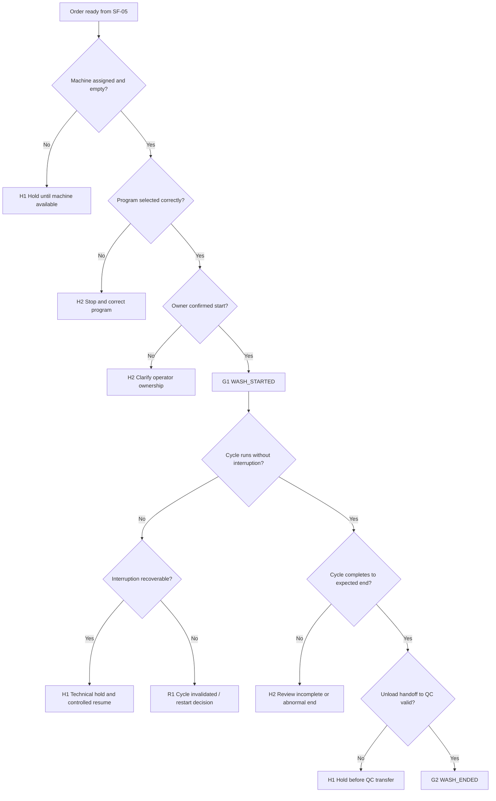

# SF-06 Deep Dive: Wash Execution
*Dự án: NowWash*

Tài liệu này đào sâu riêng cho `SF-06` trong `Service Flow`. Mục tiêu là khóa chặt logic `khi nào một mẻ được phép bắt đầu`, `khi nào một mẻ được coi là hoàn tất hợp lệ`, và `xử lý thế nào khi máy, điện, nước, người vận hành hoặc công suất làm gãy chu trình giặt`.

Tài liệu gốc liên quan:
- `docs/05_Operations/service_flow_master.md`
- `docs/05_Operations/laundry_operations_sop_detailed.md`
- `docs/05_Operations/standard_operating_procedures.md`
- `docs/05_Operations/service_flow_sf05_open_sort_prewash.md`
- `docs/05_Operations/service_flow_workshop_hold_matrix.md`
- `docs/06_Product_Tech/database_schema.md`

## 1. Mục tiêu của SF-06

`SF-06` phải trả lời 5 câu hỏi:

1. `Order này đã đủ điều kiện để bắt đầu giặt chưa?`
2. `Mẻ giặt có đang chạy đúng máy, đúng chương trình, đúng owner không?`
3. `Nếu chu trình bị gián đoạn thì reset, chuyển máy, hay hold kỹ thuật?`
4. `Khi nào được coi là WASH_ENDED hợp lệ?`
5. `Làm sao để không biến lỗi máy hoặc backlog thành lỗi custody / quality?`

Điểm quan trọng:
- `SF-06` không còn tranh luận xem đồ có nên giặt hay không; stage này chỉ xử lý `execution integrity`.
- Tuy vậy, nếu vận hành máy lỏng thì vẫn có thể gây hư hỏng, lẫn mẻ, hoặc làm mất timeline chứng minh quy trình.
- `WASH_STARTED` và `WASH_ENDED` phải là các mốc có nghĩa vận hành thật, không chỉ là nút bấm trạng thái.

## 2. Phạm vi

`In scope`
- Kiểm tra máy trống và machine assignment.
- Chọn chương trình giặt/sấy đúng loại.
- Bắt đầu mẻ với `WASH_STARTED`.
- Theo dõi mẻ đang chạy.
- Xử lý interruption: máy lỗi, mất điện, mất nước, nhầm chương trình, đổi ca, backlog.
- Kết thúc mẻ với `WASH_ENDED`.
- Bàn giao sang khu QC.

`Out of scope`
- Mở túi và sorting evidence.
- Đánh giá pass/fail chất lượng đầu ra.
- Đóng gói và giao trả.

## 3. Kết quả quyết định chuẩn của SF-06

| Outcome Code | Tên kết quả | Ý nghĩa vận hành | Hành động khuyến nghị |
| --- | --- | --- | --- |
| `G1` | Wash Started Validly | Mẻ được phép chạy với machine/program/owner hợp lệ | Tạo `WASH_STARTED` |
| `G2` | Wash Completed Validly | Chu trình hoàn thành hợp lệ và có thể sang QC | Tạo `WASH_ENDED` |
| `H1` | Technical Hold | Mẻ bị dừng do lỗi kỹ thuật hoặc utility, cần xử lý trước khi tiếp tục | Hold kỹ thuật có owner |
| `H2` | Execution Risk Hold | Có nguy cơ sai chương trình, sai machine, sai owner, hoặc lẫn mẻ | Dừng flow thường, review ngay |
| `R1` | Cycle Invalidated | Chu trình không còn đáng tin để coi là execution hợp lệ | Reset/restart/rework theo policy |

## 4. Nguyên tắc điều hành của SF-06

- `Không bấm WASH_STARTED nếu machine assignment chưa rõ`.
- `Không bấm WASH_STARTED nếu order chưa pass SF-05`.
- `Một machine tại một thời điểm chỉ có một order active trong flow chuẩn`.
- `Không đổi chương trình giữa chừng nếu chưa có rule kỹ thuật và log`.
- `Không bấm WASH_ENDED nếu chu trình chưa hoàn tất thực sự`.
- `Mẻ bị gián đoạn phải có reason code; không coi như chưa từng xảy ra`.
- `Lỗi capacity` và `lỗi machine/utility` phải được log tách nhau.

## 5. Tiền điều kiện để bắt đầu mẻ

Chỉ được bắt đầu `SF-06` nếu:

- Order đã `F1` hoặc `F2` từ `SF-05`.
- Toàn bộ item của order đã ở trong đúng `1 machine`.
- Bàn sorting đã clear.
- Machine đang ở trạng thái trống / sẵn sàng.
- Owner vận hành rõ.
- Chương trình giặt được chọn phù hợp với loại dịch vụ hiện hành.

Nếu thiếu một điều kiện, order không được sang `WASH_STARTED`.

## 6. Chuỗi quyết định SF-06

## 7. Gate-by-Gate Decision Table

### Gate 1. Machine Assignment Readiness

| Điều kiện pass | Nếu fail | Outcome | Owner |
| --- | --- | --- | --- |
| Có đúng 1 machine trống được assign cho order đó | Machine chưa trống, machine double-booked, hoặc machine assignment mơ hồ | `H1` hoặc `H2` | Washer / workshop lead |

`Rule to run`
- Không được bắt đầu mẻ khi machine còn order active khác.
- Không được “giữ chỗ” machine mà không gắn owner.
- Nếu order phải chờ machine, đó là `capacity hold`, không phải `execution complete`.

### Gate 2. Program Selection Integrity

| Điều kiện pass | Nếu fail | Outcome | Owner |
| --- | --- | --- | --- |
| Chương trình giặt/sấy được chọn đúng preset cho loại order hiện hành | Chọn nhầm preset, không rõ preset, hoặc đổi preset không có lý do/log | `H2` hoặc `R1` | Washer / workshop lead |

`Rule to run`
- Không dùng “ước chừng” nếu đã có preset chuẩn.
- Đổi preset chỉ hợp lệ nếu:
  - có rule kỹ thuật rõ
  - có người có thẩm quyền
  - có log change reason
- Nếu đã phát hiện chọn sai trước khi cycle chạy thực chất, dừng và sửa.
- Nếu phát hiện sai quá muộn, case có thể phải vào `R1` để đánh giá restart/rework.

### Gate 3. Owner Confirmation & Start Event

| Điều kiện pass | Nếu fail | Outcome | Owner |
| --- | --- | --- | --- |
| Có operator cụ thể chịu trách nhiệm bắt đầu mẻ và bấm `WASH_STARTED` | Đổi ca không bàn giao, nhiều người cùng vận hành, hoặc không rõ ai start machine | `H2` | Washer / shift lead |

`Rule to run`
- `WASH_STARTED` phải gắn với staff account rõ.
- Nếu có đổi ca trước khi mẻ bắt đầu, phải handover owner trước rồi mới start.
- Không cho một người bấm start hộ mà không phải owner thực tế của machine lúc đó.

### Gate 4. Cycle Run Integrity

| Điều kiện pass | Nếu fail | Outcome | Owner |
| --- | --- | --- | --- |
| Mẻ chạy liên tục trong điều kiện bình thường | Máy dừng đột ngột, báo lỗi, mất điện, mất nước, khóa cửa lỗi, utility fluctuation | `H1` hoặc `R1` | Washer / workshop lead / tech support |

`Rule to run`
- Mọi interruption phải có reason code.
- Không lén khởi động lại nhiều lần mà không log.
- Nếu interruption ngắn và còn kiểm soát được, dùng `technical hold`.
- `Technical hold`, `capacity hold`, và release authority phải tuân theo `docs/05_Operations/service_flow_workshop_hold_matrix.md`.
- Nếu interruption làm mất tính tin cậy của chu trình, đưa vào `R1`.

### Gate 5. Utility & Environment Stability

| Điều kiện pass | Nếu fail | Outcome | Owner |
| --- | --- | --- | --- |
| Điện, nước, hóa chất, và điều kiện máy hỗ trợ đủ để chu trình chạy đúng | Mất điện, mất nước, auto-dosing lỗi, cảnh báo bất thường từ machine | `H1` hoặc `R1` | Workshop lead / facility / tech support |

`Rule to run`
- Không coi lỗi utility là lỗi operator cá nhân nếu nguyên nhân hệ thống.
- Nhưng operator vẫn phải chịu trách nhiệm stop và log đúng lúc.
- Nếu utility outage diện rộng:
  - gắn hold cho nhiều order
  - không bấm `WASH_ENDED` giả để đẩy sang QC

### Gate 6. Mid-Cycle Change Control

| Điều kiện pass | Nếu fail | Outcome | Owner |
| --- | --- | --- | --- |
| Không có thay đổi trái phép với machine, chương trình, hoặc owner giữa chu trình | Đổi machine giữa chừng, đổi preset không log, hoặc đổi owner không bàn giao | `H2` hoặc `R1` | Washer / workshop lead |

`Rule to run`
- Không chuyển load sang machine khác giữa chừng trừ khi policy kỹ thuật cho phép và có log cực rõ.
- Nếu phải đổi owner giữa cycle:
  - có handover
  - có timestamp
  - có machine ID
- Không để mẻ “không người chịu trách nhiệm” trong 1 khoảng thời gian đáng kể.

### Gate 7. Completion Validation

| Điều kiện pass | Nếu fail | Outcome | Owner |
| --- | --- | --- | --- |
| Chu trình đã thực sự chạy hết, machine báo end hợp lệ, và order được đưa sang khu QC đúng cách | Chu trình kết thúc bất thường, bị cắt nửa chừng, machine báo lỗi cuối chu kỳ, hoặc unloading mơ hồ | `G2`, `H1`, `H2`, hoặc `R1` | Washer / workshop lead |

`Rule to run`
- `WASH_ENDED` chỉ được bấm khi chu trình kết thúc thật sự.
- Không bấm end để “đẩy KPI” khi order vẫn còn pending xử lý kỹ thuật.
- Nếu chu trình kết thúc nhưng unloading bị lẫn với mẻ khác, đó là `execution risk`.

### Gate 8. Post-Cycle Transfer to QC

| Điều kiện pass | Nếu fail | Outcome | Owner |
| --- | --- | --- | --- |
| Đồ sau mẻ được đưa ra bàn QC có kiểm soát, không trộn với mẻ khác | Đồ bị đặt lên xe đẩy lẫn, bàn QC chưa sẵn, hoặc không rõ mẻ nào với mẻ nào | `H1` hoặc `H2` | Washer / QC handoff owner |

`Rule to run`
- Sau khi kết thúc mẻ, order phải đi sang QC theo một handoff rõ.
- Không trộn đồ giữa 2 mẻ trên xe đẩy hoặc bàn gấp.
- Nếu QC station chưa sẵn, order phải ở điểm chờ có owner rõ, không treo mơ hồ.

### Gate 9. Commit Start / End Events

| Nếu bắt đầu hợp lệ | Nếu hoàn tất hợp lệ | Nếu không hợp lệ |
| --- | --- | --- |
| `G1` -> tạo `WASH_STARTED` | `G2` -> tạo `WASH_ENDED` | `H1/H2/R1` -> không commit sai stage |

`Output tối thiểu`
- `order_id`
- `machine_id`
- `program_id` hoặc preset name
- `started_at`
- `ended_at`
- `started_by`
- `ended_by`
- `execution_outcome`
- `interruption_count`
- `interruption_reason_codes`
- `handoff_to_qc_owner`

## 8. Use Case Matrix

| Use case | Kết quả đề xuất | Lý do |
| --- | --- | --- |
| Order pass từ SF-05, máy trống, preset đúng, chạy trọn vẹn | `G1 -> G2` | Flow chuẩn |
| Máy đang bận, order phải chờ | `H1` | Capacity hold |
| Chọn nhầm preset nhưng phát hiện trước khi chạy đáng kể | `H2` | Dừng để sửa, chưa commit lệch |
| Máy mất điện giữa chu trình, có thể resume theo policy kỹ thuật | `H1` | Technical hold có kiểm soát |
| Máy lỗi nặng, chu trình không còn đáng tin | `R1` | Cycle invalidated |
| Đổi ca khi machine đang chạy nhưng có handover rõ | `H1` hoặc continue | Quản lý owner transition |
| Đồ sau wash bị đặt lẫn với mẻ khác khi ra QC | `H2` | Execution risk lớn |
| Backlog làm order chờ quá lâu trước khi có máy | `H1` | Capacity, chưa phải quality fail |

## 9. Exception Matrix Cho SF-06

| Bucket | Tín hiệu | Xử lý tức thời | Outcome mặc định |
| --- | --- | --- | --- |
| `NO_MACHINE` | Không còn máy trống | Queue / reprioritize | `H1` |
| `PROGRAM_MISMATCH` | Sai preset hoặc preset không rõ | Stop and review | `H2` / `R1` |
| `MACHINE_ERROR` | Máy báo lỗi / dừng đột ngột | Hold kỹ thuật | `H1` / `R1` |
| `POWER_OUTAGE` | Mất điện | Hold diện rộng | `H1` |
| `WATER_OUTAGE` | Mất nước / áp lực nước không đủ | Hold kỹ thuật | `H1` |
| `DOSING_ERROR` | Hóa chất / auto-dosing bất thường | Stop and assess | `H1` / `R1` |
| `OWNER_GAP` | Không rõ ai đang vận hành | Dừng và xác định ownership | `H2` |
| `QC_HANDOFF_MIXING` | Sau wash bị lẫn mẻ | Incident-level review | `H2` |

## 10. Rule Phân Loại Interruption

### `Recoverable interruption`

Ví dụ:
- điện chập chờn rất ngắn nhưng machine resume chuẩn theo policy
- tạm pause kỹ thuật có log rõ
- operator đổi ca nhưng handover đầy đủ

Kết quả thường:
- `H1 technical hold`
- sau đó resume có kiểm soát

### `Non-recoverable interruption`

Ví dụ:
- machine fault làm không rõ chu trình đã đi đến đâu
- preset sai trong phần lớn chu trình
- load bị chuyển machine không log rõ
- ending state không còn đáng tin

Kết quả thường:
- `R1 cycle invalidated`
- restart / rework theo quyết định kỹ thuật và quality

## 11. Các Rule Nên Khóa Cứng Trong Hệ Thống

1. `Không cho WASH_STARTED nếu order chưa pass SF-05`
2. `Không cho một machine có 2 order active cùng lúc trong flow chuẩn`
3. `Program change sau start -> bắt buộc reason code và approval`
4. `Interruption -> bắt buộc reason code`
5. `Không cho WASH_ENDED nếu machine chưa có end state hợp lệ`
6. `Không cho handoff QC nếu order đang technical hold`
7. `Owner change mid-cycle -> bắt buộc handover log`

## 12. Các Mốc Số Liệu Nên Theo Dõi Từ SF-06

- `% mẻ start đúng giờ`
- `% mẻ bị technical hold`
- `% mẻ bị invalidated`
- `% machine error`
- `% utility outage impact`
- `% program mismatch`
- `% owner gap / handover lỗi`
- `thời gian chạy mẻ trung bình`
- `thời gian chờ máy trung bình`
- `% handoff QC sạch không lẫn mẻ`

## 13. Những Quyết Định Nên Chốt Với Bạn Ở Vòng Review Này

Đây là các policy còn nên khóa tiếp:

1. `Program override authority`
   - Ai được quyền đổi preset khi có ngoại lệ: washer, workshop lead, hay chỉ tech/lead?

2. `Machine reassignment policy`
   - Có tình huống nào cho phép chuyển load sang máy khác giữa chừng không?

3. `Utility outage protocol`
   - Mất điện/nước trên diện rộng thì ưu tiên giữ order tại machine, unload, hay chuyển toàn bộ sang hold queue?

4. `End-state validation`
   - Điều kiện tối thiểu nào bắt buộc phải có trước khi bấm `WASH_ENDED`?

## 14. Ranh Giới Với Các Flow Khác

`SF-06` chỉ quyết định việc `mẻ giặt có được vận hành và hoàn tất hợp lệ hay không`.

Không xử lý sâu tại đây:
- QC pass/fail -> thuộc `SF-07`
- Complaint hư hỏng phát sinh -> dùng evidence từ SF-05/SF-06 nhưng xử lý ở incident flow
- Quản trị bảo trì máy sâu -> thuộc `Assets / Facilities`

Nhưng `SF-06` phải để lại đủ execution log để sau này phân biệt được:
- lỗi kỹ thuật
- lỗi capacity
- lỗi vận hành người dùng
- lỗi quality phát hiện ở QC

## 15. Kết luận

Nếu chốt theo tài liệu này, `SF-06` sẽ trở thành `machine execution gate` đúng nghĩa:

- `WASH_STARTED` và `WASH_ENDED` có giá trị vận hành thật.
- Lỗi máy, lỗi utility, và lỗi người vận hành được tách rõ.
- Capacity wait không bị lẫn với technical failure.
- Tạo nền sạch để `SF-07 QC Decision` tập trung vào kết quả đầu ra thay vì đoán chuyện gì đã xảy ra trong lúc giặt.
