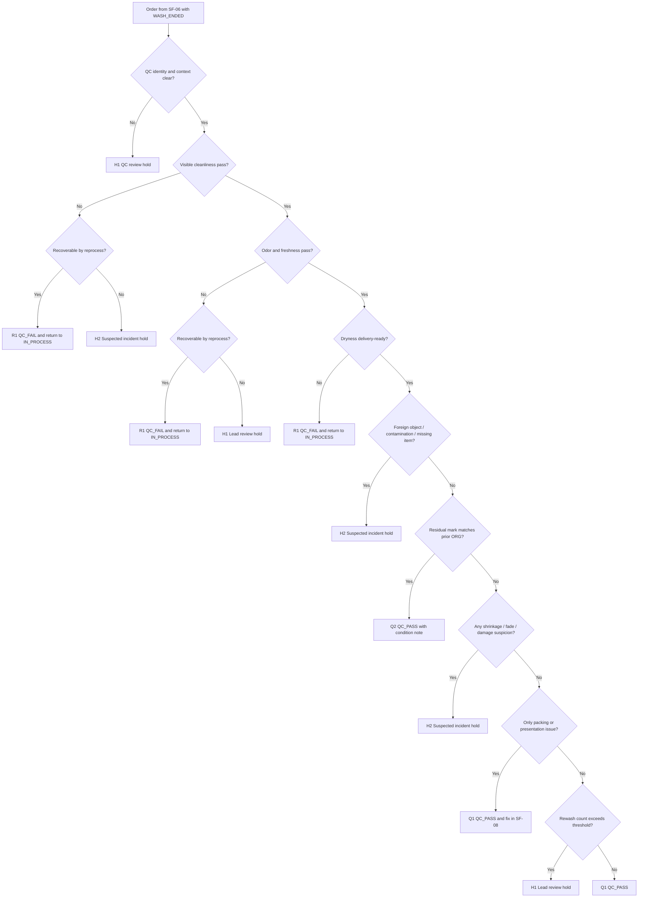

# SF-07 Deep Dive: QC Decision - Pass / Rewash / Hold
*Dự án: NowWash*

Tài liệu này đào sâu riêng cho `SF-07` trong `Service Flow`. Mục tiêu là khóa chặt logic `khi nào một order được pass chất lượng`, `khi nào phải quay lại vòng in-process`, và `khi nào tuyệt đối không được rewash tiếp mà phải hold/incident review`.

Tài liệu gốc liên quan:
- `docs/05_Operations/service_flow_master.md`
- `docs/05_Operations/laundry_operations_sop_detailed.md`
- `docs/05_Operations/standard_operating_procedures.md`
- `docs/05_Operations/service_flow_sf06_wash_execution.md`
- `docs/06_Product_Tech/database_schema.md`

## 1. Mục tiêu của SF-07

`SF-07` phải trả lời 5 câu hỏi:

1. `Order này đã sạch, khô, và đủ điều kiện giao tiếp sang packing chưa?`
2. `Nếu chưa đạt thì đây là case còn recoverable bằng reprocess hay không?`
3. `Nếu có dấu hiệu damage hoặc quality anomaly thì có được cho rewash tiếp không?`
4. `Khi nào QC được phép dùng ORG evidence để pass có điều kiện?`
5. `Làm sao để frontline không pass sai vì chạy SLA, và cũng không rewash vô hạn?`

Điểm quan trọng:
- `SF-07` là quality decision gate cuối trước khi đóng gói.
- `QC_FAIL` không đồng nghĩa với `cứ rewash tiếp`; phải xét tính recoverable.
- `Suspected damage`, `missing item`, `mixing suspicion`, hoặc `process-caused anomaly` không phải nhánh rewash mặc định.
- Nếu vấn đề chỉ là `presentation` hoặc `packing quality`, không nên đẩy ngược cả order về wash loop.

## 2. Phạm vi

`In scope`
- Kiểm tra chất lượng sau `WASH_ENDED`.
- Ra quyết định `QC_PASS`, `QC_FAIL`, `lead hold`, hoặc `incident hold`.
- Phân loại lỗi còn recoverable bằng reprocess và lỗi không được tự rewash.
- Kiểm tra lại `ORG evidence` khi cần.
- Ghi reason code, rewash count, và evidence tối thiểu cho quyết định QC.

`Out of scope`
- Vận hành máy giặt/sấy ở vòng xử lý tiếp theo.
- Đóng gói, dán label, staging giao lại.
- Liên hệ khách và xử lý bồi thường chi tiết.

## 3. Kết quả quyết định chuẩn của SF-07

| Outcome Code | Tên kết quả | Ý nghĩa vận hành | Hành động khuyến nghị |
| --- | --- | --- | --- |
| `Q1` | QC Passed Cleanly | Order đạt chất lượng chuẩn và có thể sang packing | Tạo `QC_PASS` |
| `Q2` | QC Passed With Condition Note | Order đạt để giao tiếp nhưng cần giữ note do `ORG` hoặc ngoại lệ không chặn giao | Tạo `QC_PASS` kèm note |
| `R1` | Reprocess Required | Order chưa đạt nhưng còn recoverable bằng vòng xử lý tiếp theo | Tạo `QC_FAIL`, quay về `IN_PROCESS` |
| `H1` | QC Review Hold | QC chưa đủ cơ sở pass hoặc fail-reprocess; cần workshop lead review | Hold có owner và SLA |
| `H2` | Suspected Incident Hold | Có dấu hiệu damage, missing item, contamination, hoặc anomaly nghi do vận hành | Chặn flow thường, chuyển incident review |

## 4. Nguyên tắc điều hành của SF-07

- `Không pass nếu còn ẩm, còn mùi, còn vết bẩn rõ, hoặc còn dị vật`.
- `Không rewash vô hạn nếu cùng một lỗi lặp lại`.
- `Không dùng deadline/SLA để override quality gate`.
- `ORG evidence chỉ dùng để xác nhận tình trạng gốc; không dùng để hợp thức hóa damage mới`.
- `Suspected damage không được đẩy ngay về wash loop để che mất chứng cứ`.
- `QC_FAIL` phải có reason code bắt buộc.
- `Vấn đề chỉ thuộc packing/presentation thì sửa ở SF-08, không ép chạy lại SF-06`.

## 5. Tiền điều kiện vào QC

Chỉ được bắt đầu `SF-07` nếu:

- Order đã có `WASH_ENDED` hợp lệ từ `SF-06`.
- Order được đưa tới bàn QC mà không trộn với load khác.
- QC owner rõ ràng.
- Rewash history, `ORG` note, và prior exception note có thể tra cứu được.
- Item đủ điều kiện để đánh giá chất lượng thật:
  - không còn quá nóng khiến khó đánh giá độ khô
  - không bị bỏ trên xe đẩy mơ hồ
  - không thiếu item so với handoff list đang có

Nếu chưa đủ, order phải vào `H1` thay vì pass/fail cảm tính.

## 6. Chuỗi quyết định SF-07

## 7. Gate-by-Gate Decision Table

### Gate 1. QC Identity & Context Integrity

| Điều kiện pass | Nếu fail | Outcome | Owner |
| --- | --- | --- | --- |
| Đúng order, đúng load, đúng owner QC, có thể xem history và note liên quan | Không rõ order, lẫn load, thiếu history, hoặc QC owner mơ hồ | `H1` | QC staff / QC lead |

`Rule to run`
- Không QC khi order đang ở trạng thái lẫn với load khác.
- Nếu rewash history hoặc `ORG` note chưa truy xuất được, không pass theo trí nhớ.
- Nếu nghi thiếu item ở ngay điểm vào QC, chuyển ngay sang `H2`.

### Gate 2. Visible Cleanliness

| Điều kiện pass | Nếu fail | Outcome | Owner |
| --- | --- | --- | --- |
| Không còn vết bẩn nhìn thấy bằng mắt thường ở mức không chấp nhận được | Còn vết bẩn rõ, bề mặt bẩn, residue rõ, hoặc xử lý chưa đều | `R1` hoặc `H2` | QC staff |

`Rule to run`
- Vết còn lại phải được phân loại:
  - `Residual soil likely recoverable` -> `R1`
  - `Dấu lạ nghi damage / color transfer / burn mark` -> `H2`
- Không vì gần deadline mà pass một vết bẩn còn thấy rõ.

### Gate 3. Odor & Freshness

| Điều kiện pass | Nếu fail | Outcome | Owner |
| --- | --- | --- | --- |
| Mùi sạch, không hôi ẩm, không có mùi lạ bất thường | Còn mùi hôi ẩm, mùi tồn dư bất thường, hoặc mùi lạ khó phân loại | `R1` hoặc `H1` | QC staff |

`Rule to run`
- `Mùi hôi ẩm`, `mùi mẻ chưa đủ sạch`, `mùi tồn dư có thể xử lý tiếp` -> `R1`
- `Mùi hóa chất/cháy/khét lạ` hoặc QC không chắc nguồn gốc -> `H1`
- Nếu cùng một lỗi mùi lặp lại nhiều vòng, không tiếp tục rewash tự động.

### Gate 4. Dryness Delivery Readiness

| Điều kiện pass | Nếu fail | Outcome | Owner |
| --- | --- | --- | --- |
| Độ khô đạt mức giao được, không ẩm vùng trọng yếu | Còn ẩm, chưa ổn để đóng gói/giao, hoặc không chắc có khô đồng đều hay không | `R1` hoặc `H1` | QC staff |

`Rule to run`
- `Còn ẩm nhưng rõ ràng recoverable` -> `R1`
- Nếu QC không thể xác nhận do item quá nóng hoặc điều kiện đánh giá không phù hợp -> `H1`
- Không pass “tạm” rồi hy vọng đồ tự khô tiếp trong lúc đóng gói.

### Gate 5. Foreign Object / Residue / Unexpected Item

| Điều kiện pass | Nếu fail | Outcome | Owner |
| --- | --- | --- | --- |
| Không còn vật lạ, không còn tissue/residue đáng kể, không có dấu item mismatch | Có vật lạ, còn residue bất thường, thiếu item, hoặc nghi lẫn item | `H1` hoặc `H2` | QC staff / QC lead |

`Rule to run`
- Tissue/lint nhẹ nhưng còn recoverable theo matrix kỹ thuật -> `R1` chỉ khi không có dấu mixing.
- Tiền, chìa khóa, đồ cá nhân, hoặc item không thuộc order -> ưu tiên `H2`.
- Thiếu item, dư item, hoặc nghi lẫn order khác là custody/incident risk, không xem là quality fail thường.

### Gate 6. Original Condition vs Process-Caused Anomaly

| Điều kiện pass | Nếu fail | Outcome | Owner |
| --- | --- | --- | --- |
| Dấu còn lại khớp với `ORG` đã được ghi trước wash, không có tín hiệu xấu đi do xử lý | Không có `ORG`, không khớp `ORG`, hoặc có dấu co rút/phai màu/biến dạng mới | `Q2`, `H1`, hoặc `H2` | QC staff / QC lead |

`Rule to run`
- Nếu residual mark đúng là `ORG` đã có sẵn và wash quality đã tối đa hợp lý -> `Q2`
- Nếu không có `ORG` để đối chiếu mà QC không chắc đây là dấu cũ hay dấu mới -> `H1`
- Nếu có tín hiệu rõ của shrinkage, color bleed, deformation, tear, burn, hoặc fabric stress -> `H2`

### Gate 7. Reprocess Recoverability & Threshold

| Điều kiện pass | Nếu fail | Outcome | Owner |
| --- | --- | --- | --- |
| Lỗi hiện tại còn recoverable và chưa vượt ngưỡng xử lý lặp | Lỗi không còn recoverable, hoặc rewash count đã vượt ngưỡng | `R1` hoặc `H1` | QC lead / workshop lead |

`Rule to run`
- `Recoverable by reprocess`
  - damp
  - mild odor
  - residual stain/soil còn có cơ sở xử lý tiếp
  - residue/lint còn sửa được
- `Không auto-reprocess`
  - shrinkage / fade / burn / tear
  - missing item / mixed order suspicion
  - cùng một failure lặp quá ngưỡng cho phép
- Mặc định khóa cho flow hiện tại:
  - `1st fail` -> cho `R1`
  - `2nd fail cùng reason` -> cho `H1` lead review trước khi chạy tiếp
  - `3rd fail` -> không frontline tự quyết

### Gate 8. Boundary With Packing / Presentation

| Điều kiện pass | Nếu fail | Outcome | Owner |
| --- | --- | --- | --- |
| Chất lượng wash đạt, lỗi còn lại chỉ là gấp/chỉnh presentation/bao bì | Frontline đẩy ngược về wash loop dù garment hygiene đã đạt | `Q1` hoặc `Q2` | QC staff / packing lead |

`Rule to run`
- Nếu garment đạt sạch, mùi, khô, và nguyên trạng:
  - lỗi gấp
  - presentation chưa đẹp
  - cần refold / repack
  -> sửa ở `SF-08`, không dùng `QC_FAIL`
- Nếu “gấp vội” thực chất là do còn ẩm hoặc garment chưa ổn định form, quay lại gate dryness/condition để quyết định lại.

### Gate 9. Commit QC Event

| Nếu pass chuẩn | Nếu pass có điều kiện | Nếu fail-reprocess | Nếu hold |
| --- | --- | --- | --- |
| `Q1` -> tạo `QC_PASS` | `Q2` -> tạo `QC_PASS` + note | `R1` -> tạo `QC_FAIL` | `H1/H2` -> chặn commit sai |

`Output tối thiểu`
- `order_id`
- `qc_owner`
- `qc_completed_at`
- `qc_outcome`
- `qc_reason_code`
- `rewash_count`
- `org_reference_used`
- `incident_suspected_flag`
- `supporting_photos_ref` nếu có
- `lead_review_owner` nếu hold

## 8. Bộ Evidence Tối Thiểu Của QC

`Core evidence`
- QC outcome `Q1/Q2/R1/H1/H2`
- Reason code nếu không phải `Q1`
- Rewash count hiện tại
- QC owner và timestamp

`Conditional evidence`
- Ảnh bổ sung nếu nghi damage / biến dạng / color bleed
- Link hoặc reference tới `ORG` evidence nếu dùng `Q2`
- Lead review note nếu `H1`
- Incident note nếu `H2`

Kết luận:
- `SF-07` không chỉ là một checklist ngắn; nó là điểm chốt logic để tránh pass sai hoặc rewash vô hạn.
- Nếu evidence yếu, nên hold để review hơn là ép ra quyết định không chắc chắn.

## 9. Use Case Matrix

| Use case | Kết quả đề xuất | Lý do |
| --- | --- | --- |
| Sạch, thơm, khô, không issue | `Q1` | Flow chuẩn |
| Còn dấu `ORG` đã ghi từ trước, wash quality đã đạt tối đa hợp lý | `Q2` | Pass có điều kiện, giữ note |
| Còn ẩm nhẹ, không có anomaly khác | `R1` | Recoverable by reprocess |
| Còn mùi hôi ẩm sau vòng đầu | `R1` | Có cơ sở xử lý tiếp |
| Cùng lỗi mùi lặp lại sau nhiều vòng | `H1` | Không auto-rewash vô hạn |
| Còn vết bẩn rõ nhưng là residual soil có thể xử lý tiếp | `R1` | Quality fail recoverable |
| Còn vết lạ, nghi phai màu/cháy/xém | `H2` | Suspected incident |
| Phát hiện thiếu item hoặc nghi lẫn item | `H2` | Custody risk, không phải QC fail thường |
| Garment đạt chất lượng nhưng gấp xấu / đóng gói chưa đẹp | `Q1` | Sửa ở `SF-08` |
| QC không chắc đây là dấu cũ hay mới, thiếu ORG để đối chiếu | `H1` | Cần lead review |

## 10. Exception Matrix Cho SF-07

| Bucket | Tín hiệu | Xử lý tức thời | Outcome mặc định |
| --- | --- | --- | --- |
| `DAMP` | Garment còn ẩm | Trả về in-process loop | `R1` |
| `ODOR` | Mùi hôi ẩm / mùi tồn dư | Trả về in-process loop nếu còn recoverable | `R1` |
| `RESIDUAL_SOIL` | Còn vết bẩn thấy rõ | Reprocess nếu có cơ sở xử lý | `R1` |
| `ORG_CONFIRMED` | Dấu còn lại khớp `ORG` | Pass có note | `Q2` |
| `NO_ORG_CLARITY` | Không đủ cơ sở xác định cũ/mới | Hold để lead review | `H1` |
| `SUSPECT_DAMAGE` | Co rút, phai màu, rách, cháy, biến dạng | Chặn flow thường | `H2` |
| `MISSING_OR_MIXED_ITEM` | Thiếu/dư item hoặc nghi lẫn | Incident-level review | `H2` |
| `REPEAT_FAIL` | QF lặp quá ngưỡng | Escalate lead | `H1` |
| `PRESENTATION_ONLY` | Chỉ lỗi gấp/gói | Chuyển sang SF-08 sửa | `Q1` |

## 11. Các Rule Nên Khóa Cứng Trong Hệ Thống

1. `QC_FAIL bắt buộc có reason code`
2. `QC_PASS không được tạo nếu order đang ở incident hold`
3. `Rewash count phải được tăng và lưu lại mỗi lần QC_FAIL`
4. `Nếu suspected damage = true thì không cho frontline tự QC_PASS`
5. `Q2 chỉ hợp lệ khi có ORG reference hoặc note được phê duyệt`
6. `Order hold không được sang READY_TO_DELIVER`
7. `Chỉ role QC hoặc lead được commit QC outcome`

## 12. Các Mốc Số Liệu Nên Theo Dõi Từ SF-07

- `% first-pass QC`
- `% QC_FAIL`
- `% repeat QC_FAIL cùng reason`
- `% order vào H1`
- `% order vào H2`
- `% Q2 do ORG confirmed`
- `% post-delivery complaint trên order đã Q1/Q2`
- `aging của QC hold`

## 13. Những Quyết Định Nên Chốt Với Bạn Ở Vòng Review Này

Đây là các policy còn nên khóa tiếp:

1. `Dryness threshold`
   - Mức "khô đủ để giao" cần mô tả cụ thể hơn theo loại vải hoặc rule cảm quan chuẩn.

2. `Fold-only handling`
   - Mình đề xuất tách khỏi `QC_FAIL`, xử lý ở `SF-08` nếu garment hygiene đã đạt.

3. `Q2 authority`
   - Có cho QC staff tự dùng `ORG_CONFIRMED` để pass có điều kiện hay phải có lead confirm?

4. `Damage escalation trigger`
   - Dấu hiệu nào đủ để auto chuyển `H2` thay vì `H1`?

5. `Redry vs rewash`
   - Với lỗi chỉ `DAMP`, hệ thống có cần tách riêng nhánh `redry` thay vì gom chung vào `REWASH_REQUIRED` hay không?

## 14. Ranh Giới Với Các Flow Khác

`SF-07` chỉ quyết định chất lượng đầu ra của vòng xử lý hiện tại.

Không xử lý sâu tại đây:
- Tối ưu lại machine/preset ở vòng xử lý tiếp theo.
- Đóng gói, gắn label, và staging giao lại.
- CS communication hoặc bồi thường.

Quan hệ với flow khác:
- `SF-06` cung cấp `WASH_ENDED` hợp lệ cho QC.
- `SF-07` nếu `R1` thì trả order về `IN_PROCESS`.
- `SF-07` nếu `Q1/Q2` thì chuyển sang `SF-08`.
- `SF-07` nếu `H2` thì phải liên kết sang `Complaint & Incident Flow` sau này.

## 15. Kết luận

`SF-07` là chỗ vận hành rất dễ sai vì frontline có xu hướng:
- pass sớm để đỡ trễ SLA
- rewash tiếp để né incident
- hoặc đánh đồng mọi vấn đề thành `QF`

Thiết kế đúng của stage này là:
- `recoverable quality fail` -> `R1`
- `uncertain / repeated fail` -> `H1`
- `suspected damage / custody anomaly` -> `H2`
- `true pass` -> `Q1`
- `pass with original-condition note` -> `Q2`

Nếu chốt tốt `SF-07`, mình và bạn sẽ khóa được gần hết logic trước khi sang `packing`, và cũng tạo nền rất tốt cho luồng `quality control` với mức detail cao hơn ở vòng sau.
