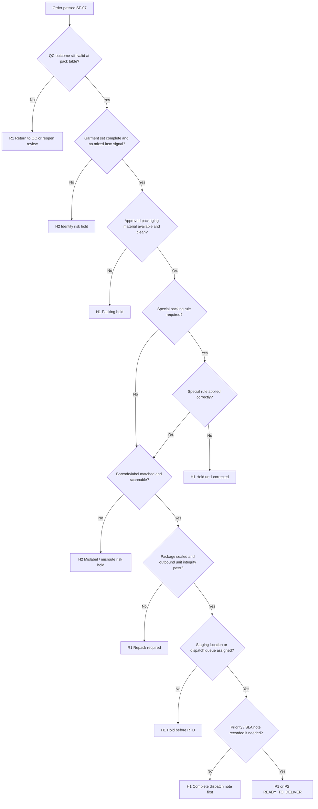

# SF-08 Deep Dive: Packing & Ready to Deliver
*Dự án: NowWash*

Tài liệu này đào sâu riêng cho `SF-08` trong `Service Flow`. Mục tiêu là khóa chặt logic `khi nào một order thực sự đủ điều kiện trở thành READY_TO_DELIVER`, `làm sao để không giao nhầm vì lỗi label/staging`, và `khi nào phải hold thay vì đẩy hàng ra kệ cho nhanh`.

Tài liệu gốc liên quan:
- `docs/05_Operations/service_flow_master.md`
- `docs/05_Operations/laundry_operations_sop_detailed.md`
- `docs/05_Operations/standard_operating_procedures.md`
- `docs/05_Operations/business_rules_exceptions.md`
- `docs/05_Operations/service_flow_sf07_qc_decision.md`
- `docs/06_Product_Tech/database_schema.md`

## 1. Mục tiêu của SF-08

`SF-08` phải trả lời 5 câu hỏi:

1. `Order đã đủ điều kiện vật lý và chất lượng để đóng gói chưa?`
2. `Gói hàng sau khi pack có đúng định danh, đúng barcode, đúng staging location không?`
3. `READY_TO_DELIVER nên được hiểu là gì để không chồng với SF-09?`
4. `Nếu thiếu vật tư, sai label, hoặc phát hiện issue muộn thì quay về đâu?`
5. `Làm sao để shipper nhận tuyến có thể tìm đúng order rất nhanh mà không giao nhầm?`

Điểm quan trọng:
- `SF-08` không đánh giá lại toàn bộ chất lượng wash, nhưng có quyền chặn `RTD` nếu phát hiện dấu hiệu chất lượng chưa sẵn sàng giao.
- `READY_TO_DELIVER` nên là `đã pack xong, định danh rõ, định vị rõ, sẵn sàng xuất tuyến`, không đồng nghĩa với `đã lên route`.
- Outer `seal sticker` ở bước này là `tamper-evident packing sticker`, không phải custody seal của `SF-02`.
- Nếu `label`, `barcode`, hoặc `staging location` sai, rủi ro vận hành chính là `giao nhầm`, không chỉ là lỗi đóng gói nhỏ.

## 2. Phạm vi

`In scope`
- Nhận order đã qua `SF-07`.
- Gấp, xếp, và đóng gói bằng vật tư outbound.
- Dán `seal sticker` và barcode/label giao trả.
- Gán staging location hoặc dispatch queue.
- Mark order là `READY_TO_DELIVER`.
- Giữ note về priority, special handling, hoặc packing exception được duyệt.

`Out of scope`
- Đánh giá pass/fail chất lượng ở mức QC đầy đủ.
- Xuất route thật sự lên shipper.
- Bàn giao thành công cho khách.

## 3. Kết quả quyết định chuẩn của SF-08

| Outcome Code | Tên kết quả | Ý nghĩa vận hành | Hành động khuyến nghị |
| --- | --- | --- | --- |
| `P1` | Packed & RTD Staged | Order được pack đúng chuẩn, label đúng, staging rõ, sẵn sàng xuất tuyến | Commit `READY_TO_DELIVER` |
| `P2` | Packed With Approved Exception | Order được pack hợp lệ với ngoại lệ đã duyệt như vật tư thay thế hoặc special packing note | Commit `READY_TO_DELIVER` + note |
| `H1` | Packing Hold | Order chưa thể RTD do thiếu vật tư, staging chưa sẵn, hoặc dispatch note chưa rõ | Hold tại packing/staging có owner |
| `H2` | Identity / Misroute Risk Hold | Có rủi ro giao nhầm do sai label, scan không khớp, mixed item, hoặc không xác định được package identity | Chặn flow thường, ưu tiên review |
| `R1` | Repack or Return-to-QC Required | Order phải tháo khỏi pack flow để repack lại hoặc quay về `SF-07` vì phát hiện issue muộn | Repack hoặc reopen QC |

## 4. Nguyên tắc điều hành của SF-08

- `Không pack order chưa có QC outcome hợp lệ`.
- `Không commit READY_TO_DELIVER nếu chưa có label scan được và staging location rõ`.
- `Không để hai order có packaging/label nhìn giống nhau mà không có cách phân biệt nhanh`.
- `Không dùng seal sticker ngoài để thay thế bằng chứng custody`.
- `Không xuất ra kệ chờ giao nếu order vẫn còn nghi chất lượng hoặc identity mismatch`.
- `Nếu phát hiện issue muộn về chất lượng, trả về nhánh đúng thay vì cố đóng gói cho kịp SLA`.

## 5. Tiền điều kiện vào Packing

Chỉ được bắt đầu `SF-08` nếu:

- Order đã có outcome `Q1` hoặc `Q2` từ `SF-07`.
- Garment đã ở trạng thái cho phép gấp/đóng gói:
  - sạch
  - khô đủ để giao
  - không đang ở hold/incident
- Có vật tư outbound phù hợp và sạch:
  - túi nilon/giấy
  - seal sticker
  - barcode/label
- Có khu vực packing và staging có kiểm soát.

Nếu thiếu một điều kiện, order phải vào `H1` hoặc `R1`, không được “pack tạm”.

## 6. Chuỗi quyết định SF-08

## 7. Gate-by-Gate Decision Table

### Gate 1. QC Handoff Integrity

| Điều kiện pass | Nếu fail | Outcome | Owner |
| --- | --- | --- | --- |
| Order có `Q1/Q2` hợp lệ và không ở hold state | QC outcome chưa final, order còn hold, hoặc đang có incident flag | `R1` hoặc `H1` | QC staff / packing staff / QC lead |

`Rule to run`
- Với model chuẩn, `QC_PASS` chỉ đưa order vào `PACKING_STAGE`; chỉ `PACKING_COMPLETED` mới được đưa sang `READY_TO_DELIVER`.
- Nếu app legacy vẫn gộp `QC_PASS` -> `READY_TO_DELIVER`, UI phải chặn commit cho tới khi đủ dữ liệu pack/staging.
- Không dùng trí nhớ hay giấy rời để pack order chưa có trạng thái rõ.
- Nếu phát hiện order đáng lẽ chưa pass QC, phải quay về `SF-07`.

### Gate 2. Final Physical Readiness Before Pack

| Điều kiện pass | Nếu fail | Outcome | Owner |
| --- | --- | --- | --- |
| Garment set đầy đủ, không có dấu mixed item, và không lộ issue muộn chặn giao | Thiếu/dư item, nghi lẫn order, còn ẩm, còn mùi, hoặc phát hiện anomaly mới khi gấp | `R1` hoặc `H2` | Packing staff / QC lead |

`Rule to run`
- Nếu chỉ phát hiện `fold/presentation issue`, sửa tại bàn pack.
- Nếu phát hiện `còn ẩm`, `mùi lạ`, hoặc `vết chưa accept được`, quay về `R1`.
- Nếu phát hiện thiếu item, dư item, hoặc nghi lẫn order khác, ưu tiên `H2`.

### Gate 3. Packaging Material Readiness

| Điều kiện pass | Nếu fail | Outcome | Owner |
| --- | --- | --- | --- |
| Có đúng vật tư outbound, sạch, không rách, không bẩn, và phù hợp kích cỡ | Thiếu túi/bao bì, seal sticker hết, vật tư rách/bẩn, hoặc kích cỡ không phù hợp | `H1` hoặc `P2` | Packing staff / ops lead |

`Rule to run`
- Vật tư thay thế chỉ hợp lệ nếu đã được duyệt trước.
- Không dùng bao bì bẩn hoặc bao bì cũ làm outbound pack.
- Nếu dùng vật tư thay thế hợp lệ, order đi `P2` kèm note.

### Gate 4. Packaging Execution & Special Handling

| Điều kiện pass | Nếu fail | Outcome | Owner |
| --- | --- | --- | --- |
| Garment được gấp gọn, cho vào đúng outbound unit, special handling được áp dụng đúng | Pack cẩu thả, bỏ sai loại bao bì, thiếu lớp bọc cần thiết, hoặc split package không kiểm soát | `R1` hoặc `H1` | Packing staff / packing lead |

`Rule to run`
- Một order mặc định nên ra `1 outbound unit` nếu hệ thống không hỗ trợ tách gói.
- Special handling ví dụ:
  - privacy inner wrap nếu policy yêu cầu
  - note cho order cần ưu tiên giao
  - approved substitute material
- Không “đóng đại” bằng cách ép nhét làm rách bao bì outbound.

### Gate 5. Label / Barcode Identity Integrity

| Điều kiện pass | Nếu fail | Outcome | Owner |
| --- | --- | --- | --- |
| Barcode/label khớp đúng order, scan được, đọc được, và gắn đúng package | Sai label, barcode không scan được, in mờ, hoặc label của order khác | `H2` hoặc `R1` | Packing staff / dispatcher |

`Rule to run`
- `Mislabel` là lỗi vận hành nghiêm trọng vì dẫn tới giao nhầm.
- Không cho package lên kệ chờ nếu label chưa scan pass.
- Relabel chỉ hợp lệ nếu:
  - xác minh đúng order
  - hủy nhãn cũ khỏi flow
  - log người sửa và thời điểm sửa

### Gate 6. Outbound Unit Integrity

| Điều kiện pass | Nếu fail | Outcome | Owner |
| --- | --- | --- | --- |
| Package hoàn chỉnh, seal sticker ngoài đã dán, không bung, không rách, không lộ contents | Bao bì rách, sticker bong, package không kín, hoặc identity marker dễ rơi mất | `R1` | Packing staff |

`Rule to run`
- `Seal sticker` tại đây là lớp niêm phong outbound mang tính trình bày/tamper-evident, không thay thế custody seal.
- Nếu bao bì hỏng sau khi đã dán label, phải repack và re-check identity trước khi RTD.
- Không dùng package bị bung mép với kỳ vọng “shipper giữ cẩn thận là được”.

### Gate 7. Staging Location & Dispatch Queue Control

| Điều kiện pass | Nếu fail | Outcome | Owner |
| --- | --- | --- | --- |
| Order được đưa vào đúng kệ/ô/dispatch queue có location code và owner rõ | Đặt sai kệ, kệ đầy, không có location code, hoặc staging lẫn order khác | `H1` hoặc `H2` | Packing staff / dispatcher |

`Rule to run`
- `READY_TO_DELIVER` chỉ hợp lệ nếu tìm thấy order nhanh tại vị trí staging đã log.
- Kệ staging phải hỗ trợ ít nhất:
  - location code
  - phân tách theo queue hoặc route wave
  - owner của ca chịu trách nhiệm
- Nếu order không thể locate nhanh, đó chưa phải RTD thật.

### Gate 8. SLA / Priority Readiness

| Điều kiện pass | Nếu fail | Outcome | Owner |
| --- | --- | --- | --- |
| Order có đầy đủ priority note, delivery note, hoặc dispatch caveat cần thiết cho bước xuất tuyến | Order sát SLA nhưng không có flag ưu tiên, thiếu note tòa nhà, hoặc thiếu note route exception | `H1` hoặc `P2` | Dispatcher / packing lead |

`Rule to run`
- `SF-08` không cần gán route cuối cùng, nhưng phải đảm bảo order đã `dispatchable`.
- Nếu order sát SLA, cần gắn priority flag trước khi RTD.
- Nếu route chưa có nhưng staging queue và priority note đã rõ, order vẫn có thể `P1/P2`.

### Gate 9. Commit READY_TO_DELIVER

| Nếu pack chuẩn | Nếu pack có ngoại lệ đã duyệt | Nếu phải repack / quay QC | Nếu hold |
| --- | --- | --- | --- |
| `P1` -> tạo `PACKING_COMPLETED` -> `READY_TO_DELIVER` | `P2` -> tạo `PACKING_COMPLETED` + note -> `READY_TO_DELIVER` | `R1` -> không commit RTD | `H1/H2` -> chặn commit RTD |

`Output tối thiểu`
- `order_id`
- `pack_owner`
- `packed_at`
- `package_type`
- `packing_exception_code` nếu có
- `final_barcode_value`
- `label_scan_result`
- `staging_location_code`
- `priority_flag`
- `rtd_outcome`

## 8. Bộ Evidence Tối Thiểu Của Packing / RTD

`Core evidence`
- `pack_owner`
- `packed_at`
- barcode/label cuối cùng
- `staging_location_code`
- `rtd_outcome`

`Conditional evidence`
- ảnh package nếu có exception đặc biệt
- relabel note nếu nhãn bị thay
- substitute material note nếu đi `P2`
- priority / dispatch note nếu sát SLA

Kết luận:
- `SF-08` là stage bảo vệ `delivery accuracy`.
- Nếu chứng cứ về pack identity yếu, chi phí giao nhầm và xử lý khiếu nại sẽ cao hơn nhiều so với việc hold vài phút để sửa đúng.

## 9. Use Case Matrix

| Use case | Kết quả đề xuất | Lý do |
| --- | --- | --- |
| QC pass rõ, vật tư đủ, label scan tốt, lên đúng kệ | `P1` | Flow chuẩn |
| Dùng vật tư thay thế đã duyệt, label vẫn đúng | `P2` | Ngoại lệ có kiểm soát |
| Phát hiện còn ẩm khi gấp | `R1` | Quay về nhánh QC/reprocess |
| Phát hiện thiếu item hoặc nghi lẫn order | `H2` | Identity risk |
| In nhãn mờ, scan fail | `H2` hoặc `R1` | Rủi ro giao nhầm nếu không sửa |
| Bao bì outbound bị rách sau khi đóng | `R1` | Repack required |
| Kệ staging đầy hoặc chưa có slot | `H1` | Chưa thể RTD thật |
| Order sát SLA, chưa có route nhưng đã có priority queue rõ | `P1` hoặc `P2` | Vẫn dispatchable |
| Order nằm trên kệ nhưng không locate nhanh được | `H2` | RTD giả, có risk misroute |

## 10. Exception Matrix Cho SF-08

| Bucket | Tín hiệu | Xử lý tức thời | Outcome mặc định |
| --- | --- | --- | --- |
| `MISSING_MATERIAL` | Hết túi, sticker, label | Hold và cấp bổ sung | `H1` |
| `SUBSTITUTE_PACK` | Dùng vật tư thay thế đã duyệt | Log exception | `P2` |
| `LATE_QUALITY_ISSUE` | Phát hiện ẩm/mùi/vết khi pack | Quay lại QC | `R1` |
| `MISLABEL` | Label sai order hoặc scan mismatch | Chặn flow, xác minh lại | `H2` |
| `UNREADABLE_BARCODE` | In mờ, scan fail | Relabel có kiểm soát | `R1` / `H2` |
| `PACKAGE_DAMAGE` | Bao bì rách, bung, sticker bong | Repack | `R1` |
| `STAGING_FULL` | Kệ/queue hết chỗ | Hold staging | `H1` |
| `UNLOCATABLE_RTD` | Không tìm thấy order tại vị trí log | Misroute review | `H2` |
| `SLA_RISK` | Sát giờ giao, thiếu priority note | Hoàn tất dispatch note | `H1` / `P2` |

## 11. Các Rule Nên Khóa Cứng Trong Hệ Thống

1. `Không cho commit READY_TO_DELIVER nếu label_scan_result != pass`
2. `Không cho commit READY_TO_DELIVER nếu staging_location_code trống`
3. `Order hold hoặc incident không được vào RTD`
4. `Relabel phải hủy hiệu lực nhãn cũ hoặc mark nhãn cũ là invalid`
5. `R1 không được tự động nhảy sang RTD mà phải qua repack/QC resolution`
6. `Nếu app legacy vẫn gộp QC_PASS -> READY_TO_DELIVER, UI phải ép nhập đủ thông tin pack/staging trước khi confirm`
7. `Một order chỉ có một RTD location active tại một thời điểm`

## 12. Các Mốc Số Liệu Nên Theo Dõi Từ SF-08

- `% order RTD đúng chuẩn ngay lần đầu`
- `% relabel`
- `% repack`
- `% staging hold`
- `% order không locate được trong RTD area`
- `% mislabel / scan fail`
- `% RTD sát SLA`
- `aging của RTD queue trước khi OFD`

## 13. Những Quyết Định Nên Chốt Với Bạn Ở Vòng Review Này

Đây là các policy còn nên khóa tiếp:

1. `Relabel authority`
   - Ai được quyền relabel, và có giới hạn số lần relabel trên một order hay không?

2. `Substitute material policy`
   - Những loại bao bì thay thế nào được phép dùng mà không ảnh hưởng brand/compliance?

3. `Locate-time threshold`
   - Bao lâu không tìm thấy order trên kệ thì phải coi là `H2 misroute risk`?

4. `Special packing classes`
   - Có nhóm item nào cần privacy wrap hoặc packaging class riêng ở outbound hay không?

5. `Packed-but-no-route handling`
   - Sau bao lâu ở RTD mà chưa được xuất tuyến thì phải escalte dispatcher/ops?

## 14. Ranh Giới Với Các Flow Khác

`SF-08` chỉ quyết định package outbound và trạng thái sẵn sàng xuất tuyến.

Không xử lý sâu tại đây:
- tạo route cuối cùng
- shipper handover
- bằng chứng giao tận tay / lễ tân
- xử lý giao thất bại

Quan hệ với flow khác:
- `SF-07` cung cấp `Q1/Q2` làm điều kiện đầu vào.
- `SF-08` nếu phát hiện issue muộn về chất lượng thì trả về `SF-07`.
- `SF-08` nếu hoàn tất sẽ tạo `PACKING_COMPLETED` để đưa order sang `READY_TO_DELIVER`.
- `SF-09` bắt đầu từ lúc dispatcher xuất đơn RTD lên tuyến `OUT_FOR_DELIVERY`.

## 15. Kết luận

`SF-08` là stage dễ bị xem nhẹ vì bề ngoài chỉ là `gấp, bỏ túi, dán nhãn, để lên kệ`. Nhưng thực tế đây là nơi tạo ra phần lớn lỗi:
- giao nhầm
- không tìm thấy hàng
- shipper cầm sai đơn
- order tưởng RTD nhưng chưa thật sự dispatchable

Thiết kế đúng của stage này là:
- `pack identity integrity` phải chặt
- `staging location` phải truy được
- `RTD` phải là readiness thật, không phải chỉ là gói xong về mặt vật lý
- `late quality issue` phải quay đúng nhánh

Nếu chốt tốt `SF-08`, bước `SF-09 Delivery Attempt & Handover` sẽ gọn hơn nhiều vì dispatcher và shipper chỉ làm việc với các package đã đúng, đã locate được, và đã có note dispatch rõ ràng.
