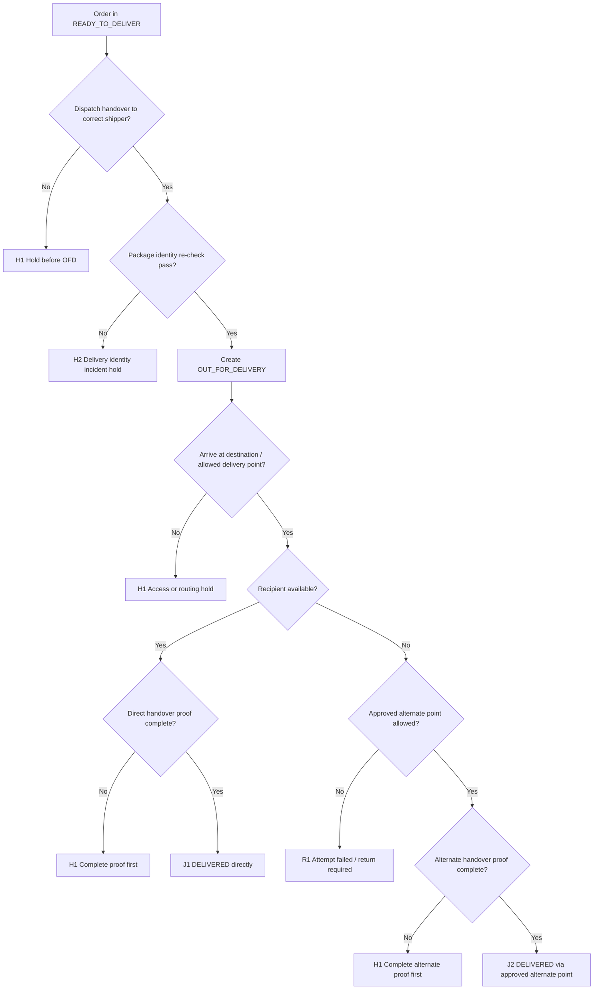

# SF-09 Deep Dive: Delivery Attempt & Handover
*Dự án: NowWash*

Tài liệu này đào sâu riêng cho `SF-09` trong `Service Flow`. Mục tiêu là khóa chặt logic `khi nào một attempt giao được coi là hợp lệ`, `khi nào được xem là giao thành công`, và `khi nào phải đưa order sang failed-delivery / re-attempt path thay vì bấm DELIVERED cho nhanh`.

Tài liệu gốc liên quan:
- `docs/05_Operations/service_flow_master.md`
- `docs/05_Operations/laundry_operations_sop_detailed.md`
- `docs/05_Operations/standard_operating_procedures.md`
- `docs/05_Operations/business_rules_exceptions.md`
- `docs/05_Operations/service_flow_sf08_packing_ready_to_deliver.md`
- `docs/06_Product_Tech/database_schema.md`

## 1. Mục tiêu của SF-09

`SF-09` phải trả lời 5 câu hỏi:

1. `Khi nào order được phép rời RTD để đi giao thật?`
2. `Delivery mode nào được xem là hợp lệ: trực tiếp, lễ tân, bảo vệ, locker?`
3. `NSH có phải luôn là failed delivery hay không?`
4. `Proof nào là đủ để bấm DELIVERED cho từng kiểu bàn giao?`
5. `Nếu attempt fail thì order quay về đâu, ai giữ, và bao giờ re-attempt?`

Điểm quan trọng:
- `OUT_FOR_DELIVERY` phải là mốc bàn giao thật từ staging sang shipper giao.
- `DELIVERED` phải gắn với `proof-of-handover` phù hợp với mode giao.
- `NSH` không tự động là giao thất bại hoàn toàn; trong nhiều tòa nhà, `handover qua lễ tân/bảo vệ/locker` là completion path hợp lệ nếu policy cho phép.
- Stage này là nơi rủi ro cao nhất về `giao nhầm`, `để sai chỗ`, `không có bằng chứng`, hoặc `vỡ SLA do re-attempt mơ hồ`.

## 2. Phạm vi

`In scope`
- Dispatcher xuất đơn RTD sang shipper.
- Tạo `OUT_FOR_DELIVERY`.
- Delivery attempt tại điểm giao.
- Xác minh người nhận hoặc điểm nhận thay thế.
- Thu bằng chứng bàn giao.
- Quyết định `DELIVERED`, `DELIVERY_ATTEMPT_FAILED`, `re-attempt`, hoặc `return-to-hub/staging`.

`Out of scope`
- Đóng gói / gắn label tại RTD.
- Complaint resolution sau khi khách phản hồi mất/sai hàng.
- Audit và đóng hồ sơ cuối cùng của case.

## 3. Kết quả quyết định chuẩn của SF-09

| Outcome Code | Tên kết quả | Ý nghĩa vận hành | Hành động khuyến nghị |
| --- | --- | --- | --- |
| `J1` | Delivered Directly | Giao thành công tận tay người nhận hợp lệ | Tạo `DELIVERED` |
| `J2` | Delivered Via Approved Alternate Point | Giao thành công qua lễ tân/bảo vệ/locker hoặc điểm nhận thay thế được phép | Tạo `DELIVERED` + note |
| `H1` | Delivery Hold / Reattempt Pending | Attempt này chưa chốt được, order cần lịch xử lý tiếp có owner rõ | Hold tại node kiểm soát |
| `H2` | Delivery Incident Hold | Có dấu hiệu giao nhầm, mất package, proof mâu thuẫn, hoặc handover bất thường | Chặn flow thường, incident review |
| `R1` | Attempt Failed / Return Required | Attempt này thất bại và order phải quay lại staging/hub hoặc chờ attempt mới | Tạo `DELIVERY_ATTEMPT_FAILED`, rồi return có log và next action |

## 4. Nguyên tắc điều hành của SF-09

- `Không bấm OUT_FOR_DELIVERY nếu package identity chưa match với shipper handover`.
- `Không bấm DELIVERED nếu proof không khớp delivery mode`.
- `Không để package tại điểm không được phép chỉ vì không gọi được khách`.
- `Không coi NSH là success nếu chưa có alternate point được policy cho phép`.
- `Không để failed-delivery package ở trạng thái không owner`.
- `Nếu giao qua người/điểm trung gian, phải log rõ ai nhận, ở đâu, lúc nào`.

## 5. Tiền điều kiện để xuất giao

Chỉ được bắt đầu `SF-09` nếu:

- Order đang ở `READY_TO_DELIVER`.
- Package scan đúng với order được giao.
- Dispatcher đã gán shipper hoặc delivery run cụ thể.
- Có thông tin delivery tối thiểu:
  - building
  - apartment / điểm nhận
  - số điện thoại / contact path
  - access note nếu có
- Không có hold/incident active chặn giao.

Nếu thiếu một điều kiện, order chưa được đi `OFD`.

## 6. Chuỗi quyết định SF-09

## 7. Gate-by-Gate Decision Table

### Gate 1. Dispatch Handover Integrity

| Điều kiện pass | Nếu fail | Outcome | Owner |
| --- | --- | --- | --- |
| Dispatcher bàn giao đúng order đúng shipper đúng route wave | Bàn giao sai mã, shipper nhận nhầm package, hoặc không rõ owner giao | `H1` hoặc `H2` | Dispatcher / delivery shipper |

`Rule to run`
- `OUT_FOR_DELIVERY` chỉ được tạo sau handover thật.
- Nếu shipper đang nhận nhiều package, từng package phải có re-check scan hoặc đối soát mã.
- Không cho shipper “xách nhầm rồi sửa sau”.

### Gate 2. Package Identity & Outbound Integrity Before Departure

| Điều kiện pass | Nếu fail | Outcome | Owner |
| --- | --- | --- | --- |
| Package nguyên vẹn, label scan đúng, shipper cầm đúng package | Bao bì rách, label mờ, scan mismatch, hoặc package không trùng route sheet | `H2` hoặc `R1` | Dispatcher / delivery shipper |

`Rule to run`
- Nếu phát hiện sai label ở thời điểm xuất giao, không được đi route rồi mới chỉnh.
- Nếu package hỏng vật lý nhưng identity vẫn rõ, có thể `R1` để quay lại repack.
- Nếu identity mơ hồ hoặc có nguy cơ giao nhầm, chuyển `H2`.

### Gate 3. Destination & Access Readiness

| Điều kiện pass | Nếu fail | Outcome | Owner |
| --- | --- | --- | --- |
| Điểm giao, building policy, access note, và contact path đủ để attempt | Thiếu địa chỉ, thiếu số liên hệ, note tòa nhà mơ hồ, hoặc route lệch điểm giao | `H1` hoặc `R1` | Dispatcher / shipper |

`Rule to run`
- Nếu tòa nhà không cho lên phòng nhưng đã có policy `locker/lễ tân/bảo vệ`, đây không phải exception mới.
- Nếu địa chỉ hoặc contact sai tới mức không attempt được, order vào `R1` hoặc `H1` tùy khả năng sửa trong ca.
- Không để shipper tự chọn điểm bỏ hàng ngoài policy.

### Gate 4. Delivery Mode Validation

| Điều kiện pass | Nếu fail | Outcome | Owner |
| --- | --- | --- | --- |
| Delivery mode khớp một trong các mode được phép | Mode giao không được phép hoặc không có căn cứ | `H1` hoặc `R1` | Dispatcher / shipper / CS |

`Mode chuẩn`
- `Direct to customer`
- `Reception / front desk`
- `Security guard`
- `Locker`

`Rule to run`
- Mỗi mode phải có bộ proof riêng.
- `Direct` là ưu tiên mặc định nếu tiếp cận được người nhận.
- `Alternate point` chỉ hợp lệ nếu:
  - building policy cho phép
  - hoặc khách/CS đã xác nhận

### Gate 5. Direct Handover Proof

| Điều kiện pass | Nếu fail | Outcome | Owner |
| --- | --- | --- | --- |
| Shipper giao tận tay người nhận hợp lệ và có proof tối thiểu | Không có proof, proof mờ, hoặc không xác định được người nhận/điểm nhận | `J1` hoặc `H1` | Delivery shipper |

`Proof tối thiểu khuyến nghị`
- timestamp bàn giao
- `recipient_type`
- tên/nghi chú người nhận
- và ít nhất `1` trong các proof sau:
  - ảnh bàn giao
  - OTP / chữ ký điện tử nếu có
  - recipient confirmation artifact được hệ thống lưu

`Rule to run`
- Không cần ép cùng một loại proof cho mọi tòa nhà, nhưng phải đạt ngưỡng bảo vệ vận hành.
- Nếu đã giao tận tay nhưng thiếu bằng chứng tối thiểu, chưa nên bấm `DELIVERED`.
- Mặc định:
  - `direct delivery` không bắt buộc ảnh nếu đã có `OTP/chữ ký/recipient confirmation artifact`
  - nếu không có các proof trên, phải có ảnh bàn giao rõ package và point handover

### Gate 6. No Show & Alternate Handover Logic

| Điều kiện pass | Nếu fail | Outcome | Owner |
| --- | --- | --- | --- |
| Khi khách không có mặt, alternate point được phép và đã dùng đúng policy | Không liên hệ được khách và cũng không có alternate point hợp lệ | `J2`, `H1`, hoặc `R1` | Delivery shipper / dispatcher / CS |

`Rule to run`
- `NSH` là signal của tình huống, không phải outcome cuối cùng.
- Nếu tòa nhà chỉ cho giao qua lễ tân/bảo vệ/locker:
  - giao tại điểm đó theo policy
  - thu proof phù hợp
  - có thể chốt `J2`
- `Alternate point` mặc định được phép mà không cần reconfirm từng lần nếu:
  - building policy đã được lưu trong hệ thống
  - không có customer opt-out note
- Nếu alternate point không được phép hoặc không có ai nhận:
  - không để hàng bừa
  - chuyển `R1` hoặc `H1`

### Gate 7. Alternate-Point Proof

| Điều kiện pass | Nếu fail | Outcome | Owner |
| --- | --- | --- | --- |
| Có đủ 2 lớp proof cho alternate point và đã nhắn khách vị trí nhận | Thiếu ảnh, thiếu thông tin nhận diện lễ tân/bảo vệ/locker, hoặc không gửi note cho khách | `J2` hoặc `H1` | Delivery shipper |

`Proof tối thiểu theo SOP`
- Ảnh package tại điểm gửi
- Ảnh có thông tin nhận diện bảo vệ/lễ tân/mã locker
- Note/SMS cho khách về vị trí gửi

`Rule to run`
- Thiếu một trong các proof này thì chưa nên chốt thành công.
- Nếu proof không thể thu do điều kiện thực địa, escalate để chọn nhánh khác thay vì bấm `DLV` tay.

### Gate 8. Failed Attempt, Return, and Reattempt Control

| Điều kiện pass | Nếu fail | Outcome | Owner |
| --- | --- | --- | --- |
| Failed attempt được log reason, return node, next owner, và kế hoạch re-attempt | Package giao fail nhưng bị treo trên xe/ngoài node, không rõ ai giữ, hoặc không có next action | `R1` hoặc `H1` | Delivery shipper / dispatcher |

`Rule to run`
- Mọi failed attempt phải có:
  - reason code
  - current package owner
  - node giữ package
  - next attempt window hoặc escalation owner
- Mặc định:
  - `1 primary attempt + 1 managed re-attempt`
  - nếu fail lần 2, frontline không tự mở attempt mới; chuyển `CS / ops decision`
- `Contact attempt minimum` trước khi kết luận `NSH/failed`:
  - `2 cuộc gọi` trong vòng `5 phút`
  - `1 SMS/Zalo/app message` để lại vị trí/hướng dẫn callback nếu applicable
- `Return node` mặc định:
  - quay về `origin RTD staging node` của cluster
  - nếu route xuất từ hub thì quay về `hub staging`
  - không quay về workshop theo flow thường
- `OFD aging threshold` mặc định:
  - `90 phút` không có update -> dispatcher alert
  - `180 phút` không có outcome -> ops lead escalation bắt buộc
- Khi package đã quay về node kiểm soát và sẵn sàng attempt mới, tạo `RETURNED_TO_STAGING` trước khi quay lại `READY_TO_DELIVER`.
- `R1` không được để package ở `OUT_FOR_DELIVERY` vô thời hạn.
- Nếu shipper không thể quay lại hub/staging ngay, phải có interim hold có owner rõ.

### Gate 9. Commit Delivery Outcome

| Nếu giao trực tiếp thành công | Nếu giao qua điểm thay thế hợp lệ | Nếu fail attempt | Nếu incident |
| --- | --- | --- | --- |
| `J1` -> tạo `DELIVERED` | `J2` -> tạo `DELIVERED` + alternate note | `R1` -> tạo `DELIVERY_ATTEMPT_FAILED`, sau đó `RETURNED_TO_STAGING` nếu reattempt được duyệt | `H2` -> chặn close và mở incident |

`Output tối thiểu`
- `order_id`
- `delivery_owner`
- `delivery_mode`
- `ofd_at`
- `delivered_at` hoặc `attempt_failed_at`
- `recipient_type`
- `recipient_name_or_point`
- `proof_refs`
- `attempt_result`
- `failed_reason_code` nếu có

## 8. Bộ Evidence Tối Thiểu Của Delivery

`Core evidence`
- `OUT_FOR_DELIVERY` timestamp
- shipper owner
- delivery mode
- attempt result

`Conditional evidence`
- direct handover proof
- 2 ảnh alternate-point theo SOP
- message/note gửi khách
- failed-attempt note
- return-to-node log nếu không giao được

Kết luận:
- `SF-09` là stage dễ phát sinh tranh chấp nhất nếu proof mỏng.
- Giữ proof rõ ngay từ attempt đầu tiên rẻ hơn rất nhiều so với giải quyết complaint sau đó.

## 9. Use Case Matrix

| Use case | Kết quả đề xuất | Lý do |
| --- | --- | --- |
| Giao tận tay khách, proof đầy đủ | `J1` | Flow chuẩn |
| Tòa nhà không cho lên, giao lễ tân đúng policy, đủ 2 ảnh | `J2` | Alternate completion hợp lệ |
| Giao locker đúng policy, có mã locker và ảnh | `J2` | Completion hợp lệ |
| Khách không nghe máy, không có điểm nhận thay thế được phép | `R1` | Attempt fail |
| Sai package phát hiện trước khi giao | `H2` | Misdelivery risk |
| Không vào được tòa trong thời gian ngắn nhưng dispatcher đang xử lý | `H1` | Chưa fail hẳn |
| Giao xong nhưng proof thiếu một phần | `H1` | Chưa nên close |
| Failed attempt, package đã quay về hub có owner rõ | `R1` | Return path đúng |
| Có tranh chấp shipper giao nhầm / bỏ sai chỗ | `H2` | Incident-level review |

## 10. Exception Matrix Cho SF-09

| Bucket | Tín hiệu | Xử lý tức thời | Outcome mặc định |
| --- | --- | --- | --- |
| `NSH` | Khách vắng / không nhận máy | Kiểm tra alternate point policy | `J2` / `R1` |
| `NO_ACCESS` | Không vào được tòa/căn hộ | Gọi dispatcher / dùng point thay thế nếu hợp lệ | `H1` / `R1` |
| `BAD_CONTACT` | Sai số hoặc không liên lạc được | Xác minh nhanh qua CS/dispatcher | `H1` / `R1` |
| `MISDELIVERY_RISK` | Sai package, sai route, sai người nhận | Chặn giao | `H2` |
| `PROOF_INCOMPLETE` | Thiếu ảnh / thiếu note / thiếu point identity | Hoàn tất proof hoặc hold | `H1` |
| `ALT_POINT_SUCCESS` | Giao lễ tân/bảo vệ/locker đủ proof | Close with note | `J2` |
| `RETURN_TO_NODE` | Giao fail, package quay lại node kiểm soát | Log owner + next action | `R1` |
| `DISPUTED_HANDOVER` | Khách phủ nhận đã nhận / point nhận mâu thuẫn | Incident review | `H2` |

## 11. Các Rule Nên Khóa Cứng Trong Hệ Thống

1. `Không cho DELIVERED nếu proof_refs trống`
2. `Không cho DELIVERED direct mode nếu recipient_type không rõ`
3. `Alternate-point delivery phải có point identity proof`
4. `Failed attempt phải có failed_reason_code và next owner`
5. `Order không được treo ở OUT_FOR_DELIVERY quá 90 phút mà không có update`
6. `Một package chỉ có một delivery owner active tại một thời điểm`
7. `Nếu attempt_result = failed thì order phải rời khỏi nhánh delivery active theo rule return/hold`

## 12. Các Mốc Số Liệu Nên Theo Dõi Từ SF-09

- `% giao đúng hẹn`
- `% delivered direct`
- `% delivered via alternate point`
- `% NSH`
- `% failed attempt`
- `% re-attempt success`
- `% proof incomplete`
- `% misdelivery / disputed handover`

## 13. Default Policy Đã Khóa Cho SF-09

Các policy delivery mặc định đã được khóa cho bản `Service Flow` hiện tại:

1. `Re-attempt count`
   - `1 primary attempt + 1 managed re-attempt`
   - fail lần 2 -> frontline dừng, chuyển `CS / ops decision`

2. `Contact attempt minimum`
   - `2 cuộc gọi` trong vòng `5 phút`
   - `1 SMS/Zalo/app message` nếu vẫn chưa kết nối được

3. `Alternate-point default`
   - lễ tân/bảo vệ/locker là default hợp lệ nếu `building policy` đã có trong hệ thống và không có `customer opt-out note`

4. `Proof standard by mode`
   - `Direct`: timestamp + recipient note/type + `1` proof trong `ảnh / OTP / chữ ký / recipient confirmation artifact`
   - `Alternate point`: bắt buộc `2 ảnh + message/note cho khách`

5. `Return node`
   - mặc định quay về `origin RTD staging node`
   - nếu route xuất từ hub thì quay về `hub staging`
   - không quay workshop theo flow thường

6. `OFD aging threshold`
   - `90 phút` không update -> dispatcher alert
   - `180 phút` không outcome -> ops lead escalation bắt buộc

## 14. Ranh Giới Với Các Flow Khác

`SF-09` chỉ giải quyết attempt giao và bàn giao vật lý.

Không xử lý sâu tại đây:
- complaint resolution
- refund / compensation
- post-delivery audit
- root-cause analysis của delivery failure

Quan hệ với flow khác:
- `SF-08` cung cấp package đã `READY_TO_DELIVER`.
- `SF-09` nếu success sẽ tạo `DELIVERED`.
- `SF-09` nếu fail sẽ đưa order sang failed-delivery path hoặc hold.
- `SF-10` sẽ gom toàn bộ evidence chain để đóng hồ sơ vận hành.

## 15. Kết luận

`SF-09` là stage mà frontline rất dễ bấm `DELIVERED` theo cảm giác, hoặc xem `NSH` là một label chung chung. Thiết kế đúng cần tách rõ:
- `J1`: giao trực tiếp thành công
- `J2`: giao thành công qua điểm thay thế hợp lệ
- `H1`: attempt đang chờ xử lý tiếp
- `R1`: attempt fail và package phải quay node kiểm soát
- `H2`: dấu hiệu giao nhầm / proof mâu thuẫn / incident

Nếu chốt tốt `SF-09`, chúng ta sẽ khóa được một trong những vùng dễ phát sinh complaint nhất của vận hành, đồng thời làm cho `SF-10 Operational Closure` trở nên rất rõ và ít tranh cãi hơn.
