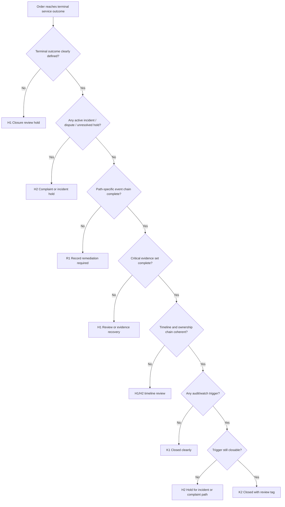

# SF-10 Deep Dive: Operational Closure
*Dự án: NowWash*

Tài liệu này đào sâu riêng cho `SF-10` trong `Service Flow`. Mục tiêu là khóa chặt logic `khi nào một order thực sự được đóng hồ sơ vận hành`, `khi nào case đủ sạch để archive`, và `khi nào phải giữ lại ở trạng thái review/remediation vì evidence hoặc event chain chưa đủ để tự bảo vệ`.

Tài liệu gốc liên quan:
- `docs/05_Operations/service_flow_master.md`
- `docs/05_Operations/laundry_operations_sop_detailed.md`
- `docs/05_Operations/standard_operating_procedures.md`
- `docs/05_Operations/business_rules_exceptions.md`
- `docs/05_Operations/service_flow_sf09_delivery_attempt_handover.md`
- `docs/06_Product_Tech/database_schema.md`
- `docs/09_Strategy_Management/00. Tài liệu chung.md`

## 1. Mục tiêu của SF-10

`SF-10` phải trả lời 5 câu hỏi:

1. `Case này đã có terminal outcome rõ ràng chưa?`
2. `Event chain và evidence chain có đủ để giải thích toàn bộ đường đi thực tế của order chưa?`
3. `Case có còn hold, incident, dispute, hoặc dữ liệu mâu thuẫn khiến chưa được close không?`
4. `Có case nào được close bình thường, và case nào phải close kèm review tag/audit flag?`
5. `Nếu evidence thiếu hoặc timeline lệch thì remediation window và escalation đi đâu?`

Điểm quan trọng:
- `DELIVERED` chưa chắc đã đồng nghĩa với `operationally closed`.
- `Operational closure` là gate cuối để đảm bảo sau này audit, CS, complaint, hoặc pháp lý vẫn truy ngược được.
- Stage này phải `path-aware`: order đi qua hub, direct-to-workshop, alternate-point delivery, hay terminal failure sẽ có bộ event/evidence khác nhau.
- Với delivery failure, terminal path chuẩn dùng `DELIVERY_ATTEMPT_FAILED`, `RETURNED_TO_STAGING`, và nếu dừng dịch vụ thì `SERVICE_FAILURE_CLOSED`.
- `Archive-ready` không có nghĩa là xóa khỏi khả năng truy vết; nó có nghĩa là hồ sơ đã đủ tự bảo vệ mà không cần đi hỏi trí nhớ của người vận hành.

## 2. Phạm vi

`In scope`
- Xác nhận terminal outcome của order.
- Kiểm tra đủ event chain theo đường đi thực tế.
- Kiểm tra đủ evidence tối thiểu tại các điểm bàn giao trọng yếu.
- Xử lý `closure review`, `record remediation`, hoặc `complaint/incident hold`.
- Gắn audit flag, review tag, hoặc archive-ready status.

`Out of scope`
- Giải quyết complaint chi tiết với khách.
- Điều tra root-cause chuyên sâu của incident.
- Thực hiện lại service.

## 3. Kết quả quyết định chuẩn của SF-10

| Outcome Code | Tên kết quả | Ý nghĩa vận hành | Hành động khuyến nghị |
| --- | --- | --- | --- |
| `K1` | Closed Cleanly | Hồ sơ vận hành đầy đủ, nhất quán, archive-ready | Close bình thường |
| `K2` | Closed With Review Tag | Case đủ để close nhưng cần giữ cờ audit/complaint-watch do ngoại lệ đáng chú ý | Close + retain review tag |
| `H1` | Closure Review Hold | Case chưa đủ điều kiện close nhưng còn khả năng hoàn tất bằng review tay trong ngưỡng thời gian cho phép | Hold chờ ops admin / lead review |
| `H2` | Complaint / Incident Hold | Có dispute, incident, custody anomaly, hoặc rủi ro pháp lý làm case chưa được close | Chặn close bình thường |
| `R1` | Record Remediation Required | Event hoặc evidence thiếu/sai cần backfill hoặc chỉnh dữ liệu trước khi close | Remediation trước khi close |

## 4. Nguyên tắc điều hành của SF-10

- `Không close nếu terminal outcome chưa rõ`.
- `Không archive-ready nếu thiếu evidence tại điểm bàn giao trọng yếu`.
- `Không force-close case có incident/dispute còn mở`.
- `Event chain phải đúng với path thực tế, không ép mọi order dùng cùng một checklist cứng`.
- `Review tag không thay thế remediation`; case thiếu dữ liệu cứng vẫn phải sửa trước.
- `Không dùng trí nhớ người vận hành làm bằng chứng chính khi event/evidence lẽ ra phải có trong hệ thống`.

## 5. Tiền điều kiện vào Closure

Chỉ được bắt đầu `SF-10` nếu:

- Order đã có terminal service outcome:
  - `DELIVERED`
  - hoặc terminal failure disposition được chấp nhận
- Không còn stage vận hành mở ở `pickup`, `workshop`, `QC`, `packing`, hoặc `delivery active`.
- Có thể truy được event timeline của order.
- Có thể truy được evidence chính nếu case đi qua các điểm cần proof.

Nếu một điều kiện chưa đạt, case không được vào closure bình thường.

## 6. Chuỗi quyết định SF-10

## 7. Gate-by-Gate Decision Table

### Gate 1. Terminal Outcome Eligibility

| Điều kiện pass | Nếu fail | Outcome | Owner |
| --- | --- | --- | --- |
| Order đã có kết quả dịch vụ cuối cùng rõ ràng | Order vẫn ở stage active, failed attempt chưa có return path, hoặc terminal reason chưa rõ | `H1` | System / ops admin |

`Rule to run`
- `DELIVERED` là terminal outcome phổ biến nhất.
- Với service failure terminal, phải có reason/disposition rõ, không chỉ là order “dừng lại”.
- Nếu order còn treo ở `OUT_FOR_DELIVERY` hoặc `H1` từ stage trước, chưa được đóng.

### Gate 2. Open-Hold / Incident / Dispute Clearance

| Điều kiện pass | Nếu fail | Outcome | Owner |
| --- | --- | --- | --- |
| Không còn incident, complaint, custody anomaly, hoặc unresolved hold active | Có incident đang mở, dispute khách hàng, hoặc unresolved exception owner | `H2` hoặc `H1` | Ops admin / incident owner / CS |

`Rule to run`
- `Near-miss` đã được review xong có thể close với tag.
- `Open incident` hoặc `customer dispute active` không được close bình thường.
- Nếu case đang chờ phản hồi từ bộ phận khác nhưng chưa đến mức incident, có thể vào `H1`.

### Gate 3. Path-Specific Event Chain Completeness

| Điều kiện pass | Nếu fail | Outcome | Owner |
| --- | --- | --- | --- |
| Chuỗi event đủ cho đường đi thực tế của order | Thiếu event bắt buộc, event trái path, hoặc terminal event mâu thuẫn | `R1` hoặc `H1` | System / ops admin / product-tech |

`Rule to run`
- Không bắt order direct-to-workshop phải có event hub.
- Không coi order via-hub là đủ nếu thiếu handover node quan trọng.
- Chuỗi thành công tối thiểu thường gồm:
  - `BAG_ASSIGNED`
  - `SEAL_APPLIED`
  - `PICKED_UP`
  - `IN_WORKSHOP` hoặc `HUB_RECEIVED -> IN_WORKSHOP`
  - `WASH_STARTED`
  - `WASH_ENDED`
  - `QC_PASS`
  - `PACKING_COMPLETED`
  - `OUT_FOR_DELIVERY`
  - `DELIVERED`
- Chuỗi failed-delivery có reattempt hoặc terminal failure thường phải thấy:
  - `OUT_FOR_DELIVERY`
  - `DELIVERY_ATTEMPT_FAILED`
  - `RETURNED_TO_STAGING` nếu quay về reattempt
  - `SERVICE_FAILURE_CLOSED` nếu đã có terminal disposition
- Nếu event bị thiếu nhưng có thể backfill từ nguồn kiểm soát được, đi `R1`.

### Gate 4. Critical Evidence Set Completeness

| Điều kiện pass | Nếu fail | Outcome | Owner |
| --- | --- | --- | --- |
| Có đủ evidence tối thiểu tại các điểm bàn giao trọng yếu theo path thực tế | Thiếu proof pickup/intake/QC/delivery ở điểm bắt buộc | `H1` hoặc `R1` | Ops admin / shift lead |

`Rule to run`
- `Critical control points` thường là:
  - pickup completion
  - workshop intake / seal check
  - QC decision nếu có exception lớn
  - delivery handover hoặc failed-delivery return
- Không phải mọi case đều cần cùng một lượng ảnh/video, nhưng các điểm control chính phải có chứng cứ phù hợp.
- Nếu proof bị thiếu hoàn toàn ở điểm lẽ ra bắt buộc phải có, không nên close sạch.

### Gate 5. Timeline & Ownership Coherence

| Điều kiện pass | Nếu fail | Outcome | Owner |
| --- | --- | --- | --- |
| Timeline logic hợp lý và ownership chain không đứt | Timestamp đảo ngược, OFD trước RTD, nhiều owner active cùng lúc, hoặc custody chain mơ hồ | `H1` hoặc `H2` | Ops admin / product-tech / incident owner |

`Rule to run`
- `Incoherent timeline` có thể là lỗi dữ liệu hoặc dấu hiệu vận hành bất thường.
- Nếu chỉ là lỗi đồng bộ nhỏ có thể giải thích và sửa được -> `H1/R1`
- Nếu timeline lệch đi kèm custody anomaly, proof mâu thuẫn, hoặc nghi chỉnh tay dữ liệu -> `H2`

### Gate 6. Payment / Reconciliation Applicability

| Điều kiện pass | Nếu fail | Outcome | Owner |
| --- | --- | --- | --- |
| Các tín hiệu thu tiền/reconciliation liên quan đã hoàn tất hoặc được xác nhận là không áp dụng | Có thu hộ/COD/upsell cần đối soát nhưng chưa khớp | `H1` hoặc `R1` | Ops admin / finance ops / dispatcher |

`Rule to run`
- Với order trả trước hoàn toàn, gate này có thể `not applicable`.
- Nếu form giao hàng có `PAYMENT_RECEIVED` hoặc khoản phát sinh, closure cần biết trạng thái đối soát đó.
- Không để case `service closed cleanly` nhưng tiền hoặc phụ phí vẫn mơ hồ.

### Gate 7. Audit / Watch Trigger Classification

| Điều kiện pass | Nếu fail | Outcome | Owner |
| --- | --- | --- | --- |
| Case được phân loại đúng là `close cleanly` hay `close with review tag` | Case có tín hiệu phải watch nhưng lại close như bình thường | `K1`, `K2`, hoặc `H1` | Ops admin / QA / CS |

`Các trigger nên vào K2`
- alternate-point delivery
- repeat QC fail / rewash nhiều vòng nhưng đã giải quyết
- relabel / repack có kiểm soát
- manual fallback do app/scanner/network issue
- near-miss custody hoặc delivery đã review xong

`Rule to run`
- `K2` vẫn là close được.
- Nhưng case phải còn tìm được nhanh trong queue audit/complaint-watch.
- Không được dùng `K2` để che case đáng ra phải vào `H2`.

### Gate 8. Commit Operational Closure

| Nếu close sạch | Nếu close có review tag | Nếu cần remediation | Nếu hold |
| --- | --- | --- | --- |
| `K1` -> archive-ready close | `K2` -> close + review tag | `R1` -> chưa close | `H1/H2` -> chưa close |

`Output tối thiểu`
- `order_id`
- `terminal_service_outcome`
- `closure_outcome`
- `closure_owner`
- `closed_at`
- `review_tags`
- `missing_items_flag` nếu có
- `evidence_completeness_status`
- `event_chain_status`
- `closure_notes`

## 8. Bộ Evidence Tối Thiểu Của Operational Closure

`Core evidence`
- terminal outcome của case
- event chain truy được
- evidence references của các control point chính
- closure owner
- closure decision note

`Conditional evidence`
- incident resolution note
- dispute handoff note
- remediation log nếu đã backfill
- review tag reason
- payment reconciliation ref nếu applicable

Kết luận:
- `SF-10` không tạo thêm giá trị dịch vụ cho khách, nhưng nó bảo vệ công ty và đội vận hành khi sự việc bị lật lại sau này.
- Một case close sạch sẽ tiết kiệm rất nhiều thời gian cho CS, QA, và quản lý khi có audit hoặc complaint.

## 9. Use Case Matrix

| Use case | Kết quả đề xuất | Lý do |
| --- | --- | --- |
| Delivered direct, event và proof đầy đủ, không exception | `K1` | Close sạch |
| Delivered qua lễ tân đúng policy, proof đủ | `K2` | Close được nhưng nên giữ watch tag |
| Order có relabel/repack đã review xong, hồ sơ đầy đủ | `K2` | Ngoại lệ có kiểm soát |
| Thiếu event handover qua hub nhưng còn khả năng backfill | `R1` | Cần remediation |
| Thiếu proof delivery ở case lẽ ra bắt buộc | `H1` hoặc `R1` | Chưa đủ tự bảo vệ |
| Timeline lệch nhẹ do sync delay, có thể giải thích | `H1` | Review trước khi close |
| Timeline lệch nặng kèm proof mâu thuẫn | `H2` | Incident/dispute risk |
| Customer dispute đang mở | `H2` | Không close bình thường |
| Failed delivery đã có return node, next owner rõ, service failure disposition rõ | `K2` hoặc `K1` | Close theo terminal failure path nếu hồ sơ đủ |

## 10. Exception Matrix Cho SF-10

| Bucket | Tín hiệu | Xử lý tức thời | Outcome mặc định |
| --- | --- | --- | --- |
| `MISSING_EVENT` | Thiếu event trong path | Truy nguồn và backfill nếu hợp lệ | `R1` |
| `MISSING_PROOF` | Thiếu ảnh / scan / note ở control point | Review khả năng recovery | `H1` / `R1` |
| `TIMELINE_MISMATCH` | Timestamp vô lý hoặc đảo thứ tự | Soát dữ liệu và owner chain | `H1` / `H2` |
| `OPEN_INCIDENT` | Incident / complaint chưa đóng | Chặn closure | `H2` |
| `PAYMENT_UNCLEAR` | COD / upsell / thu hộ chưa khớp | Reconcile trước | `H1` / `R1` |
| `AUDIT_TAG` | Case ngoại lệ nhưng đủ hồ sơ | Close có tag | `K2` |
| `FORCE_CLOSE_RISK` | Có xu hướng close tay để hết queue | Chặn close và escalate | `H1` / `H2` |

## 11. Các Rule Nên Khóa Cứng Trong Hệ Thống

1. `Không cho archive-ready nếu event_chain_status != complete`
2. `Không cho close sạch nếu evidence_completeness_status != complete`
3. `Case có incident/dispute active không được vào K1/K2`
4. `K2 bắt buộc có review_tags`
5. `R1 phải có remediation owner và due time`
6. `Một case đã close vẫn phải truy được evidence refs và timeline`
7. `Force-close action phải được giới hạn role và lưu audit log`

## 12. Các Mốc Số Liệu Nên Theo Dõi Từ SF-10

- `% close sạch K1`
- `% close có tag K2`
- `% closure hold H1`
- `% complaint/incident hold H2`
- `% remediation R1`
- `% case thiếu event chain`
- `% case thiếu proof control point`
- `closure lag từ terminal outcome đến close`

## 13. Những Quyết Định Nên Chốt Với Bạn Ở Vòng Review Này

Đây là các policy còn nên khóa tiếp:

1. `Remediation window`
   - Sau bao lâu không bổ sung được event/proof thì case phải chuyển hẳn sang incident/audit queue?

2. `K2 watch duration`
   - Case close có review tag sẽ được giữ trong watch queue bao lâu?

3. `Critical proof list`
   - Với từng path, điểm nào là hard blocker nếu thiếu proof, điểm nào chỉ cần note?

4. `Force-close authority`
   - Ai được quyền close tay khi thiếu dữ liệu, và có cần 2 lớp phê duyệt không?

5. `Payment gate`
   - Những loại đơn nào bắt buộc reconciliation xong mới được close?

6. `Terminal failure closure`
   - Những nhánh thất bại dịch vụ nào được close như case bình thường, và nhánh nào phải luôn đi qua review tag?

## 14. Ranh Giới Với Các Flow Khác

`SF-10` chỉ đóng hồ sơ vận hành.

Không xử lý sâu tại đây:
- CS resolution sau complaint
- root-cause analysis
- bồi thường
- preventive action cho chu kỳ sau

Quan hệ với flow khác:
- `SF-09` cung cấp terminal delivery outcome hoặc failed-delivery path.
- `SF-10` xác minh hồ sơ có đủ để close hay không.
- Nếu case vào `H2`, nó sẽ là đầu nối rất quan trọng sang `Complaint & Incident Flow`.
- Nếu case vào `K2`, nó sẽ là đầu vào rất hữu ích cho `Quality Control` và `Reports`.

## 15. Kết luận

`SF-10` là stage giúp tách rất rõ:
- `service đã xong`
- `hồ sơ đã đủ để tự bảo vệ`
- `case còn phải review`

Thiết kế đúng của stage này là:
- `K1` cho case sạch
- `K2` cho case close được nhưng cần watch
- `R1` cho case phải sửa record
- `H1` cho case cần review closure
- `H2` cho case có incident/dispute chưa khép

Nếu chốt tốt `SF-10`, chúng ta có thể coi `Service Flow` đã khép kín end-to-end ở mức đủ chắc để chuyển sang luồng tiếp theo mà không bị bỏ sót lỗ hổng audit hoặc complaint defense.
